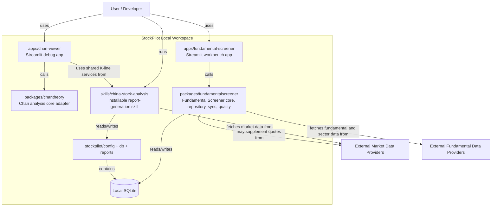

# StockPilot C4 Container View

This document describes the main executable and storage containers inside the
current StockPilot repository.

## Purpose

- Clarify the responsibilities of `packages/`, `apps/`, `skills/`, and runtime
  data.
- Show the dependency direction between reusable logic and delivery adapters.
- Make the local SQLite boundary explicit.

## Container View



## Container Responsibilities

### `packages/chantheory`

- Owns the stable Chan Theory analysis contract.
- Accepts normalized OHLCV inputs and returns structured analysis results.
- Does not own remote fetching, runtime-path management, or persistence.

### `packages/fundamentalscreener`

- Owns Fundamental Screener domain logic, contracts, repositories, sync, and
  quality handling.
- Builds stable domain snapshots from fixture or SQLite-backed sources.
- Exposes reusable logic to CLI and app layers.

### `apps/chan-viewer`

- A validation/debug UI for chart overlays and Chan structure output.
- Calls shared services and `chantheory`; it should not duplicate domain logic
  or provider integrations.

### `apps/fundamental-screener`

- A Streamlit workbench that renders screening results for humans.
- Uses a thin frontend adapter layer to hide SQLite paths, fixture details, and
  engineering internals from the UI.

### `skills/china-stock-analysis`

- An installable skill bundle for daily report generation and related runtime
  workflows.
- Owns skill-specific scripting, runtime paths, report orchestration, and local
  market-data fetching flows.
- Does not currently invoke `packages/chantheory`; Chan analysis is handled by
  the debug app through the shared package.

### Local Runtime Data And SQLite

- `config/`, `db/`, and generated reports belong to local runtime data, not to
  the installable skill bundle.
- SQLite is the current storage boundary for local caches and synchronized
  market/fundamental snapshots.

## Dependency Direction

The intended direction is:

```text
apps -> packages
skills -> packages
packages -> data source adapters / SQLite
```

The reverse direction should not happen. Domain logic should not move upward
into Streamlit pages or installable skill entry points.
