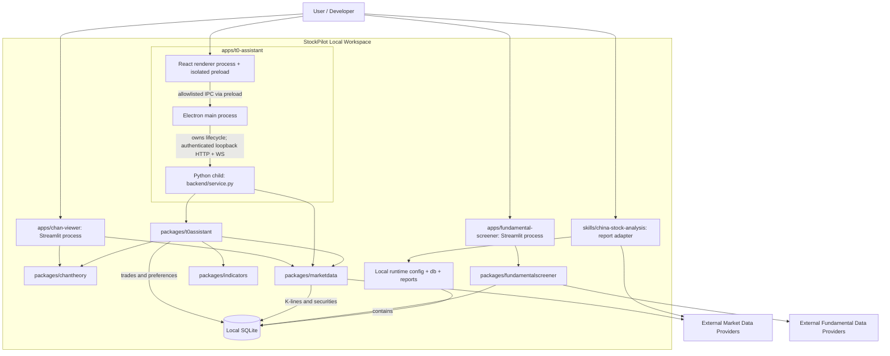

# StockPilot C4 Container View

This document describes the main executable and storage containers inside the
current StockPilot repository.

## Purpose

- Clarify the responsibilities of `packages/`, `apps/`, `skills/`, and runtime
  data.
- Show the dependency direction between reusable logic and delivery adapters.
- Make the local SQLite boundary explicit.

## Container View

Packages below are in-process libraries, not independently deployed services.
The T+0 subgraph shows its actual process boundary.


```mermaid
graph TD
    User[User / Developer]
    MarketProviders[External Market Data Providers]
    FundamentalProviders[External Fundamental Data Providers]

    subgraph StockPilot[StockPilot Local Workspace]
        Chantheory[packages/chantheory]
        MarketData[packages/marketdata]
        Indicators[packages/indicators]
        T0Core[packages/t0assistant]
        FundamentalCore[packages/fundamentalscreener]
        ChanApp[apps/chan-viewer: Streamlit process]
        FsApp[apps/fundamental-screener: Streamlit process]
        Skill[skills/china-stock-analysis: report adapter]
        subgraph T0[apps/t0-assistant]
            Renderer[React renderer process + isolated preload]
            Main[Electron main process]
            Python[Python child: backend/service.py]
        end
        RuntimeData[Local runtime config + db + reports]
        SQLite[(Local SQLite)]
    end

    User --> ChanApp
    User --> FsApp
    User --> Renderer
    User --> Skill
    ChanApp --> Chantheory
    ChanApp --> MarketData
    FsApp --> FundamentalCore
    Renderer -->|allowlisted IPC via preload| Main
    Main -->|owns lifecycle; authenticated loopback HTTP + WS| Python
    Python --> T0Core
    Python --> MarketData
    T0Core --> MarketData
    T0Core --> Chantheory
    T0Core --> Indicators
    T0Core -->|trades and preferences| SQLite
    MarketData -->|K-lines and securities| SQLite
    MarketData --> MarketProviders
    FundamentalCore --> SQLite
    FundamentalCore --> FundamentalProviders
    Skill --> RuntimeData
    Skill --> MarketProviders
    RuntimeData -->|contains| SQLite
```

The skill node retains its existing delivery context; standalone skill packaging
and dependency verification are outside #191. No application imports its market
services from the skill. Chan's `services/market_service.py` imports `marketdata`;
T+0 backend assembly imports `packages.marketdata` and `packages.t0assistant`.
The shared T+0 `runtime/pipeline.py` calls Chan Theory and indicators.

Fundamental Screener obtains company daily quotes and the CSI 300 benchmark
through AkShare's Sina-backed `stock_zh_a_daily` and `stock_zh_index_daily`
adapters. These belong to its external provider integration, not the Tencent
market-data path used by `packages/marketdata`.

## Container Responsibilities

### `packages/chantheory`

- Owns the stable Chan Theory analysis contract.
- Accepts normalized OHLCV inputs and returns structured analysis results.
- Does not own remote fetching, runtime-path management, or persistence.

### `packages/fundamentalscreener`

- Owns Fundamental Screener domain logic, contracts, repositories, sync, and
  quality handling.
- Builds stable domain snapshots from fixture or SQLite-backed sources.
- Exposes reusable logic to CLI and app layers.

### Shared market data, indicators, and T+0 core

- `packages/marketdata` owns providers, calendars, runtime paths, K-line storage,
  and securities storage.
- `packages/indicators` owns timestamp-aligned calculations used by the common
  Live/Replay pipeline.
- `packages/t0assistant` owns runtime sessions, pipeline, Replay, trade records,
  preferences, repositories, and trading abstractions. Live and Replay share
  calculation code while keeping mutable session state separate.

### `apps/t0-assistant`

- React renders project-owned payloads and calls the preload Safe Bridge.
- Electron main owns the Python child, credentials, ephemeral loopback port,
  HTTP requests, and WebSocket event gateway.
- `backend/service.py` is the sole managed Python entry point; backend adapters
  assemble shared package services.
- Renderer has no direct Python transport or SQLite access. Service event loss
  requires the documented [restart procedure](../../apps/t0-assistant/README.md#internal-service-event-failures).
- Public fields and event semantics remain in the [existing contract guide](../../apps/t0-assistant/contracts/README.md).

### `apps/chan-viewer`

- A validation/debug UI for chart overlays and Chan structure output.
- Calls shared services and `chantheory`; it should not duplicate domain logic
  or provider integrations.

### `apps/fundamental-screener`

- A Streamlit workbench that renders screening results for humans.
- Uses a thin frontend adapter layer to hide SQLite paths, fixture details, and
  engineering internals from the UI.

### `skills/china-stock-analysis`

- An installable skill bundle for daily report generation and related runtime
  workflows.
- Owns skill-specific scripting, runtime paths, report orchestration, and local
  market-data fetching flows.
- Does not currently invoke `packages/chantheory`; Chan analysis is handled by
  the debug app through the shared package.

### Local Runtime Data And SQLite

- `config/`, `db/`, and generated reports belong to local runtime data, not to
  the installable skill bundle.
- SQLite is the current storage boundary for local caches and synchronized
  market/fundamental snapshots.

## Dependency Direction

The intended direction is:

```text
apps -> packages
skills -> packages
packages -> data source adapters / SQLite
```

The reverse direction should not happen. Domain logic should not move upward
into Streamlit pages, Electron/React adapters, or installable skill entry points.
