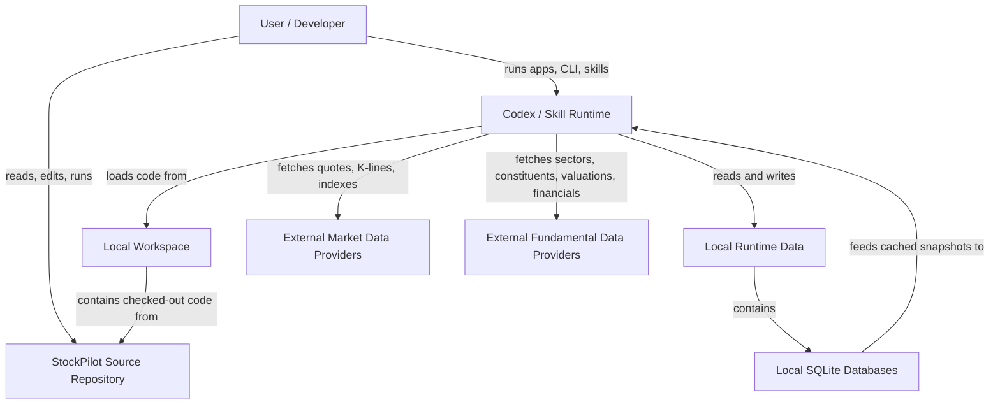

# StockPilot C4 System Context

This document captures the top-level system context for StockPilot using a
C4-style view expressed in Mermaid.

## Purpose

- Show the primary users and execution environments around StockPilot.
- Make the local workspace and runtime-data boundary explicit.
- Clarify which external providers the current codebase depends on.

## Context View

## System Boundary

StockPilot is the system inside the `Local Workspace`. It includes:

- reusable domain packages under `packages/`
- local Streamlit apps under `apps/`
- installable skill bundles under `skills/`
- documentation under `docs/`

The source repository is the code origin. The local workspace is the active
checkout used by developers, tests, CLI commands, and local app runs.

## External Actors And Systems

- `User / Developer`: reads docs, runs commands, uses Streamlit apps, and may
  install the skill into an agent runtime.
- `Codex / Skill Runtime`: executes the project code locally and mediates calls
  to apps, CLI modules, and skill scripts.
- `External Market Data Providers`: currently represent Tencent-backed quote/K-
  line access and similar market-data integrations.
- `External Fundamental Data Providers`: currently represent AkShare-backed
  public sources for sectors, constituents, valuations, and financial metrics.

## Data Boundary

- Local runtime data is not the same thing as the source repository.
- Runtime files such as `config/`, `db/`, and generated reports belong under a
  local runtime directory, not inside the installed skill bundle.
- SQLite is the current local persistence boundary for market and fundamental
  data caches.

## Notes

- The current repo is a local modular monolith, not a microservice deployment.
- External providers are dependencies of runtime workflows, not internal
  containers of the system.
