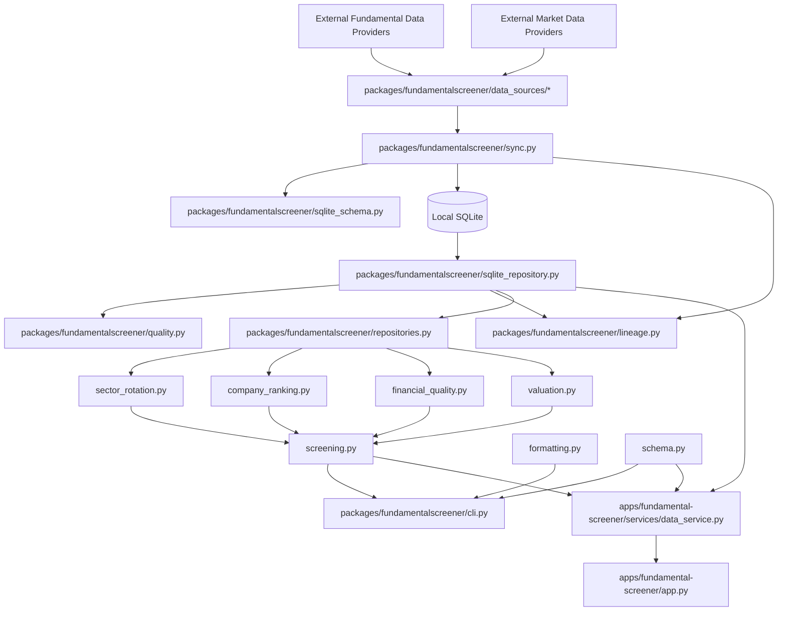

# StockPilot Component View: Fundamental Screener

This document captures the main components inside the current Fundamental
Screener architecture.

## Scope

This view focuses on:

- data source access and sync
- SQLite-backed repositories
- stable domain snapshot construction
- scoring and screening modules
- CLI and Streamlit consumption

## Component View

## Responsibilities

### Data Source And Sync Layer

- `data_sources/*` translate external providers into project-owned records.
- `sync.py` runs synchronization tasks and writes lineage-aware rows into
  SQLite.
- `sqlite_schema.py` defines and initializes the storage schema.

### Repository And Snapshot Layer

- `sqlite_repository.py` reads SQLite data and assembles a stable
  `MarketSnapshot`.
- `repositories.py` defines repository-facing domain structures and fixture
  loading paths.
- `quality.py` and `lineage.py` attach quality status, provenance, and refresh
  metadata to snapshots and sync results.

### Domain Calculation Layer

- `sector_rotation.py` computes sector-level signals and rankings.
- `company_ranking.py` computes sector-detail company ordering.
- `financial_quality.py` computes finance-oriented comparisons and flags.
- `valuation.py` computes valuation views and labels.
- `screening.py` combines domain outputs into a screening-oriented result.
- `schema.py` freezes the stable output contracts used by CLI and app layers.

### Delivery Adapters

- `cli.py` exposes machine-readable command output.
- `apps/fundamental-screener/services/data_service.py` is a thin frontend
  adapter that loads or refreshes snapshots and hides storage details from the
  UI.
- `apps/fundamental-screener/app.py` renders data for humans and should not
  duplicate scoring logic.

## Dependency Rules

- Real provider integrations stay behind `data_sources/*`.
- SQLite access stays behind repository and sync modules.
- Domain calculations depend on stable snapshots and contracts, not on
  Streamlit or provider SDKs.
- The Streamlit app and CLI consume domain outputs; they do not own the
  algorithms.
