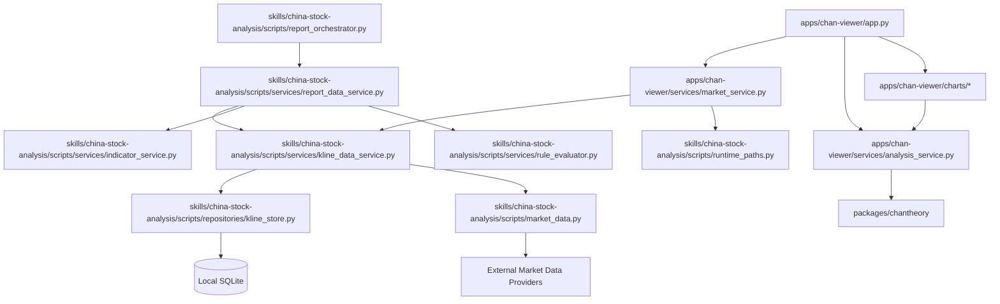

# StockPilot Component View: Market Data And K-Line Flows

This document focuses on the shared market-data path used by the Chan analysis
debug app and the daily report skill.

## Scope

This view covers:

- market-data provider access
- local SQLite-backed K-line storage
- the shared K-line service
- report orchestration
- Chan analysis invocation from the app side

## Component View

## Responsibilities

### UI And Delivery Components

- `apps/chan-viewer/app.py` collects user input and renders results.
- `market_service.py` adapts the app to the shared K-line service.
- `analysis_service.py` is a thin wrapper around `packages/chantheory`.
- `charts/*` turn stable analysis output into Plotly-friendly rendering.
- `report_orchestrator.py` coordinates data preparation, rendering, and report
  persistence for the skill flow.

### Shared Application Services

- `kline_data_service.py` is the key coordination point for K-line retrieval.
- It implements the local-first pattern: read from SQLite, fetch remotely if
  needed, write back, then return a normalized local result.
- `report_data_service.py` composes K-line access, indicators, and rule
  evaluation into structured report data.

### Infrastructure Components

- `market_data.py` owns remote market-provider integration.
- `kline_store.py` owns SQLite reads and writes for K-line persistence.
- `runtime_paths.py` resolves local runtime directories.

### Domain Component

- `packages/chantheory` owns analysis contracts and structure mapping.
- It does not fetch remote data or manage persistence itself.

## Dependency Rules

- UI components do not call remote providers directly.
- UI components do not talk to SQLite directly.
- `chantheory` does not depend on runtime paths, providers, or storage code.
- The shared K-line service is the convergence point between app and report
  flows.
