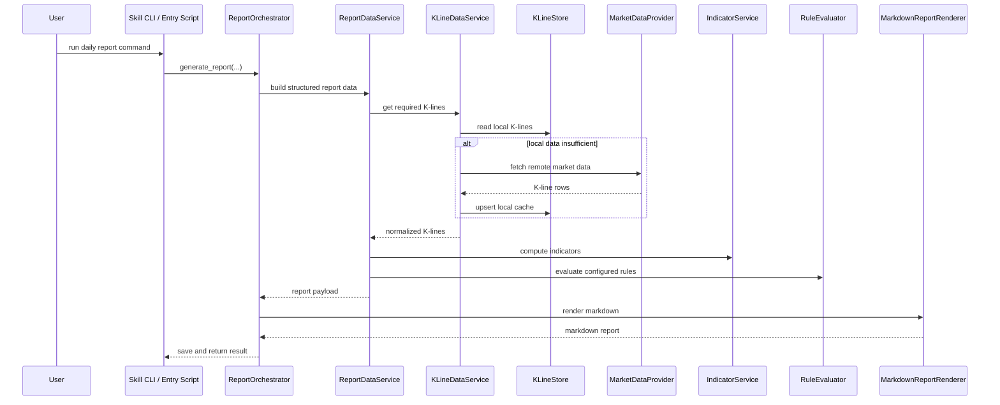
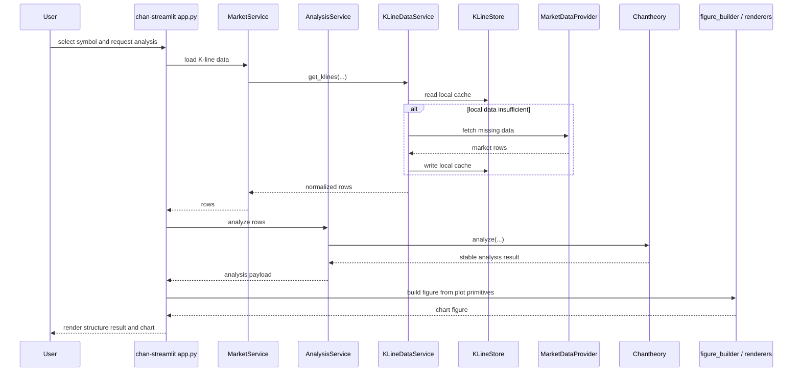
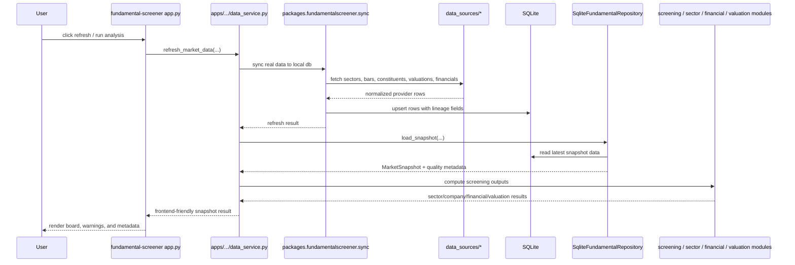
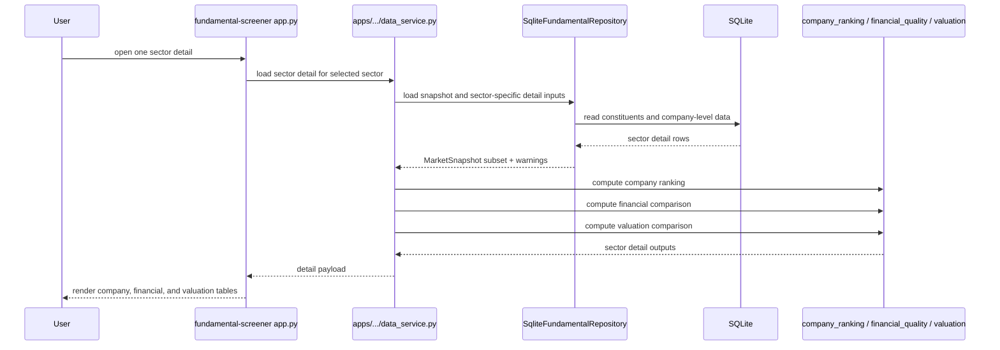

# StockPilot Architecture Sequences

This document records the main runtime sequences that the current repository is
designed to support.

## 1. Daily Report Generation

## 2. Chan Analysis In The Debug App

## 3. Fundamental Screener Refresh

## 4. Sector-Detail Lazy Loading

## Notes

- The Streamlit apps are consumers of domain results, not owners of the
  algorithms.
- Local SQLite is the persistence boundary for cached and synchronized runtime
  data.
- External providers are accessed through service or data-source adapters, not
  directly from UI code.
