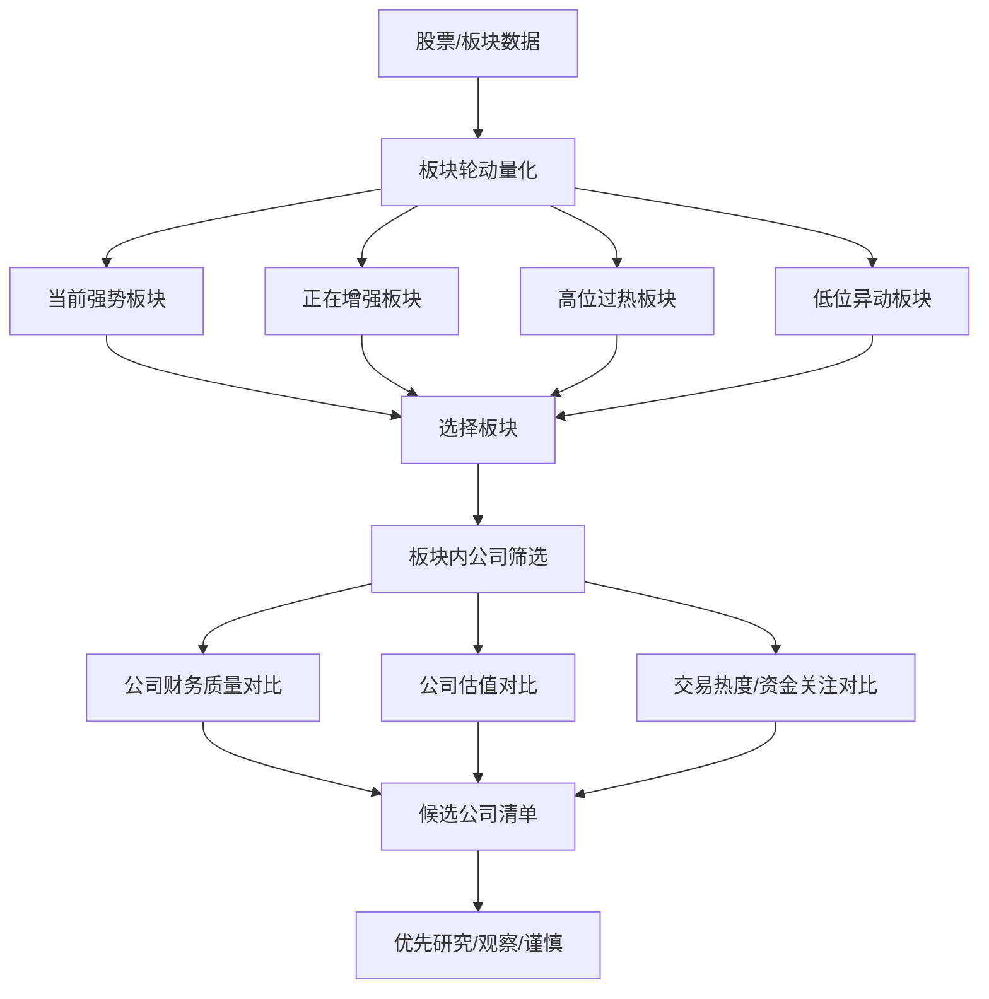
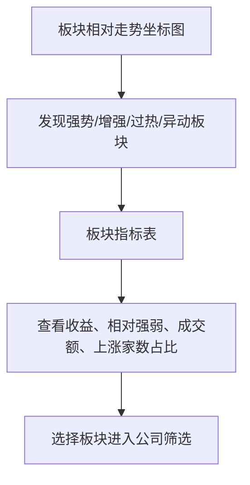
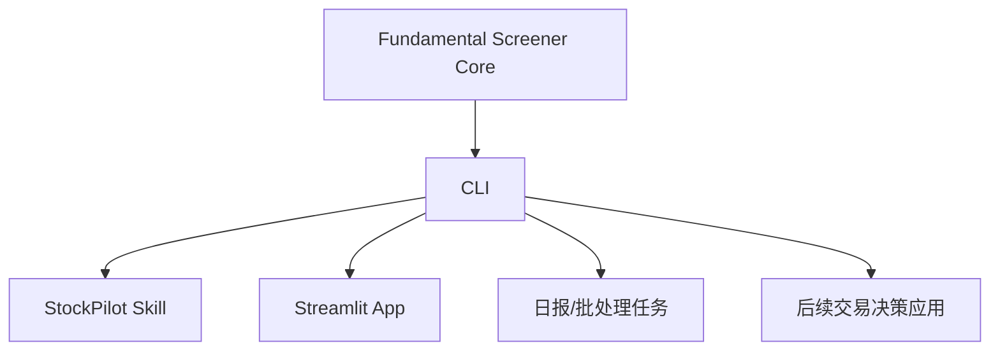

# Fundamental Screener MVP

## 1. MVP 定位

Fundamental Screener 是 StockPilot 的第一版基本面量化筛选应用。它的目标不是写研报，也不是直接给买卖建议，而是通过可量化指标帮助用户在板块和公司之间做横向比较，筛选优先研究对象，并识别明显的财务、估值和交易热度风险。

一句话定位：

```text
用板块轮动、公司排名、财务质量和估值指标，帮助用户从全市场缩小到值得研究的公司清单。
```

## 2. 明确不做什么

第一版必须保持克制，避免过早复杂化。

| 不做事项 | 原因 |
| --- | --- |
| 不写研报 | 产品目标是量化比较，不是生成长文分析 |
| 不输出投资建议 | 第一版只做筛选和排序，不做买入/卖出建议 |
| 不预测下一个板块 | 板块预测不稳定，先做当前状态识别 |
| 不做复杂三张表解读 | 先抽取关键指标做表格对比 |
| 不做 DCF | 假设敏感，第一版优先相对估值 |
| 不拼新闻故事 | 避免用非结构化叙事替代量化判断 |
| 不急着集成总 UI | 可以先做独立 Streamlit 应用验证价值 |

## 3. 要解决的问题

Fundamental Screener 第一版回答四个问题：

1. 当前哪些板块值得关注？
2. 这些板块内部哪些公司值得优先研究？
3. 这些公司财务质量如何，谁更健康？
4. 这些公司估值是否合理，谁存在明显高估或低估？

## 4. 产品流程



## 5. 模块一：板块轮动量化

板块轮动模块只识别当前状态，不预测未来板块。

### 5.1 板块状态分类

| 状态 | 含义 | 典型特征 |
| --- | --- | --- |
| 当前强势 | 已经明显跑赢市场，热度高 | 短中期涨幅靠前，相对大盘强，成交放大 |
| 正在增强 | 排名和成交正在抬升 | 近 5/10 日改善明显，资金关注上升 |
| 高位过热 | 已强势较久，短期风险上升 | 涨幅分位高，成交拥挤，短期涨幅过大 |
| 低位异动 | 长期不强但近期出现变化 | 低位放量、短期相对强度改善 |

### 5.2 板块指标定义

| 指标 | 说明 | 用途 |
| --- | --- | --- |
| 近 1 日涨跌幅 | 板块当日表现 | 识别短期热点 |
| 近 5 日涨跌幅 | 一周强弱 | 识别短期持续性 |
| 近 20 日涨跌幅 | 月度强弱 | 判断中期趋势 |
| 近 60 日涨跌幅 | 季度强弱 | 判断是否处于较大周期 |
| 相对大盘收益 | 板块区间收益 - 基准指数区间收益，是正/负百分比值 | 判断是否跑赢或跑输市场 |
| 成交额变化 | 当前成交额相对过去均值变化 | 判断资金关注 |
| 成交额市场占比 | 板块成交额 / 全市场成交额 | 判断市场拥挤度 |
| 上涨家数占比 | 板块内上涨公司比例 | 判断板块广度 |
| 创新高公司数 | 板块内新高股票数量 | 判断强势扩散 |
| 强弱排名变化 | 当前排名相对过去排名变化 | 判断是否正在增强 |

其中“相对大盘收益”不是布尔值，而是一个可以为正也可以为负的百分比值：

```text
相对大盘收益 = 板块区间涨跌幅 - 基准指数区间涨跌幅

示例：
板块近 20 日涨幅 = 12%
沪深 300 近 20 日涨幅 = 5%
相对大盘收益 = +7%
```

### 5.3 板块轮动展示

板块轮动展示由上方走势图和下方指标结果表组成。走势图负责建立直觉，指标表负责解释量化原因。

```text
上方：板块相对走势坐标图
下方：板块指标结果表
```

#### 5.3.1 板块相对走势坐标图

板块轮动页面应优先提供一张坐标走势图，把所有板块的阶段走势放在同一张图中，并叠加大盘基准走势线。图的作用是先让用户一眼看出哪些板块持续跑赢、哪些板块刚开始抬升、哪些板块高位回落，再通过下方指标表查看具体数字。

第一版建议使用归一化收益曲线：

```text
纵轴：区间累计收益，或以起始日 = 100 的归一化指数
横轴：交易日期
曲线：各板块走势线 + 大盘基准走势线
```

建议交互：

| 功能 | 说明 |
| --- | --- |
| 时间窗口 | 支持 5 日、20 日、60 日、120 日切换 |
| 基准线 | 默认显示沪深 300 或中证全指 |
| 板块筛选 | 默认显示 Top N 板块，允许勾选/取消 |
| 高亮状态 | 当前强势、正在增强、高位过热、低位异动用不同颜色或标记 |
| 鼠标悬停 | 显示日期、板块收益、相对基准收益、成交额变化 |
| 点击板块 | 下方指标表和公司筛选表同步切换到该板块 |

图表下方继续展示板块指标表。图负责回答“走势关系是否清楚”，表负责回答“为什么这样分类”。



第一版图表不做预测，只展示历史和当前状态。避免用曲线外推暗示未来板块。

#### 5.3.2 板块指标结果表

板块指标结果表是 5.2 指标定义的计算结果展示，不是一个新的分析模块。它应和上方走势图联动：点击走势图中的板块，表格高亮对应行；点击表格中的板块，走势图高亮对应曲线。

| 板块 | 近 1 日 | 近 5 日 | 近 20 日 | 近 60 日 | 相对大盘 | 成交额变化 | 上涨家数占比 | 强弱排名变化 | 状态 |
| --- | ---: | ---: | ---: | ---: | ---: | ---: | ---: | ---: | --- |
| 半导体 | 2.1% | 8.4% | 15.2% | 22.3% | 6.8% | 35% | 78% | 5 | 当前强势 |
| 工程机械 | 0.8% | 4.2% | 6.5% | 8.1% | 2.1% | 18% | 62% | 12 | 正在增强 |

排序规则：

| 列 | 排序规则 |
| --- | --- |
| 近 1 日 | 默认排序列，按涨跌幅从高到低排序 |
| 近 5 日 | 点击后按近 5 日涨跌幅从高到低排序 |
| 近 20 日 | 点击后按近 20 日涨跌幅从高到低排序 |
| 近 60 日 | 点击后按近 60 日涨跌幅从高到低排序 |
| 相对大盘 | 点击后按相对大盘收益从高到低排序 |
| 成交额变化 | 点击后按成交额变化从高到低排序 |
| 上涨家数占比 | 点击后按上涨家数占比从高到低排序 |
| 强弱排名变化 | 展示为辅助信息，默认不作为主要排序列 |
| 状态 | 展示为标签，默认不作为主要排序列 |

默认使用“近 1 日涨跌幅”排序。用户点击近 5 日、近 20 日、近 60 日、相对大盘、成交额变化、上涨家数占比等列时，应立即切换排序依据。

### 5.4 板块状态与评分规则

板块评分用于排序，不用于绝对判断。

```text
板块强度分 =
  短期收益分 * 25%
+ 中期收益分 * 20%
+ 相对大盘强弱分 * 25%
+ 成交额变化分 * 15%
+ 板块广度分 * 15%
```

状态标签建议用规则生成：

| 标签 | 示例规则 |
| --- | --- |
| 当前强势 | 近 5 日和近 20 日收益排名靠前，且相对大盘为正 |
| 正在增强 | 近 5 日排名明显上升，成交额变化为正 |
| 高位过热 | 近 20/60 日涨幅分位很高，短期涨幅过快 |
| 低位异动 | 近 60 日不强，但近 5 日强度和成交额明显改善 |

## 6. 模块二：板块内公司筛选

板块内公司筛选的目标是找出“值得先看”的公司，而不是给出最终买入结论。

### 6.1 公司分类

同一板块内，Top 公司不应只给一个榜单，而应按类型展示。

| 类型 | 含义 | 量化依据 |
| --- | --- | --- |
| 龙头代表 | 行业地位和规模更突出 | 市值、营收、净利润、行业排名 |
| 资金关注 | 当前市场交易关注度高 | 成交额、换手率、相对强弱、涨幅排名 |
| 财务质量较好 | 财务指标更健康 | ROE、毛利率、现金流、负债、成长 |
| 估值相对合理 | 估值没有明显透支 | PE/PB/PS 分位、同行比较、PEG |

### 6.2 公司综合评分

第一版公司综合分用于板块内部排序。

```text
公司综合分 =
  龙头/规模分 * 20%
+ 资金关注分 * 20%
+ 财务质量分 * 35%
+ 估值合理性分 * 25%
```

评分权重应允许后续在配置中调整。

### 6.3 板块内公司排名表

| 公司 | 市值 | 成交额 | 换手率 | 板块内涨幅排名 | ROE | 营收增速 | 净利增速 | 现金流质量 | PE 分位 | 综合分 |
| --- | ---: | ---: | ---: | ---: | ---: | ---: | ---: | ---: | ---: | ---: |
| A 公司 | 1200 亿 | 35 亿 | 3.2% | 5 | 14% | 18% | 25% | 1.2 | 45% | 82 |
| B 公司 | 800 亿 | 28 亿 | 4.1% | 2 | 7% | 5% | -12% | 0.4 | 30% | 61 |
| C 公司 | 500 亿 | 12 亿 | 1.8% | 14 | 16% | 22% | 19% | 0.9 | 80% | 76 |

## 7. 模块三：财务质量横向对比

三张表分析第一版不做复杂文字解读，而是抽取关键指标做横向表格比较。

### 7.1 财务质量指标

| 维度 | 指标 | 来源 | 含义 |
| --- | --- | --- | --- |
| 盈利能力 | 毛利率 | 利润表 | 产品或服务赚钱能力 |
| 盈利能力 | 净利率 | 利润表 | 最终利润转化能力 |
| 盈利能力 | ROE | 利润表 + 资产负债表 | 股东权益回报 |
| 成长能力 | 营收同比 | 利润表 | 收入增长情况 |
| 成长能力 | 净利润同比 | 利润表 | 利润增长情况 |
| 成长能力 | 扣非净利润同比 | 利润表 | 主业利润增长情况 |
| 现金流质量 | 经营现金流/净利润 | 现金流量表 + 利润表 | 利润含金量 |
| 现金流质量 | 自由现金流 | 现金流量表 | 可自由支配现金创造能力 |
| 偿债能力 | 资产负债率 | 资产负债表 | 杠杆压力 |
| 偿债能力 | 有息负债率 | 资产负债表 | 真实债务压力 |
| 运营效率 | 应收账款同比 | 资产负债表 | 回款风险 |
| 运营效率 | 存货同比 | 资产负债表 | 库存和减值风险 |

### 7.2 财务质量对比表

| 公司 | 营收同比 | 净利润同比 | 毛利率 | 净利率 | ROE | 经营现金流/净利润 | 资产负债率 | 应收账款同比 | 存货同比 | 财务质量分 |
| --- | ---: | ---: | ---: | ---: | ---: | ---: | ---: | ---: | ---: | ---: |
| A 公司 | 18% | 25% | 36% | 12% | 14% | 1.2 | 42% | 10% | 8% | 79 |
| B 公司 | 5% | -12% | 28% | 6% | 7% | 0.4 | 68% | 35% | 40% | 43 |
| C 公司 | 22% | 19% | 41% | 15% | 16% | 0.9 | 38% | 12% | 18% | 77 |

### 7.3 财务质量评分

```text
财务质量分 =
  盈利能力分 * 25%
+ 成长能力分 * 25%
+ 现金流质量分 * 25%
+ 偿债能力分 * 15%
+ 运营效率分 * 10%
```

### 7.4 财务异常检测

第一版至少识别以下异常：

| 异常 | 示例规则 | 风险含义 |
| --- | --- | --- |
| 利润增长但现金流差 | 净利润同比为正，经营现金流/净利润 < 0.5 | 利润含金量不足 |
| 应收增长过快 | 应收账款同比显著高于营收同比 | 回款压力上升 |
| 存货增长过快 | 存货同比显著高于营收同比 | 库存积压风险 |
| 负债偏高 | 资产负债率高于行业分位阈值 | 财务杠杆压力 |
| 毛利率下滑 | 毛利率同比明显下降 | 竞争加剧或成本压力 |
| 扣非利润弱于净利润 | 扣非净利润增速显著低于净利润增速 | 主业质量不足 |

异常输出示例：

| 公司 | 异常类型 | 指标表现 | 风险等级 |
| --- | --- | --- | --- |
| B 公司 | 现金流弱 | 经营现金流/净利润 = 0.4 | 中 |
| B 公司 | 存货增长过快 | 存货同比 40%，营收同比 5% | 高 |

## 8. 模块四：估值横向对比

估值模块第一版做相对估值，不做 DCF。

### 8.1 估值指标

| 指标 | 适用场景 | 注意事项 |
| --- | --- | --- |
| PE | 盈利稳定公司 | 周期股利润高点会误导 |
| PB | 重资产、金融、资源类公司 | 要关注资产质量 |
| PS | 高增长但利润波动公司 | 要结合利润率趋势 |
| PEG | 成长股 | 增速预测不能过度乐观 |
| 股息率 | 红利和低波公司 | 要看分红可持续性 |
| PE 历史分位 | 成熟公司 | 历史区间可能变化 |
| PB 历史分位 | 重资产公司 | 需结合净资产质量 |
| 行业估值分位 | 横向比较 | 公司之间商业模式要可比 |

### 8.2 估值对比表

| 公司 | PE | PB | PS | PEG | 股息率 | PE 历史分位 | PB 历史分位 | 行业估值位置 | 估值分 | 估值标签 |
| --- | ---: | ---: | ---: | ---: | ---: | ---: | ---: | --- | ---: | --- |
| A 公司 | 28 | 3.2 | 4.5 | 1.1 | 1.2% | 45% | 52% | 中位 | 72 | 合理 |
| B 公司 | 15 | 1.8 | 2.1 | - | 2.8% | 30% | 35% | 偏低 | 68 | 偏低但增长弱 |
| C 公司 | 45 | 6.0 | 8.5 | 1.8 | 0.5% | 80% | 76% | 偏高 | 48 | 偏贵 |

### 8.3 估值标签

| 标签 | 含义 |
| --- | --- |
| 偏低但需确认质量 | 估值低，但财务或成长不一定好 |
| 合理 | 当前估值与质量、成长基本匹配 |
| 偏贵但成长可支撑 | 估值高，但成长和财务质量较强 |
| 明显偏贵 | 估值分位高，成长或质量无法支撑 |
| 不适用 | 指标对该行业或公司不适合 |

### 8.4 估值评分

```text
估值合理性分 =
  历史估值分位分 * 35%
+ 行业相对估值分 * 35%
+ 成长匹配分 * 20%
+ 股息/现金回报分 * 10%
```

## 9. CLI 与应用形态

Fundamental Screener 的核心能力应优先设计成可复用 CLI，供 StockPilot skill、日报任务、自动化任务和 Streamlit 页面共同调用。Streamlit 只是一个交互界面，不应承载核心计算逻辑。



### 9.1 CLI 设计原则

| 原则 | 说明 |
| --- | --- |
| 核心逻辑与 UI 分离 | 板块计算、公司筛选、财务评分、估值评分都在 core/CLI 层完成 |
| 输出结构化数据 | 默认输出 JSON，方便 skill 和其他程序调用 |
| 支持表格输出 | CLI 可选输出 Markdown/CSV，方便人工查看 |
| 参数显式 | 日期、股票池、板块分类、基准指数、排序列、Top N 等通过参数传入 |
| 可批处理 | 支持一次性输出多个板块和公司筛选结果 |
| 可追溯 | 分数必须包含原始指标，不能只输出总分 |

### 9.2 CLI 命令建议

第一版可以提供以下命令：

```text
stockpilot fundamental sectors
stockpilot fundamental sector-detail
stockpilot fundamental companies
stockpilot fundamental financials
stockpilot fundamental valuations
stockpilot fundamental screen
```

命令职责：

| 命令 | 作用 |
| --- | --- |
| `fundamental sectors` | 输出板块轮动指标结果 |
| `fundamental sector-detail` | 输出单个板块走势、指标和状态 |
| `fundamental companies` | 输出指定板块内公司排名 |
| `fundamental financials` | 输出指定公司列表的财务质量对比 |
| `fundamental valuations` | 输出指定公司列表的估值对比 |
| `fundamental screen` | 一次性输出板块、公司、财务、估值和候选分组 |

示例：

```bash
stockpilot fundamental sectors \
  --date 2026-06-19 \
  --benchmark hs300 \
  --periods 1,5,20,60 \
  --sort return_1d \
  --top 20 \
  --format json
```

```bash
stockpilot fundamental companies \
  --sector 半导体 \
  --date 2026-06-19 \
  --sort combined_score \
  --top 10 \
  --format markdown
```

```bash
stockpilot fundamental screen \
  --date 2026-06-19 \
  --benchmark hs300 \
  --sector-top 10 \
  --company-top 5 \
  --format json
```

### 9.3 CLI 输出格式

CLI 默认输出 JSON，给 skill 调用时优先使用 JSON。人工调试时可以使用 Markdown 或 CSV。

| 格式 | 用途 |
| --- | --- |
| JSON | skill 调用、自动化任务、Streamlit 数据源 |
| Markdown | 终端查看、轻量记录 |
| CSV | 导出到表格工具继续分析 |

`fundamental screen` JSON 输出建议包含：

```yaml
fundamental_screen:
  date: "YYYY-MM-DD"
  benchmark: "hs300"
  sectors: []
  selected_sectors:
    - sector_id: ""
      sector_name: ""
      state: ""
      metrics: {}
      companies: []
  candidates:
    priority: []
    watch: []
    cautious: []
  generated_at: ""
```

### 9.4 Skill 调用场景

CLI 应支持 StockPilot skill 在以下场景调用：

| 场景 | 调用方式 |
| --- | --- |
| 自选股日报 | 拉取自选股所属板块状态、板块排名、公司财务和估值摘要 |
| 持仓股票报告 | 判断持仓所在板块是否强势、公司财务和估值是否恶化 |
| 板块筛选 | 输出当前强势、正在增强、高位过热、低位异动板块 |
| 公司筛选 | 输出指定板块 Top 公司和候选分组 |
| 后续交易应用 | 为买入、加仓、减仓、清仓模块提供基本面量化输入 |

Skill 不应重复实现计算逻辑，只负责调用 CLI、解释结构化输出、结合用户上下文做展示。

## 10. MVP 页面设计

第一版建议做独立 Streamlit 应用：

```text
apps/fundamental-screener/app.py
```

页面目标是数据工作台，不是报告页面。

Streamlit 应调用 CLI 或 core 层结果，不直接实现板块和公司评分算法。

### 10.1 侧边栏

| 控件 | 说明 |
| --- | --- |
| 分析日期 | 默认最近交易日 |
| 股票池范围 | 全市场、自选股、持仓股、指定板块 |
| 板块分类 | 申万行业、中信行业、概念板块等 |
| 基准指数 | 沪深 300、中证全指、上证指数 |
| 最小成交额 | 排除流动性差股票 |
| 最小市值 | 排除过小公司 |
| 排除规则 | ST、退市风险、数据缺失 |
| 权重配置 | 板块、财务、估值和资金关注权重 |

### 10.2 主区域

页面建议按以下顺序：

1. 板块相对走势坐标图。
2. 板块指标结果表。
3. 板块状态分布。
4. 选择板块后的公司排名表。
5. 财务质量横向对比表。
6. 估值横向对比表。
7. 财务异常/估值风险表。
8. 候选公司清单。

### 10.3 候选清单分组

| 分组 | 含义 |
| --- | --- |
| 优先研究 | 板块强、公司综合分高、财务和估值没有明显硬伤 |
| 继续观察 | 有亮点但存在估值、现金流或趋势问题 |
| 谨慎/排除 | 财务异常明显、估值过高或流动性不足 |

## 11. 数据结构建议

### 11.1 板块结果

```yaml
sector_rotation:
  date: "YYYY-MM-DD"
  benchmark: "沪深300"
  sectors:
    - sector_id: ""
      sector_name: ""
      return_1d: 0.0
      return_5d: 0.0
      return_20d: 0.0
      return_60d: 0.0
      relative_return_20d: 0.0
      turnover_amount_change: 0.0
      market_turnover_share: 0.0
      rising_stock_ratio: 0.0
      rank_change_5d: 0
      sector_score: 0
      state: "strong | improving | overheated | low_level_active | neutral"
```

### 11.2 公司筛选结果

```yaml
company_screening:
  date: "YYYY-MM-DD"
  sector_id: ""
  sector_name: ""
  companies:
    - code: ""
      name: ""
      market_cap: 0.0
      turnover_amount: 0.0
      turnover_rate: 0.0
      sector_return_rank: 0
      leader_score: 0
      attention_score: 0
      financial_quality_score: 0
      valuation_score: 0
      combined_score: 0
      group: "priority | watch | cautious"
      flags:
        - ""
```

### 11.3 财务质量结果

```yaml
financial_quality:
  code: ""
  name: ""
  revenue_yoy: 0.0
  net_profit_yoy: 0.0
  gross_margin: 0.0
  net_margin: 0.0
  roe: 0.0
  operating_cashflow_to_profit: 0.0
  debt_to_asset: 0.0
  accounts_receivable_yoy: 0.0
  inventory_yoy: 0.0
  score: 0
  abnormal_flags:
    - type: ""
      level: "low | medium | high"
      description: ""
```

### 11.4 估值结果

```yaml
valuation:
  code: ""
  name: ""
  pe: 0.0
  pb: 0.0
  ps: 0.0
  peg: 0.0
  dividend_yield: 0.0
  pe_percentile: 0.0
  pb_percentile: 0.0
  industry_valuation_position: "low | mid | high | unknown"
  score: 0
  label: "low_need_quality_check | fair | expensive_but_supported | expensive | not_applicable"
```

## 12. 评分等级

评分用于排序，不用于精确判断。页面上应同时展示原始指标和分数。

| 分数区间 | 等级 | 含义 |
| ---: | --- | --- |
| 85-100 | 优秀 | 明显优于多数可比对象 |
| 70-84 | 较好 | 具备优先研究价值 |
| 55-69 | 一般 | 有亮点但不足以优先 |
| 40-54 | 偏弱 | 存在明显短板 |
| 0-39 | 较差 | 暂不适合作为重点候选 |

## 13. 第一版验收标准

第一版完成后，至少应满足：

- 可以展示当前板块指标结果表。
- 可以展示板块相对走势坐标图，并叠加大盘基准走势线。
- 可以按状态筛选当前强势、正在增强、高位过热、低位异动板块。
- 可以选择一个板块，并列出板块内公司排名。
- 可以展示板块内公司财务质量横向对比表。
- 可以展示板块内公司估值横向对比表。
- 可以识别并展示基础财务异常。
- 可以输出优先研究、继续观察、谨慎/排除三个分组。
- 可以通过 CLI 输出 JSON，供 StockPilot skill 调用。
- Streamlit 页面和 skill 调用应复用同一套核心计算逻辑。
- 所有分数都能回溯到原始指标。
- 页面不生成长篇研报，不输出买入/卖出建议。

## 14. 后续扩展方向

MVP 验证有效后，再考虑以下扩展：

| 扩展 | 说明 |
| --- | --- |
| 接入自选股/持仓 | 对用户已有股票做板块和基本面排序 |
| 接入技术面结果 | 把 K 线、MACD、成交量、缠论结构作为辅助过滤 |
| 行业专属指标 | 不同行业使用不同财务和估值指标 |
| 历史回看 | 查看过去某个日期的板块和公司排名 |
| 指标权重配置 | 用户可以调整偏价值、偏成长、偏资金关注 |
| 导出观察池 | 将优先研究公司加入 StockPilot 观察池 |

## 15. 核心原则

Fundamental Screener 的第一原则是：

```text
用量化指标帮助判断公司价值，不用长文叙事替代判断。
```

第一版真正有价值的不是“结论写得完整”，而是：

- 哪个板块现在强。
- 哪个板块正在增强。
- 板块内哪些公司更值得先看。
- 哪些公司财务质量更好。
- 哪些公司估值更合理。
- 哪些公司存在明显异常或需要谨慎。

这些问题都应优先通过表格、排序、分位数、评分和异常标记来回答。
