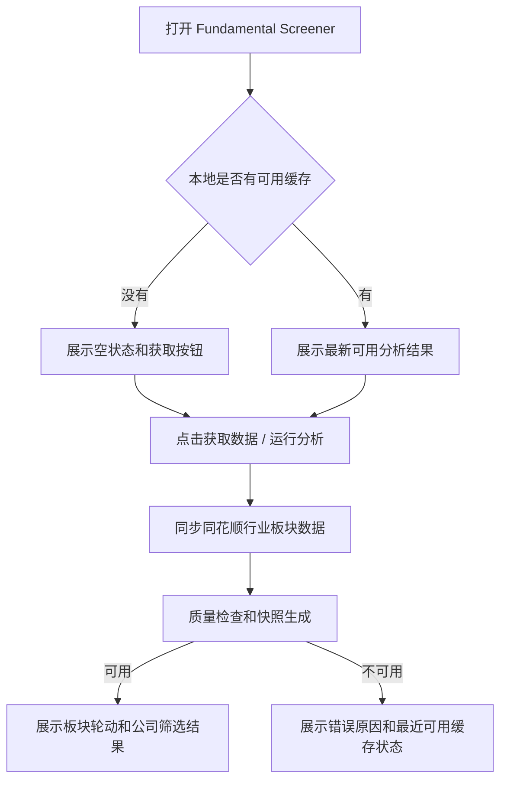

# Fundamental Screener Streamlit Frontend Plan

## 1. 目标

本文档只描述 `apps/fundamental-screener/` 这个小型 Streamlit 前端项目的产品功能和开发步骤。它不重新定义 Fundamental Screener 的算法、数据 schema、评分规则或数据治理表结构。

一句话目标：

```text
打开基本面量化工作台后，用户可以一键获取最新可用板块数据，并浏览“板块 -> 公司 -> 财务/估值/异常标记”的筛选结果。
```

## 2. 产品功能设计

### 2.1 用户定位

该页面面向股票研究和自选股筛选用户，不面向数据工程师。用户不应理解或操作 fixture、SQLite、数据库路径、CLI 参数、数据表结构等工程概念。

### 2.2 核心用户流程



### 2.3 页面应展示什么

第一版页面只需要完成一个工作台，不做 landing page。

页面结构：

| 区域 | 内容 |
| --- | --- |
| 顶部操作区 | `获取数据 / 运行分析` 按钮、分析日期、数据状态 |
| 信息卡 | 分析日期、数据截止日、基准、板块数、质量状态 |
| 板块走势图 | Top N 板块归一化走势 + 基准线 |
| 板块指标表 | 板块收益、相对基准、成交额变化、上涨家数占比、状态、评分 |
| 板块详情 | 点击板块后展示公司排名 |
| 财务/估值 Tabs | 财务质量对比、估值对比、异常 flags |
| 质量信息 | warnings / stale / degraded / invalid 的解释 |

### 2.4 页面不应展示什么

以下内容不能出现在用户界面：

| 不展示 | 原因 |
| --- | --- |
| `Fixture` 数据源选项 | fixture 只用于测试，不是产品功能 |
| fixture JSON 路径 | 用户不应编辑测试数据文件 |
| `SQLite` 数据源选项 | SQLite 是内部缓存实现，不是用户概念 |
| SQLite 数据库路径输入框 | 用户不应理解或填写数据库路径 |
| AkShare / 同花顺 / 东方财富内部接口细节 | 只展示“数据来源：同花顺行业板块”等可理解信息 |
| CLI 参数 | CLI 是工程入口，不是前端配置 |

### 2.5 侧边栏保留项

侧边栏只保留真实产品参数：

| 控件 | 默认值 | 说明 |
| --- | --- | --- |
| 显示语言 | 中文 | 只影响列名和枚举显示 |
| 分析日期 | 最新可用日期或今天 | 留空时使用最新可用交易日 |
| 板块排序字段 | `return_1d` 或配置默认值 | 影响板块表排序 |
| 板块 Top N | 10 | 控制走势图和板块表 |
| 公司 Top N | 5 | 控制板块内公司排名 |

### 2.6 数据状态展示

页面必须把数据状态翻译成用户能理解的提示：

| 状态 | 页面行为 |
| --- | --- |
| `ok` | 正常展示 |
| `degraded` | 展示结果，同时提示部分财务/估值缺失 |
| `stale` | 展示最近可用缓存，同时提示数据不是最新 |
| `invalid` | 不展示评分结果，展示阻断原因 |
| 无缓存 | 展示空状态，引导点击获取数据 |
| 网络失败 | 不清空旧结果；若有缓存则展示缓存和失败原因 |

### 2.7 默认数据源口径

根据本地实测，同花顺行业板块接口比东方财富行业板块接口更稳定、响应更快，更适合作为第一版产品默认源。

产品默认口径调整为：

| 角色 | 数据源 | 说明 |
| --- | --- | --- |
| 主源 | 同花顺行业板块 | 默认用于板块列表、板块行情、行业热度和上涨家数等板块层数据 |
| 备选源 | 东方财富行业板块 | 仅在同花顺不可用时作为开发对照 |
| 不使用 | fixture | 仅测试使用，不进入产品路径 |

注意：同花顺和东方财富都是自研行业分类，成分股不完全一致。不要把两个源的数据混写成同一个板块口径；必须通过 `classification_system` 或 `source_set` 区分，例如 `ths_industry` 与 `em_industry`。

## 3. 开发模块划分

### 3.1 `app.py`

职责：

- 负责 Streamlit 布局、控件、状态展示和表格/图表渲染。
- 只调用 `services/data_service.py` 的产品级函数。
- 不直接读取 fixture。
- 不直接读取或暴露 SQLite 路径。
- 不直接调用 AkShare、东方财富或腾讯接口。
- 不实现排序、评分、异常检测算法。

### 3.2 `services/data_service.py`

职责：

- 把前端动作转换成内部数据服务调用。
- 提供 `load_latest_snapshot()`：读取最新可用真实数据缓存。
- 提供 `refresh_market_data()`：同步数据并写入内部缓存。
- 提供 `load_or_refresh_snapshot()`：前端的一站式入口，可按按钮状态决定是否刷新。
- 继续封装 `build_sector_board()`、`build_sector_detail()` 等视图数据整理函数。

禁止：

- 不在 service 内复制 core 算法。
- 不让用户传入 fixture 路径或 SQLite 路径。
- fixture 相关函数只能作为测试辅助保留，不能被 `app.py` 的产品路径调用。

### 3.3 `packages/fundamentalscreener.sync`

职责：

- 继续负责真实数据同步。
- 优先使用同花顺行业板块数据源获取板块数据。
- 东方财富行业板块数据源只作为对照源。
- 初始化和更新内部 SQLite 缓存。
- 写入 `data_fetch_log`。

前端只通过 service 调用它，不直接暴露给用户。

### 3.4 `SqliteFundamentalRepository`

职责：

- 从内部缓存组装 `MarketSnapshot`。
- 透传 snapshot metadata、质量状态和质量问题。

前端只消费它的结果，不展示数据库路径。

### 3.5 测试

测试分两类：

| 类型 | 用途 |
| --- | --- |
| fixture tests | 验证 UI/core 调用边界，不依赖真实网络 |
| fake source SQLite tests | 验证真实数据路径的缓存、读取、质量状态和页面状态 |

fixture 只能在测试里出现。

## 4. 开发步骤

### Step 1：文档和 README 收敛

- [x] 新增本文档。
- [x] 更新 `apps/fundamental-screener/README.md`，删除“默认数据源是 fixture”的产品描述。
- [x] 在总开发计划中说明 Streamlit 前端按本文档执行。

### Step 2：数据服务产品化

- [ ] 在 `services/data_service.py` 增加内部默认缓存路径常量，建议为 `stockpilot/db/fundamental_data.sqlite`。
- [ ] 增加 `load_latest_snapshot()`，默认从内部缓存读取最新可用数据。
- [ ] 增加 `refresh_market_data()`，内部调用 `sync_all()` 和同花顺行业板块数据源。
- [ ] 保留东方财富行业板块数据源作为对照源，但不作为默认产品源。
- [ ] 增加统一返回结构，例如 `FrontendSnapshotResult`，包含：
  - `snapshot`
  - `metadata`
  - `quality_report`
  - `status`
  - `message`
  - `refresh_result`
- [ ] 保留 `load_snapshot(fixture_path)` 作为测试辅助，但不要在产品路径调用。

### Step 3：Streamlit UI 去工程化

- [ ] 删除数据源 radio。
- [ ] 删除 fixture JSON 路径输入框。
- [ ] 删除 SQLite 数据库路径输入框。
- [ ] 增加顶部或侧边栏按钮：`获取数据 / 运行分析`。
- [ ] 页面启动时先尝试读取最新缓存。
- [ ] 无缓存时展示空状态，不展示工程错误。
- [ ] 点击按钮后刷新数据，刷新成功后展示结果。
- [ ] 刷新失败但有旧缓存时展示旧缓存和失败提示。

### Step 4：数据状态和质量提示

- [ ] 顶部展示数据质量：`ok | degraded | stale | invalid`。
- [ ] 展示数据截止日、来源、采集批次。
- [ ] `degraded` / `stale` 用 warning 展示，但允许浏览。
- [ ] `invalid` 用 error 展示，并阻断评分结果。
- [ ] 质量问题放到折叠面板，不占据主要工作区。

### Step 5：前端测试更新

- [ ] 更新 `test_app.py` 的 streamlit stub，断言页面不渲染 `Fixture` / `SQLite` / `数据库路径`。
- [ ] 用 fake source 或 monkeypatch 模拟刷新成功。
- [ ] 用 fake source 或 monkeypatch 模拟刷新失败但旧缓存可用。
- [ ] 保留 fixture smoke 测试，但测试名称明确标注为 internal fixture path。

### Step 6：运行验证

必须运行：

```bash
python -m unittest discover -s apps/fundamental-screener/tests -p 'test_*.py'
```

建议运行：

```bash
python -m unittest packages.fundamentalscreener.tests.test_sync
python -m unittest packages.fundamentalscreener.tests.test_sqlite_repository
python -m unittest packages.fundamentalscreener.tests.test_quality
```

手动 smoke：

```bash
streamlit run apps/fundamental-screener/app.py
```

## 5. 验收标准

- [ ] 用户界面不出现 fixture、SQLite、数据库路径。
- [ ] 用户可以点击 `获取数据 / 运行分析` 获取真实板块数据。
- [ ] 默认真实板块数据来自同花顺行业板块，东方财富只作为对照源。
- [ ] 有缓存时，打开页面能直接看到最新可用结果。
- [ ] 无缓存时，页面有清楚的空状态和获取按钮。
- [ ] 网络失败不会破坏已有缓存。
- [ ] 页面展示数据日期、数据截止、来源和质量状态。
- [ ] 板块走势图、板块表、公司排名、财务/估值/flags 均来自 core/repository。
- [ ] Streamlit 中没有重复排序、评分或异常检测算法。
- [ ] app 测试不依赖真实网络。

## 6. 给执行模型的约束

执行代码编写时必须遵守：

- 先改 `services/data_service.py`，再改 `app.py`。
- 不要把 fixture 作为产品数据源。
- 不要让用户填写 SQLite 路径。
- 不要在 Streamlit 中直接调用 AkShare。
- 不要把东方财富行业板块继续写死为唯一默认源。
- 不要在 Streamlit 中复制 core 算法。
- 不要新增复杂前端框架；继续使用 Streamlit。
- 不要做登录、权限、部署、日报集成、skill 集成。
- 不要改评分规则。
