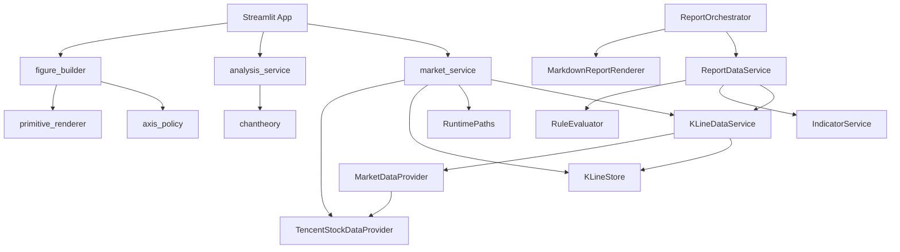
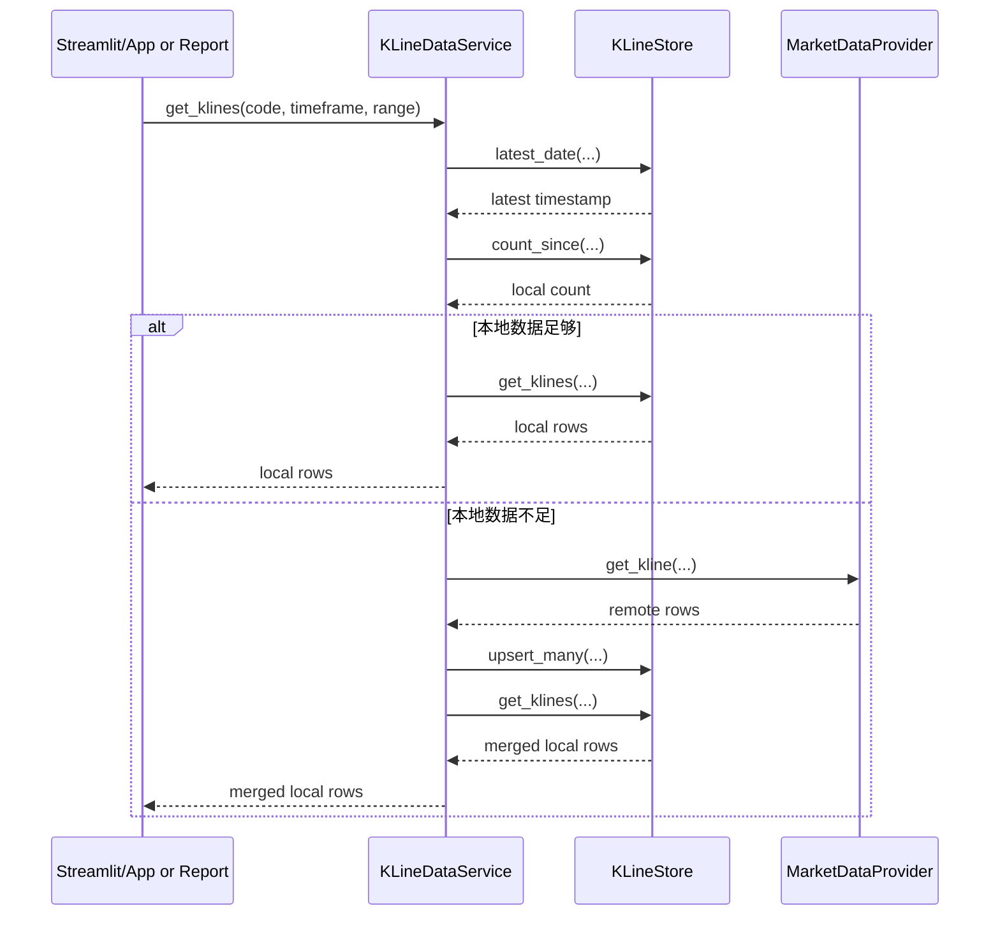
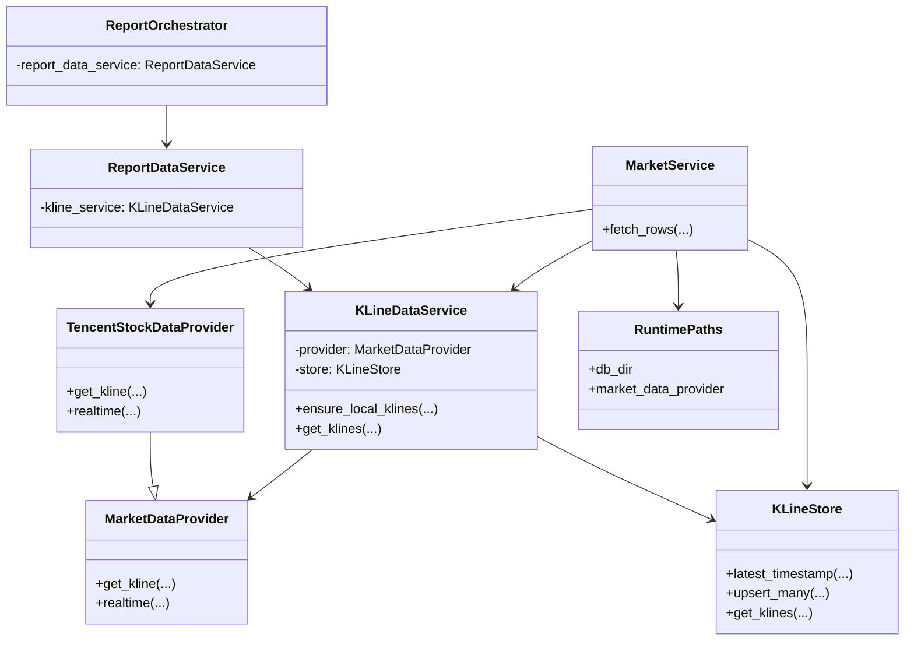

# 软件技术文档

## 1. 文档目的

本文档描述 `stockpilotskills` 当前已落地的软件架构，重点覆盖以下两个重构热点：

- `apps/chan-streamlit`
- `skills/china-stock-analysis/scripts`

文档目标：

- 说明当前模块边界与依赖方向；
- 解释共享 K 线数据链路的责任划分；
- 记录本次重构后形成的高内聚、低耦合结构；
- 为后续维护、扩展与继续收口提供统一技术基线。

## 2. 架构目标

本轮重构围绕以下原则展开：

- 表现层、应用服务层、领域分析层、基础设施层分离；
- 远端行情获取、本地 SQLite 持久化、数据同步策略三者解耦；
- `chantheory` 保持分析内核定位，不承担行情抓取和存储职责；
- App 侧与报告侧复用统一 K 线数据流程；
- 对外入口尽量兼容，降低改造期间的破坏性。

## 3. 当前目录角色

### 3.1 顶层分层

- `packages/chantheory`
  - 稳定分析接口层。
  - 对输入 K 线进行缠论分析，输出结构化结果与绘图原语。

- `apps/chan-streamlit`
  - 调试与验证型前端应用。
  - 负责参数输入、状态管理、结果展示。

- `skills/china-stock-analysis`
  - 报告生成与数据处理链路。
  - 负责共享行情数据服务、报告数据组装、Markdown 输出。

### 3.2 关键模块

- `skills/china-stock-analysis/scripts/market_data.py`
  - 远端行情 Provider 层。
  - 定义 `MarketDataProvider` 与 `TencentStockDataProvider`。

- `skills/china-stock-analysis/scripts/repositories/kline_store.py`
  - 本地 SQLite 仓储层。
  - 只负责 K 线读写，不负责联网补齐策略。

- `skills/china-stock-analysis/scripts/services/kline_data_service.py`
  - 统一 K 线数据处理服务。
  - 负责“本地优先 -> 本地不足则远端拉取 -> 写回本地 -> 再统一读取”。

- `skills/china-stock-analysis/scripts/services/report_data_service.py`
  - 报告数据装配服务。
  - 调用共享 K 线服务、指标服务、规则评估服务，输出结构化报告数据。

- `skills/china-stock-analysis/scripts/report_orchestrator.py`
  - 报告编排层。
  - 组织运行时、数据准备、渲染与保存，不下沉到 SQLite 读写细节。

- `apps/chan-streamlit/services/market_service.py`
  - App 侧行情访问服务。
  - 复用共享 `KLineDataService`，不重复实现腾讯抓取逻辑。

- `apps/chan-streamlit/services/analysis_service.py`
  - App 侧分析调用适配层。
  - 对 `chantheory` 做薄封装。

- `apps/chan-streamlit/charts/*`
  - 图表构建与坐标轴策略层。
  - 将 Figure 装配、坐标规则、Plotly 原语映射拆分。

## 4. 分层设计

### 4.1 表现层

表现层包含以下模块：

- `apps/chan-streamlit/app.py`
- `apps/chan-streamlit/ui_text.py`
- `apps/chan-streamlit/charts/figure_builder.py`
- `apps/chan-streamlit/charts/axis_policy.py`
- `apps/chan-streamlit/charts/primitive_renderer.py`
- `skills/china-stock-analysis/scripts/renderers/markdown_report_renderer.py`

职责特点：

- 接收用户输入或上层数据；
- 负责页面装配、文案格式化、图表和 Markdown 输出；
- 不直接访问远端 Provider；
- 不直接操作 SQLite。

### 4.2 应用服务层

应用服务层包含以下模块：

- `apps/chan-streamlit/services/market_service.py`
- `apps/chan-streamlit/services/analysis_service.py`
- `skills/china-stock-analysis/scripts/services/kline_data_service.py`
- `skills/china-stock-analysis/scripts/services/report_data_service.py`
- `skills/china-stock-analysis/scripts/services/indicator_service.py`
- `skills/china-stock-analysis/scripts/services/rule_evaluator.py`
- `skills/china-stock-analysis/scripts/report_orchestrator.py`

职责特点：

- 组织跨模块调用；
- 封装业务流程；
- 将表现层与基础设施层隔离；
- 保持流程语义集中，避免散落到 UI 或脚本入口中。

### 4.3 领域分析层

领域分析层当前以 `packages/chantheory` 为核心，职责为：

- 接收标准化 K 线序列；
- 执行缠论分析；
- 返回摘要、告警、图形原语等稳定结构；
- 不感知数据来源，也不管理缓存或持久化。

### 4.4 基础设施层

基础设施层包含以下模块：

- `skills/china-stock-analysis/scripts/market_data.py`
- `skills/china-stock-analysis/scripts/repositories/kline_store.py`
- `skills/china-stock-analysis/scripts/runtime_paths.py`

职责特点：

- 远端数据访问；
- 本地数据库访问；
- 运行路径、配置目录等环境支撑；
- 不承载业务编排。

## 5. 核心职责划分

### 5.1 `market_data.py`

职责：

- 定义远端行情能力接口；
- 提供腾讯财经实现；
- 负责日线与分钟线的在线获取。

不负责：

- SQLite 存储；
- 本地是否足够的判断；
- 报告编排；
- UI 状态管理。

### 5.2 `kline_store.py`

职责：

- 管理本地 `klines` 表与兼容性数据表；
- 提供 `latest_timestamp(...)`、`upsert_many(...)`、`get_klines(...)` 等仓储接口；
- 屏蔽 SQLite 细节。

不负责：

- 何时联网拉取；
- 拉取失败后的策略判断；
- 业务规则计算。

### 5.3 `kline_data_service.py`

职责：

- 统一封装 K 线同步策略；
- 优先命中本地 SQLite；
- 本地不足时调用 `market_data.py` 获取；
- 将远端结果回写 `kline_store.py`；
- 再从本地统一读取返回给上层；
- 支持日线与分钟线共享同一条数据通路。

这是本轮重构最关键的责任收口点。

### 5.4 `report_orchestrator.py`

职责：

- 初始化运行时对象；
- 调用 `report_data_service.py` 获取结构化数据；
- 调用 `markdown_report_renderer.py` 渲染报告；
- 负责报告保存。

不负责：

- 直接读写 SQLite；
- 编写 K 线同步策略；
- 指标计算细节。

### 5.5 `app.py`

职责：

- 页面入口；
- 用户输入与会话状态管理；
- 调用 `market_service.py` 获取 K 线；
- 调用 `analysis_service.py` 触发分析；
- 调用 `figure_builder.py` 渲染图表。

不负责：

- 直接联网抓腾讯数据；
- 直接操作 SQLite；
- 直接实现复杂图表原语映射与坐标轴策略。

## 6. UML 视角说明

### 6.1 组件图

说明：

- App 与报告链路在 K 线获取上已经收口到同一个 `KLineDataService`；
- `chantheory` 仅被应用服务层调用，不直接依赖基础设施；
- 仓储层与 Provider 层都位于 `KLineDataService` 下游。

### 6.2 时序图

说明：

- 应用层不感知“本地命中还是远端补齐”；
- 本地优先策略被稳定收口在单一模块中；
- 远端结果回写后统一再读本地，避免上下游出现数据视图不一致。

### 6.3 类关系图

## 7. 高内聚、低耦合分析

### 7.1 高内聚表现

- `market_data.py` 只做远端行情抓取；
- `kline_store.py` 只做本地存储；
- `kline_data_service.py` 只做数据同步流程；
- `report_data_service.py` 只做报告数据组装；
- `markdown_report_renderer.py` 只做 Markdown 渲染；
- `app.py` 回归为页面装配器。

### 7.2 低耦合表现

- App 页面层不直接实现腾讯抓取逻辑；
- App 通过 `apps/chan-streamlit/services/market_service.py` 适配到共享 `KLineDataService`；
- K 线同步策略统一由 `skills/china-stock-analysis/scripts/services/kline_data_service.py` 负责；
- 当前 Provider 实例仍在 App 侧适配服务中组装，后续如需多 Provider 可再收口到工厂或配置；
- 报告编排层不直接依赖 SQLite SQL；
- 分析内核不依赖 UI 和数据来源；
- 图表坐标策略与图形原语渲染彼此分离；
- 对外兼容入口保留，减少调用方迁移成本。

### 7.3 仍然保留的合理耦合

以下耦合是当前架构下可接受的：

- `KLineDataService` 同时依赖 Provider 与 Store；
- `report_data_service.py` 聚合多个服务；
- `app.py` 作为页面入口需要汇聚多个 UI 相关模块。

这些依赖属于编排型依赖，不是责任混叠。

## 8. 兼容性策略

当前已保留以下兼容点：

- `skills/china-stock-analysis/scripts/generate_report.py`
  - 作为兼容入口继续存在；
- `ReportGenerator = ReportOrchestrator`
  - 保持旧导入名可用；
- `apps/chan-streamlit/app.py`
  - 保留部分测试依赖的兼容导出；
- 日线历史数据
  - 通过仓储层兼容旧表结构并迁移到统一 `klines` 表。

## 9. 测试与验证

本次重构后的验证重点包括：

- `skills/china-stock-analysis/tests/test_market_data.py`
  - 验证 Provider 行为保持稳定；
- `skills/china-stock-analysis/tests/test_kline_store.py`
  - 验证 SQLite 日线与分钟线存取；
- `skills/china-stock-analysis/tests/test_kline_data_service.py`
  - 验证本地优先、远端补齐、回写后再读取；
- `apps/chan-streamlit/tests/test_app.py`
  - 验证图表与排序兼容行为；
- `apps/chan-streamlit/tests/test_market_service.py`
  - 验证 App 侧已复用共享 K 线服务。

手工验证关注点：

- Streamlit 页面可正常切换日线与分钟线；
- 报告脚本可继续生成 Markdown 报告；
- 本地 SQLite 可正常复用与补齐；
- 图表、摘要、告警行为与原有体验一致。

## 10. 后续演进建议

建议后续继续关注以下方向：

- 将共享 K 线服务进一步上移为更稳定的公共包接口；
- 逐步减少脚本目录下的 `sys.path` 兼容写法；
- 继续补充分钟线边界场景与异常场景测试；
- 如果后续引入更多 Provider，可在 `market_data.py` 之上继续扩展工厂与配置策略。

## 11. 结论

当前落地架构已经完成以下关键收口：

- `app.py` 从超大单文件收缩为页面装配器；
- `generate_report.py` 从 God module 收缩为兼容入口；
- “远端获取 / 本地存储 / 数据同步策略”三者已清晰分层；
- App 与报告链路复用统一 K 线数据服务；
- 日线与分钟线共用同一条 K 线处理主路径；
- 整体结构已经更接近高内聚、低耦合的 UML 分层目标。
