# 股票技术概念

## 1. 文档目标

这份文档用于沉淀 Stock Pilot 中需要长期复用的股票技术概念和术语口径。

当前文档先记录缠论中的线段规则。后续可以继续补充分型、笔、中枢、走势类型、背驰、买卖点等概念。

本文档的定位：

- 作为产品、研究和可视化之间的共同口径
- 用语言、表格和 Mermaid 图说明股票证券中的技术概念
- 不替代完整缠论教材，只沉淀当前采用的概念定义

## 2. 缠论

### 2.1 线段

#### 2.1.1 基本定义

线段由已经确认的笔构成。先确定笔，再划分线段，因此线段比笔更高一级。

线段的基本约束：

- 线段至少由连续的 3 笔构成
- 线段可以由更多笔构成，但笔数必须是奇数，如 3、5、7、9
- 起始三笔必须有重叠，否则不能构成线段
- 线段有方向，分为向上线段和向下线段
- 向上线段起始于向上笔，结束于向上笔
- 向下线段起始于向下笔，结束于向下笔

最小三笔线段示意：

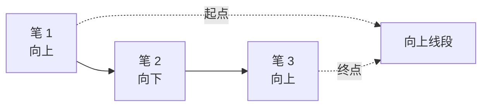

#### 2.1.2 起始三笔重叠

起始三笔是否重叠，是判断能否形成线段的核心条件之一。

可以把每一笔视为一个价格区间：低点到高点之间的范围。

前三笔的公共重叠区间，由三笔低位中的最高值和三笔高位中的最低值共同决定。

| 项目 | 含义 |
| --- | --- |
| 每笔价格区间 | 单笔从低点到高点覆盖的价格范围 |
| 公共重叠下沿 | 三笔低位中的最高值 |
| 公共重叠上沿 | 三笔高位中的最低值 |
| 是否重叠 | 公共重叠下沿不高于公共重叠上沿 |

满足该条件，表示起始三笔有重叠，可以构成线段。若前三笔无重叠，则不构成线段。

重叠判断流程：

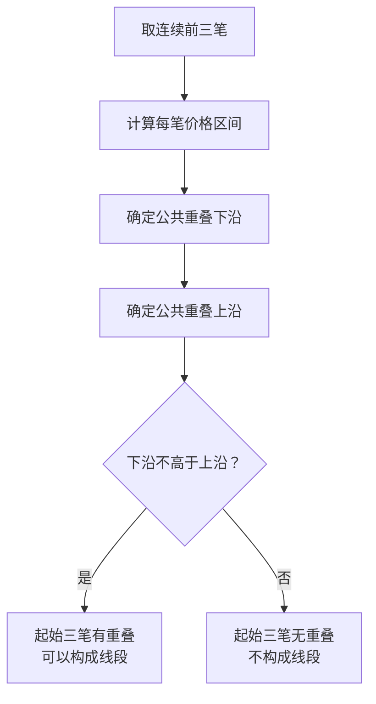

#### 2.1.3 方向

线段方向由起始笔决定。

向上线段：

- 第一笔为向上笔
- 最后一笔也为向上笔
- 因此构成笔数必须是奇数

向下线段：

- 第一笔为向下笔
- 最后一笔也为向下笔
- 因此构成笔数必须是奇数

#### 2.1.4 连续性

线段必须连续连接。

连续性规则：

- 一个向上线段完成后，对应一个向下线段
- 一个向下线段完成后，对应一个向上线段
- 相邻线段方向应交替
- 前一线段的结束点，应作为后一线段的起始点
- 划分线段时不能跳过中间笔

相邻线段之间，应在时间和价格端点上首尾相接，并且方向相反。

连续线段示意：

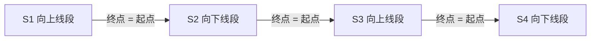

#### 2.1.5 完成与确认

线段生成后，不代表该线段已经完成。

完成与确认规则：

- 新反向线段的生成，才能确立前一个线段的完成
- 一个线段只能被反向线段终结或破坏
- 向上线段只能被向下线段破坏
- 向下线段只能被向上线段破坏
- 如果后续反向线段尚未生成，当前线段处于待定状态
- 最后一条线段通常应标记为待定，而不是已确认完成

常见状态：

| 状态 | 含义 |
| --- | --- |
| 已确认 | 已由后一条反向线段确认完成 |
| 待定 | 尚无后一条反向线段确认，仍可能延伸或反向 |

示例：

| 线段 | 方向 |
| --- | --- |
| S1 | 向上 |
| S2 | 向下 |
| S3 | 向上 |

对应状态：

| 线段 | 状态 | 原因 |
| --- | --- | --- |
| S1 | 已确认 | 由 S2 确认完成 |
| S2 | 已确认 | 由 S3 确认完成 |
| S3 | 待定 | 尚无后续反向线段确认 |

确认关系示意：

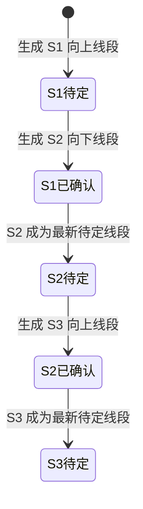

破坏规则：

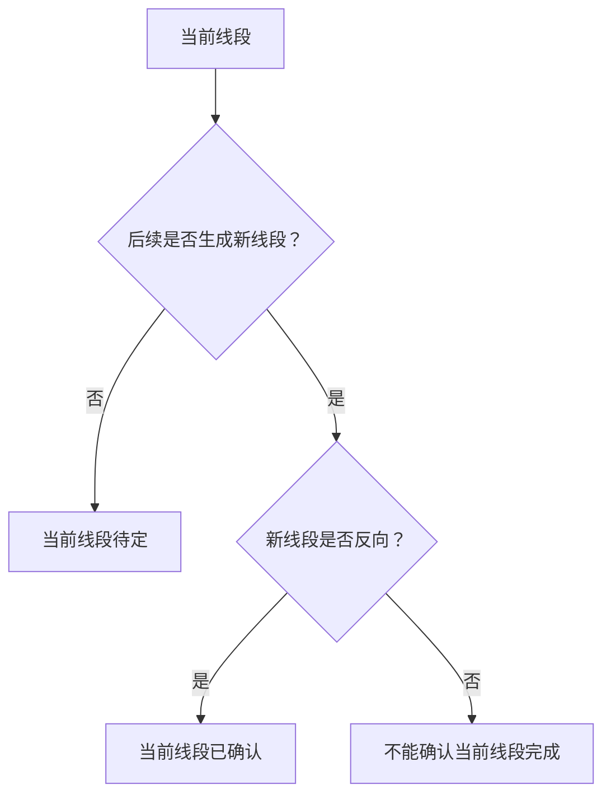

#### 2.1.6 跨周期关系

一般而言，高一级周期的一笔，在低一级周期中可能对应一个线段。

常见对应关系：

- 日线 1 笔，可能对应 30 分钟 1 线段
- 30 分钟 1 笔，可能对应 5 分钟 1 线段
- 5 分钟 1 笔，可能对应 1 分钟 1 线段

这是一种形态展开关系，不表示不同周期之间存在机械换算关系。

多周期观察时，应注意：

- 先在同一周期内观察笔、线段和方向关系
- 再观察高低周期之间的结构对应
- 对一字板等特殊形态，必要时可下降到更低周期观察细节

跨周期展开关系：

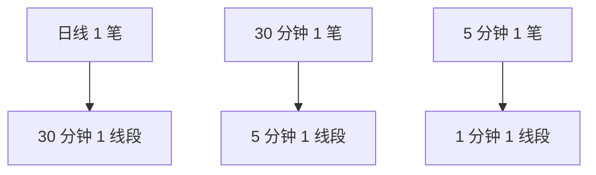

#### 2.1.7 特征序列

特征序列是线段划分中用于观察线段内部反向结构的一组序列。它不是另一个独立级别，而是从当前线段内部抽取与线段方向相反的笔或结构片段，并按出现顺序排列。

| 当前线段 | 特征序列由什么构成 | 观察重点 |
| --- | --- | --- |
| 向上线段 | 线段内部的向下笔 | 回落是否持续扩大，是否足以破坏原向上线段 |
| 向下线段 | 线段内部的向上笔 | 反弹是否持续扩大，是否足以破坏原向下线段 |

也就是说，特征序列的方向总是与当前线段方向相反：

- 上涨线段的特征序列，由向下笔构成
- 下跌线段的特征序列，由向上笔构成

特征序列的作用，是帮助判断当前线段是否仍在延续，还是已经被反向结构破坏。当反向笔之间形成明确的分型、重叠关系或破坏结构时，原线段可能结束，并进入新的反向线段。

特征序列示意：

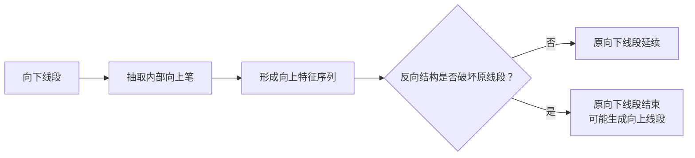

#### 2.1.8 特征序列判断线段结束

判断线段是否结束时，可以把特征序列中的每个元素近似看作一根 K 线，再观察这些元素之间是否形成顶分型、底分型，以及第一、第二元素之间是否存在缺口。

以下以“向上线段是否结束”为例说明。向下线段是否结束时，方向反过来，观察底分型和后续向上结构即可。

| 情况 | 特征序列表现 | 判断结果 |
| --- | --- | --- |
| 无缺口，形成顶分型 | 向上线段的向下特征序列形成顶分型，且第一、第二元素之间没有缺口；若左侧元素被中间顶元素包含，也可视为有效顶分型 | 原向上线段确定结束，新的向下线段正在生长 |
| 有缺口，形成顶分型，后续又形成底分型 | 第一、第二元素之间有缺口，不能只用顶分型完成全部判断；后续向下线段的反向结构形成底分型 | 第一根向上线段确定结束，第二根向下线段也确定结束，第三根向上线段正在生长 |
| 有缺口，形成顶分型，但没有后续底分型 | 第一、第二元素之间有缺口，且后续没有出现底分型确认 | 原向上线段处于待定状态，直到出现确认信号；若继续创新高，则仍未见结束迹象 |

第一种情况：无缺口，顶分型确认向上线段结束。

这里的顶分型按特征序列元素来观察。由于每个元素可近似看作一根 K 线，所以允许包含关系：顶分型左侧元素即使被中间顶元素包含，只要整体仍表现为无缺口的顶分型结构，也可以确认原向上线段结束。

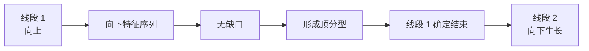

第二种情况：有缺口，顶分型之后还需要后续底分型确认。

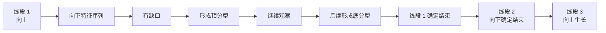

第三种情况：有缺口，顶分型之后没有后续底分型确认。

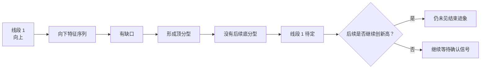

向下线段转为向上线段时，同理观察相反方向：

| 当前线段 | 主要观察 | 无缺口时 | 有缺口时 |
| --- | --- | --- | --- |
| 向上线段 | 向下特征序列的顶分型 | 顶分型可确认向上线段结束 | 需要等待后续底分型确认 |
| 向下线段 | 向上特征序列的底分型 | 底分型可确认向下线段结束 | 需要等待后续顶分型确认 |

#### 2.1.9 线段划分唯一性

线段划分唯一性，是指在缠论的线段划分规则下，只要笔、分型、特征序列和缺口等前提判断一致，线段不应出现多种互相冲突的划分结果。

它的主要意义，是保证理论表达的严谨性：同一组走势结构，在规则完整、前提一致的情况下，应当可以得到唯一的线段划分。对于实际观察和操作而言，唯一性不是为了追求复杂化，而是为了避免把基本概念划乱。

线段划分唯一性的基础约束：

| 约束 | 含义 |
| --- | --- |
| 笔有方向 | 每一笔要么向上，要么向下 |
| 线段有方向 | 每一条线段也要么向上，要么向下 |
| 首尾同向 | 向上线段应起于向上笔、止于向上笔；向下线段应起于向下笔、止于向下笔 |
| 两端一顶一底 | 同一线段中，两端应形成一顶一底，而不是顶到顶或底到底 |
| 起始结构重叠 | 构成线段的起始三笔应存在重叠关系 |
| 反向确认 | 当前线段的结束，需要由后续反向结构确认 |

如果一个线段从向上笔开始，却结束在向下笔，通常说明划分不符合线段的基本方向约束。同理，如果一个线段两端都是顶，或两端都是底，也不符合线段应在顶底之间展开的基本概念。

唯一性可以这样理解：

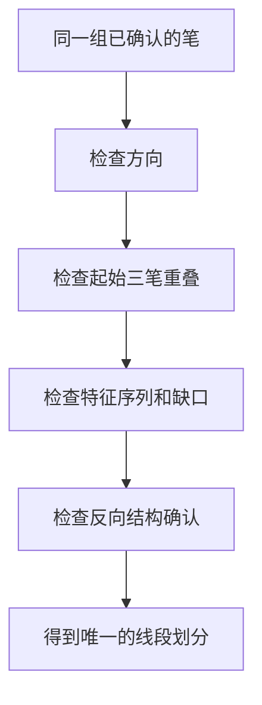

常见误区：

- 把还没有反向确认的线段提前判定为完成
- 把向上线段划到向下笔结束，或把向下线段划到向上笔结束
- 忽略前三笔重叠，导致线段起点过早或过晚
- 忽略特征序列中的缺口，直接用单个分型判断线段完成
- 在同一线段中划出顶到顶或底到底的结构
