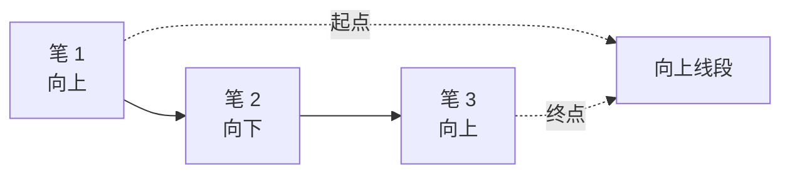
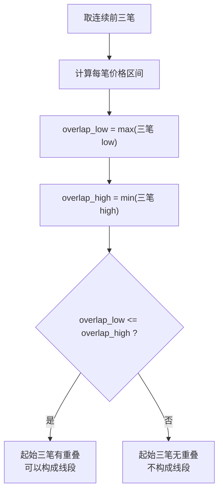
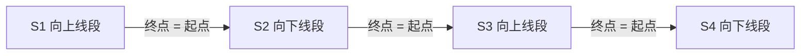
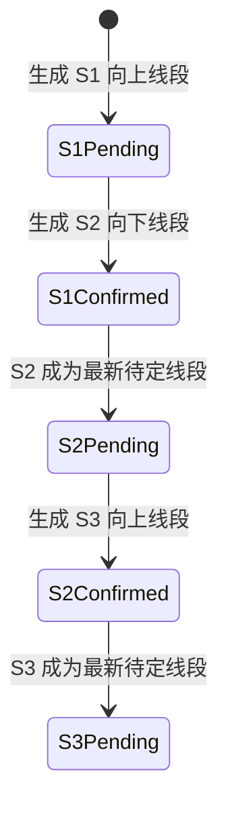
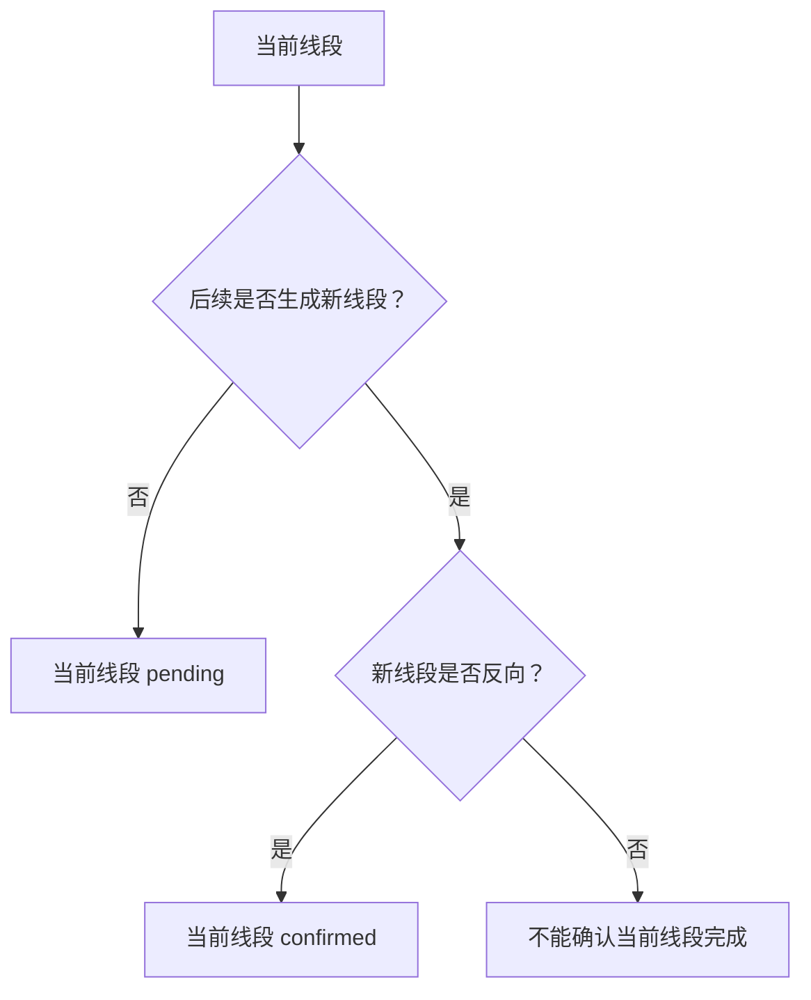
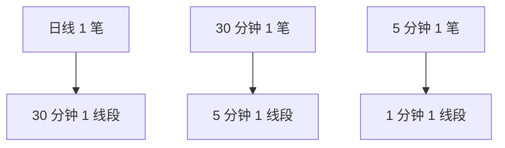

# 股票技术概念

## 1. 文档目标

这份文档用于沉淀 Stock Pilot 中需要长期复用的股票技术概念、术语口径和工程实现边界。

当前文档先记录缠论中的线段规则。后续可以继续补充分型、笔、中枢、走势类型、背驰、买卖点等概念。

本文档的定位：

- 作为产品、算法、可视化和测试之间的共同口径
- 先记录可操作规则，再区分理论规则和工程近似
- 不替代完整缠论教材，只冻结 Stock Pilot 当前采用的实现边界

## 2. 缠论

### 2.1 线段

#### 2.1.1 基本定义

线段由已经确认的笔构成。先确定笔，再划分线段，因此线段比笔更高一级。

线段的基本约束：

- 线段至少由连续的 3 笔构成
- 线段可以由更多笔构成，但笔数必须是奇数，如 3、5、7、9
- 起始三笔必须有重叠，否则不能构成线段
- 线段有方向，分为向上线段和向下线段
- 向上线段起始于向上笔，结束于向上笔
- 向下线段起始于向下笔，结束于向下笔

最小三笔线段示意：




#### 2.1.2 起始三笔重叠

起始三笔是否重叠，是判断能否形成线段的核心条件之一。

工程上可以把每一笔视为一个价格区间：

```text
stroke_range = [
  min(start_price, end_price),
  max(start_price, end_price)
]
```

前三笔的公共重叠区间：

```text
overlap_low = max(stroke_1.low, stroke_2.low, stroke_3.low)
overlap_high = min(stroke_1.high, stroke_2.high, stroke_3.high)
```

判断规则：

```text
overlap_low <= overlap_high
```

满足该条件，表示起始三笔有重叠，可以构成线段。若前三笔无重叠，则不构成线段。

重叠判断流程：



#### 2.1.3 方向

线段方向由起始笔决定。

向上线段：

- 第一笔为向上笔
- 最后一笔也为向上笔
- 因此构成笔数必须是奇数

向下线段：

- 第一笔为向下笔
- 最后一笔也为向下笔
- 因此构成笔数必须是奇数

#### 2.1.4 连续性

线段必须连续连接。

连续性规则：

- 一个向上线段完成后，对应一个向下线段
- 一个向下线段完成后，对应一个向上线段
- 相邻线段方向应交替
- 前一线段的结束点，应作为后一线段的起始点
- 划分线段时不能跳过中间笔

工程上应满足：

```text
previous_segment.end_timestamp == current_segment.start_timestamp
previous_segment.end_price == current_segment.start_price
previous_segment.direction != current_segment.direction
```

连续线段示意：



#### 2.1.5 完成与确认

线段生成后，不代表该线段已经完成。

完成与确认规则：

- 新反向线段的生成，才能确立前一个线段的完成
- 一个线段只能被反向线段终结或破坏
- 向上线段只能被向下线段破坏
- 向下线段只能被向上线段破坏
- 如果后续反向线段尚未生成，当前线段处于待定状态
- 最后一条线段通常应标记为待定，而不是已确认完成

推荐状态：

```text
confirmed: 已由后一条反向线段确认完成
pending: 尚无后一条反向线段确认，仍可能延伸或反向
```

示例：

```text
S1 向上线段
S2 向下线段
S3 向上线段
```

对应状态：

```text
S1 confirmed，由 S2 确认完成
S2 confirmed，由 S3 确认完成
S3 pending，尚无后续反向线段确认
```

确认关系示意：



破坏规则：



#### 2.1.6 跨周期关系

一般而言，高一级周期的一笔，在低一级周期中可能对应一个线段。

常见对应关系：

- 日线 1 笔，可能对应 30 分钟 1 线段
- 30 分钟 1 笔，可能对应 5 分钟 1 线段
- 5 分钟 1 笔，可能对应 1 分钟 1 线段

这是一种形态展开关系，不表示代码中必须把不同周期强行换算。

当前工程边界：

- 同一周期内，先实现线段构造和确认规则
- 多周期之间的笔和线段对应关系，作为后续验证和分析能力
- 对一字板等特殊形态，必要时应下降到 1 分钟 K 线画笔

跨周期展开关系：



#### 2.1.7 工程实现边界

当前实现应优先覆盖以下可操作规则：

- 连续笔
- 奇数笔
- 至少 3 笔
- 起始三笔重叠
- 首尾同向
- 相邻线段首尾连接
- 反向线段确认前一线段完成
- 最后一条线段保持待定

当前不优先实现完整特征序列算法。

特征序列主要用于说明线段划分的唯一性，适合理解理论推导。工程上可以先采用保守、可解释、可测试的线段构造规则，再逐步补充更完整的特征序列处理。

#### 2.1.8 参考伪代码

```python
def derive_segments(strokes):
    segments = []
    i = 0

    while i + 2 < len(strokes):
        first_three = strokes[i:i + 3]

        if not first_three_have_overlap(first_three):
            i += 1
            continue

        direction = strokes[i].direction
        end = i + 2

        probe = i + 4
        while probe < len(strokes):
            if strokes[probe].direction != direction:
                break

            if can_start_opposite_segment(strokes, end, direction):
                break

            end = probe
            probe += 2

        segments.append(
            make_segment(
                strokes=strokes[i:end + 1],
                direction=direction,
                status="pending",
            )
        )

        # 下一条线段从上一条线段终点继续，保证线段连续连接。
        i = end

    apply_segment_confirmation(segments)
    return segments
```

```python
def first_three_have_overlap(strokes):
    if len(strokes) < 3:
        return False

    lows = []
    highs = []

    for stroke in strokes:
        lows.append(min(stroke.start_price, stroke.end_price))
        highs.append(max(stroke.start_price, stroke.end_price))

    overlap_low = max(lows)
    overlap_high = min(highs)

    return overlap_low <= overlap_high
```

```python
def apply_segment_confirmation(segments):
    for index, segment in enumerate(segments):
        segment.status = "pending"
        segment.confirmed_by_segment_id = None

        if index + 1 >= len(segments):
            continue

        next_segment = segments[index + 1]

        if next_segment.direction != segment.direction:
            segment.status = "confirmed"
            segment.confirmed_by_segment_id = next_segment.id
```

#### 2.1.9 测试用例口径

线段相关测试至少应覆盖：

- 不足 3 笔，不生成线段
- 3 笔有重叠，生成候选线段
- 3 笔无重叠，不生成线段
- 5 笔、7 笔线段仍保持奇数笔
- 向上线段起于向上笔，终于向上笔
- 向下线段起于向下笔，终于向下笔
- 相邻线段方向交替
- 相邻线段首尾点一致
- 新反向线段生成后，前一线段标记为 confirmed
- 最后一条线段标记为 pending
- 同方向延伸不能确认前一线段完成
