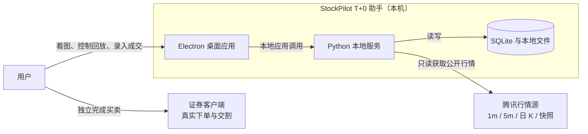
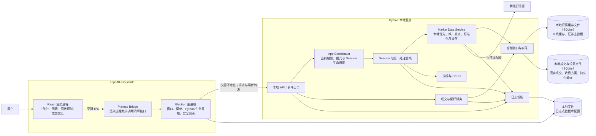
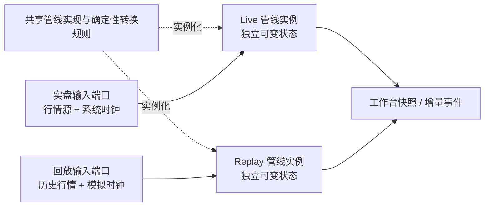
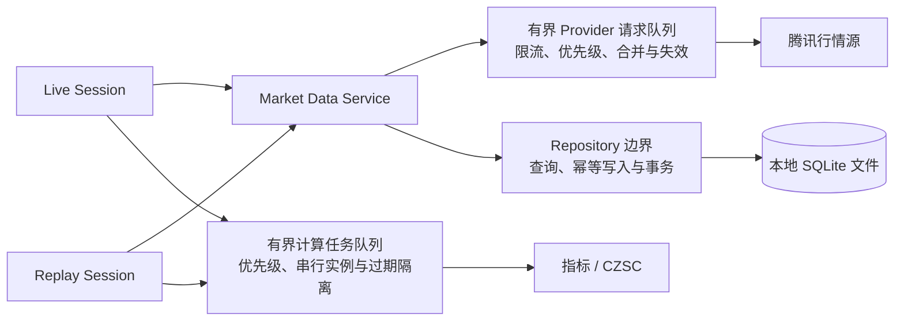
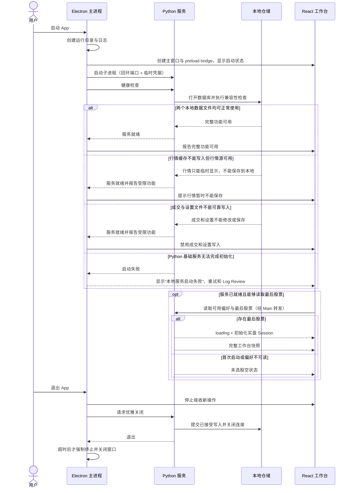
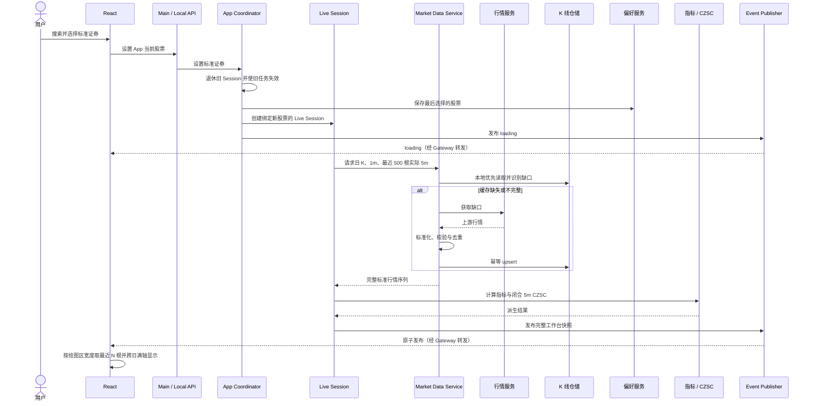
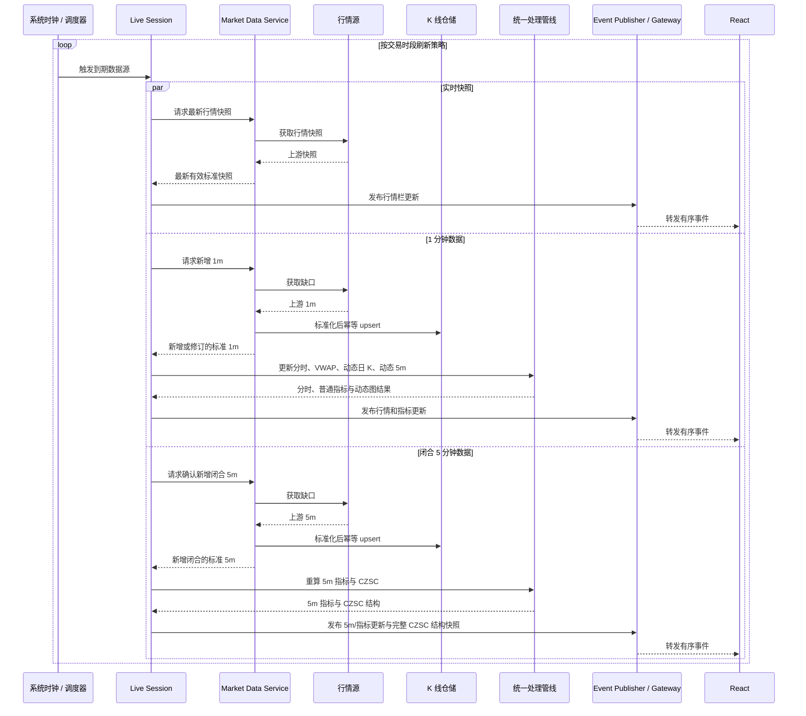
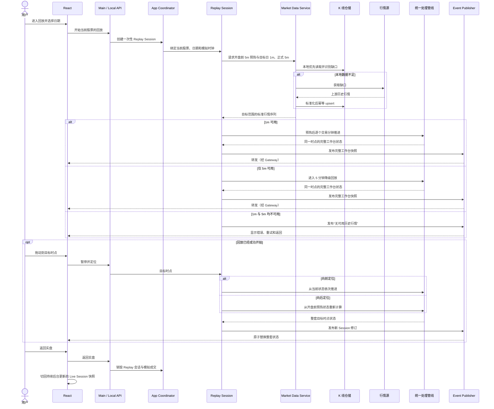
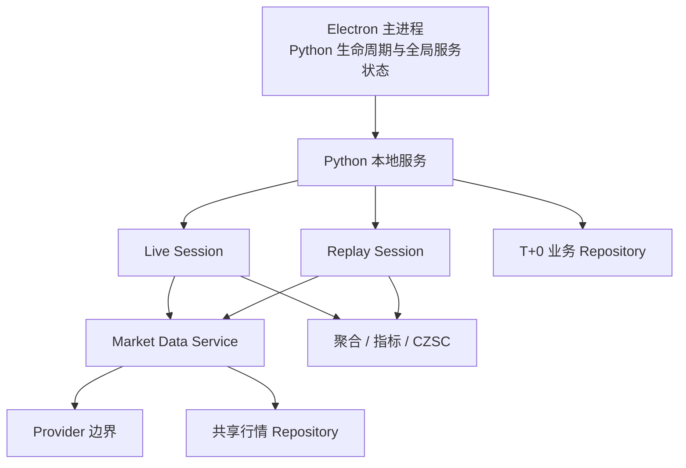

# StockPilot 盘中 T+0 助手架构设计

## 1. 文档信息

| 项目 | 内容 |
| --- | --- |
| 产品 | StockPilot 盘中 T+0 助手 |
| 文档类型 | 系统架构与运行时设计 |
| 状态 | 产品架构基线 |
| 更新日期 | 2026-07-21 |
| 上位需求 | [`t0_assistant_prd.md`](./t0_assistant_prd.md) |
| UI/UX 基线 | [`ui_layout_spec.md`](./ui_layout_spec.md) |

## 2. 目的与边界

本文定义 T+0 助手的系统边界、进程关系、数据所有权和关键运行时流程，回答“系统由哪些可运行部分组成、它们如何协作”。

本文不定义：

- 前后端端点、请求字段、事件字段、错误码和版本策略；
- Python 类、函数或 React 组件的详细设计；
- SQLite 表结构和迁移脚本；
- 打包、签名、自动更新和发布流水线；
- Epic、Issue 或开发排期。

这些内容应在本架构确认后分别进入 ADR、接口契约和分模块技术方案。

## 3. 架构目标

产品架构优先保证以下性质：

1. **实盘与回放同源**：只替换行情输入和时钟，不复制计算与展示链路。
2. **本地优先**：行情缓存、真实成交、偏好、收费方案和技术日志保存在当前电脑，不依赖云服务。
3. **前端轻业务**：React 负责工作台状态、交互和绘图，不实现行情标准化、指标、CZSC、收费或仓储规则。
4. **计算可复现**：同一股票、日期和输入序列在回放中产生相同结果，不读取未来数据。
5. **故障隔离**：行情刷新失败保留最后成功数据；Python 服务异常不能直接拖垮 Electron 主进程。
6. **复用现有边界**：行情与缓存复用 `packages/marketdata/`，缠论复用 `packages/chantheory/`，新增通用逻辑继续进入 `packages/`。

## 4. 系统上下文与边界

用户仍在证券客户端完成真实下单。T+0 助手只获取公开行情、展示图表、运行本地分析和保存用户手工录入的成交，不连接券商账户，不自动下单。



系统边界外包括券商交易、账户、持仓、现金、可卖数量、Level 2/Tick、自定义策略建议和云同步。

## 5. 系统容器图



### 5.1 Electron 主进程

- 创建和恢复主窗口，设置目标设备适用的最小窗口尺寸；
- 提供系统菜单及 `Help → Log Review` 日志窗口；
- 启动、健康检查和关闭 Python 子进程；
- 选择空闲回环端口并建立仅本次运行有效的连接凭据；
- 通过 preload 暴露的白名单能力转发请求和后台事件；
- 不计算指标、不访问行情源、不直接读写业务表。

### 5.2 React 渲染进程

- 呈现三栏工作台、两个图表同步组、行情栏、回放面板和成交 Drawer；
- 保存 UI 会话状态，例如布局、图层开关、可见范围、5 分钟图跟随最新/手工浏览状态和当前模式；
- 接收后端的完整初始快照、行情与指标更新以及完整 CZSC 结构快照，更新 Lightweight Charts；
- 根据 Session 状态、当前回放时间、下一根实际 K 的时间、市场规定的结束时间和回放粒度决定回放控件的显示与禁用状态，不依赖 Python 输出按钮开关字段；
- 根据 5 分钟绘图区实际宽度和统一显示密度确定可见 N 根 K 线，只改变视口，不在前端重新计算指标或 CZSC；
- 不直接访问 Node.js、SQLite、行情源或 Python 监听端口。

### 5.3 Python 本地服务

- 提供面向桌面应用的本地请求与事件接口；
- App Coordinator 持有 App 当前股票和模式，维护对应的实盘 Session，并按需创建一次性回放 Session；
- Session 只提出标准行情需求并消费结果，不直接访问具体行情源或 SQLite；
- Market Data Service 负责本地优先读取、缺口识别、远端补齐、Provider 字段映射、基础校验、排序去重和行情缓存策略；
- 协调行情聚合、指标和 CZSC 计算；
- 保存行情缓存、真实成交、收费方案和持久化偏好；
- 将内部异常映射为稳定的应用错误，详细堆栈只写本地日志。

### 5.4 SQLite 与本地文件

- SQLite 是结构化运行时数据的持久化边界，按数据所有权分为本地行情缓存文件和本地成交与设置文件；
- 本地行情缓存文件保存 K 线缓存和证券主数据，可由 `chan-viewer`、`t0-assistant` 等使用 `packages/marketdata/` 的 App 共同访问；
- 本地成交与设置文件仅由 `t0-assistant` 拥有，保存真实成交、收费方案和持久化偏好，其他 App 不得直接读写；
- 行情缓存、真实成交和收费方案通过仓储访问，不由 UI 或 Session 拼接 SQL；
- Repository 只执行查询、幂等写入和事务等持久化操作，不感知 Live/Replay，也不决定刷新或缓存策略；
- 回放模拟成交只在回放 Session 内存中存在；
- 可重算的 CZSC、BOLL、VOL、MACD 不建立事件快照表；
- 日志使用轮转本地文件，避免无界增长；
- 数据库和日志位于应用运行时目录，不写入源码目录或安装包资源目录。

复用同一个 `packages/` 能力不等于共享该 App 的全部运行时状态。多个 App 可以复用 `packages/marketdata/` 并共享本地行情缓存，但 T+0 成交等应用私有数据保持隔离。架构允许多个 App 同时访问本地行情缓存文件；具体的 WAL、连接管理、写入串行化、锁等待和迁移策略由 SQLite ADR 固化。

## 6. 进程与通信关系

### 6.1 进程模型

当前产品使用一个 Electron 应用进程组和一个 Python 子进程，不拆分为远程微服务。每个 App 实例只管理自己的 Python 子进程。

```text
Electron main
├── BrowserWindow: 主工作台
├── BrowserWindow: Log Review（按需）
├── preload bridge
└── child process: Python local service
    ├── Live Session（当前股票，后台持续）
    └── Replay Session（进入回放后按需创建）
```

### 6.2 通信原则

- Renderer 与 Electron 之间使用 `contextIsolation` 下的白名单 IPC，不开放通用 Node 能力；
- Electron 与 Python 之间使用仅绑定 `127.0.0.1` 的本地请求/事件通道；
- Electron 主进程持有连接地址和临时凭据，Renderer 不直接发现或调用 Python；
- 请求通道承担选股、回放控制、成交 CRUD、偏好和设置操作；
- 事件通道承担加载状态、行情增量、Session 快照、后台错误和服务状态；
- Electron main 与 Python 之间采用 ADR 0007 已接受的 HTTP 请求通道与 WebSocket 有序事件通道；逻辑契约保持请求与事件分离；
- Python 的标准输出和错误输出只用于进程诊断，不作为业务消息协议。

## 7. Session 与时间模型

### 7.1 实盘 Session

App Coordinator 在恢复或选择当前股票后创建实盘 Session，并在用户查看回放时让它继续后台运行。Session 创建后绑定的股票不可修改；切换股票时，Coordinator 退休旧 Session、使其未完成任务失效，再为新股票创建具有新实例标识的 Live Session。它使用行情源和系统时钟，分别更新实时快照、1 分钟 K 和已闭合 5 分钟 K；三个数据时间可以短暂不一致。

### 7.2 回放 Session

回放 Session 是一次性的内存对象，使用历史行情和模拟时钟。进入回放只带入 App 当前股票；未选股时可以先进入空白回放模式，随后选中的股票同时成为 App 当前股票，并由 Coordinator 创建后台 Live Session 和该股票的 Replay 初始状态。开始回放时加载目标日前的 5 分钟预热数据，并在进入可播放状态前从本地 SQLite 和必要的网络补数一次性准备目标日完整行情；正式回放后不按下一根 K 逐次请求网络。Session 按实际序列推进，并向前端提供下一根实际 K 的时间但不提供其未来行情值。回放起止边界由证券所属市场和目标交易日的交易日历确定，不能用最后一根已下载 K 线改写；数据不完整时先补齐、降级或明确失败，不生成虚假 K 线。退出回放立即销毁其日期、进度、派生画面和模拟成交，但保留已下载行情缓存。

### 7.3 共享处理管线



统一管线消费 Market Data Service 输出的标准行情，负责交易时段解释、动态 5 分钟 K、正式闭合 5 分钟 K 的接入、动态日 K、指标和 CZSC。1 分钟 K 只用于形成尚未闭合的动态 5 分钟 K；动态 K 可以显示，但不进入 CZSC。系统取得正式闭合的 5 分钟行情后，以它替换动态 K，再更新正式 5 分钟指标和 CZSC、笔、笔中枢。

管线必须在完整已加载的跨交易日历史序列上连续计算 5 分钟指标和 CZSC，再向工作台快照投影完整可浏览序列及其派生结果。可见窗口属于 React 图表状态：前端按实际绘图区宽度从序列尾部选择最近 N 根用于默认显示，不得把可见窗口反向作为 MA、BOLL、MACD、RSI、VOL 均线或 CZSC 的计算输入。K 线横坐标使用实际序列的逻辑索引，非交易时段不生成空槽。

“实盘与回放共用处理管线”表示共用同一套实现和状态转换规则，不表示共用同一个运行时实例。Live Session 和 Replay Session 各自拥有独立的有状态管线实例，分别维护聚合、指标、CZSC 和当前投影状态；两个实例不得共享可变派生状态，也不得读取对方的当前结果。

管线行为必须由标准行情输入、可替换时钟和显式配置决定。同一初始条件和输入前缀必须产生相同结果。Replay 向后定位时丢弃当前管线状态，从开盘前预热状态重新创建实例并顺序重放到目标时点；后续允许使用检查点优化性能，但不得改变重建语义。当前产品不持久化或承诺兼容管线内部状态，只要求状态可丢弃、输入可重放、结果可重建。

### 7.4 并发 Session 与共享资源协调

用户进入回放时 Live Session 继续后台运行，因此 Live 与 Replay 并存是正常运行模式。两者保持 Session 和管线状态隔离，但共享进程内的行情服务、仓储基础设施和计算资源。当前产品不引入包揽所有资源的通用调度器，而是采用“两个队列、一个仓储边界”：远程行情请求和计算任务分别通过有界优先队列协调，数据库访问统一通过 Repository。



共享资源遵循 `Live 实时任务 > 用户正在等待的 Replay 操作 > Replay 后台预取` 的优先级。该优先级只管理资源使用顺序，不允许 Live 读取 Replay 状态或 Replay 读取 Live 的未来结果。

- **行情请求**：Session 不直接调用 Provider。Market Data Service 先读取共享缓存并识别缺口，只有远程缺口进入进程内共享的 Provider 请求队列；队列必须有界，支持优先级、相同请求合并和失效请求隔离。Replay 切换目标或退出后，旧请求结果可以按规则写入行情缓存，但不得再更新失效 Session。
- **数据库访问**：Live 与 Replay 统一通过业务服务和 Repository 访问数据库。进程内写入按数据库进入单写入边界，读取不得被长事务持续阻塞；多个 App 同时访问本地行情缓存文件时，正确性仍由 SQLite 事务、文件锁和幂等写入保证，不能只依赖单个 Python 进程内的队列。
- **指标与 CZSC 计算**：Live 与 Replay 的计算任务进入有界计算队列，但操作各自独立的管线实例。同一个实例不得并发推进；新的 Replay 定位使旧定位计算失效，长重算应允许分段或中止，避免阻塞 Live 刷新、API 通道和应用退出。

Provider 队列容量与执行者数量、SQLite WAL 和连接参数、计算使用线程或进程等属于后续 ADR 与分模块技术方案，不在本架构中固定。

## 8. 数据所有权与一致性

| 数据 | 权威所有者 | 持久化 | 说明 |
| --- | --- | --- | --- |
| 原始/标准化 K 线缓存 | Python 行情仓储 | 本地行情缓存文件 | 1 分钟、5 分钟、日 K；本地优先，网络补齐，可供多个 App 复用 |
| 证券主数据 | Python 行情仓储 | 本地行情缓存文件 | 标准证券代码与基础信息，可供多个 App 复用 |
| 实时行情快照 | Live Session | 否 | 保留最近成功值，独立刷新 |
| 指标与 CZSC 结果 | Python 处理管线 | 否 | 可由 K 线重算 |
| 当前工作台服务端快照 | 当前 Session | 否 | 前端初始加载、切换和重连的基线 |
| App 当前股票与模式 | App Coordinator | 否 | Session 生命周期的运行时权威；启动默认实盘，Replay 不持久化 |
| 最后选择的股票 | Python 偏好服务 | 本地成交与设置文件 | 仅用于下次启动恢复 App 当前股票 |
| 当前布局与图层开关 | React 工作台状态 | 否 | 当前交互值由 React 管理，并异步保存持久化副本 |
| 持久化布局与图层偏好 | Python 偏好服务 | 本地成交与设置文件 | App 重启后用于恢复，不替代 React 的当前运行时状态 |
| 真实手工成交 | Python 成交仓储 | 本地成交与设置文件 | 仅 T+0 助手访问；可修改，删除为确认后的永久删除 |
| 回放模拟成交 | Replay Session | 否 | 退出回放即清空 |
| 收费方案 | Python 配置仓储 | 本地成交与设置文件 | 保存结构化费率；不追溯历史成交 |
| 图表实例与可见范围 | React 工作台状态 | 否 | 布局/模式切换期间保持 |
| 5 分钟跟随最新/手工浏览状态 | React 工作台状态 | 否 | 决定宽度变化和增量更新时是右对齐重算 N，还是保持用户逻辑可见范围 |
| 技术日志 | Electron/Python 日志设施 | 本地文件 | Log Review 只读展示 |

Session 对前端输出单调递增的修订号或等价序列标识。前端忽略已过期事件，并在连接未断但事件序号不连续时停止应用后续事件、重新获取完整快照；协议不定义由后端推测前端接收状态的 `gap` 事件。股票切换、回放跳转和重连同样使用完整快照重新建立基线，避免旧请求晚到后覆盖新状态。具体字段在接口与行为约定中定义。

Python 是行情加工和分析结果的唯一权威来源。运行时 K 线和普通指标按各自数据节奏更新；CZSC 在正式闭合 5 分钟 K 到来后重算并发布完整 CZSC 结构快照。React 原子替换笔、中枢、买卖点等 CZSC 图层，不推导或合并 CZSC 领域结构差异。具体事件结构由接口契约定义。

## 9. 关键运行时流程

### 9.1 启动与退出



### 9.2 选股与首次加载



如果用户在未选股的回放模式中完成选股，仍由 App Coordinator 执行同一套当前股票切换流程：创建该股票的后台 Live Session，并将尚未开始的 Replay 保持为空白初始状态，等待用户选择日期。

### 9.3 实时刷新



单个刷新分支失败时只报告该分支状态并保留最后成功数据，不阻塞其他分支；非交易时段停止或降低轮询频率，不生成虚假 K 线。

### 9.4 历史回放与定位



回放工作台的默认可见窗口与实盘使用同一规则，但其右边界只能是当前模拟时点。目标日已推进的 5 分钟 K 不足以铺满时间轴时，左侧使用开盘前预热历史补足；任何窗口宽度、布局或缩放计算都不得访问模拟时点之后的 K 线或派生结果。

### 9.5 真实成交写入

真实成交的新增、修改和删除由 Python 成交服务校验并在单个数据库事务中完成。写入成功后，后端返回新的成交列表修订和图表标记；前端只在成功确认后更新真实成交状态。收费方案只用于生成当前录入的默认费用，成交保存的是用户最终确认金额。

## 10. 错误边界与部分功能继续运行

系统以 Provider、Repository、分析阶段、Session 和 Python 进程作为逐级错误边界。错误默认在能够维持一致性的最小边界内处理；局部失败只停止依赖该能力的功能，不清空最后成功状态，不发布部分完成的工作台修订，也不扩大到其他 Session 或 Electron 主进程。



### 10.1 行情源与历史补数失败

- Provider 请求失败时保留最后成功行情并标记数据陈旧或暂不可用，采用有限重试与退避，不用空响应覆盖已有状态，也不生成虚假 K 线；
- Live 的单个刷新分支失败不得终止其他刷新分支或 Replay 使用已有缓存；
- Replay 补数失败时优先使用已有缓存；只有 5 分钟数据时进入 5 分钟降级回放，数据不足时只终止本次 Replay 加载，不影响 Live；
- 只有完整、合法并经过标准化的数据才能推进相应管线。

### 10.2 分析阶段失败

- 普通指标或 CZSC 计算失败时不发布该部分的新结果，保留最后成功结果并将受影响图层标记为陈旧或不可用；K 线和未受影响的指标可以继续更新；
- 分析模块发生异常后不得假定其内部状态仍然有效，应从标准 K 线输入重建干净实例，重建成功后才能发布新修订；
- 单个独立指标失败只停止更新该指标；CZSC 失败只停止更新笔、中枢和买卖点等 CZSC 图层；核心 K 线聚合失败时暂停当前 Session 推进并重建管线；
- 工作台修订必须原子发布，不能把部分新结果与未标明时间的旧结果拼成一个成功快照。允许行情栏、K 线和分析结果具有不同数据时间，但必须分别表达其新鲜度。

### 10.3 本地数据文件失败

- 本地行情缓存文件运行时不能写入时，已经从行情源取得并验证的数据仍可在当前 App 运行期间临时显示，但明确提示“行情暂时不能保存到本地”。这些数据不会假装已经缓存，App 重启后可能需要重新下载，依赖本地历史数据的回放可能无法使用；用户真实成交不受影响；
- 本地成交与设置文件的成交写入必须原子确认。保存失败时不增加成交修订号，前端保持原成交记录并明确提示“成交记录保存失败”；
- 本地成交与设置文件仍能读取但不能写入时，行情图和已有成交可以继续查看，但新增、修改、删除成交以及收费方案和偏好保存必须禁用；
- 真实成交属于不可替代数据。本地成交与设置文件不兼容或损坏时不得自动清空；迁移、备份和恢复策略由 SQLite ADR 固化。

### 10.4 Session 故障隔离

- Replay Session 失败时销毁其管线、进度和模拟成交，Live Session 继续后台运行；用户可以返回实盘或重新创建 Replay；
- Live Session 失败时保留最后成功实盘画面并标记陈旧，尝试从标准行情缓存重建 Live，不污染正在运行的 Replay；
- Session 重建使用新的实例标识或等价世代边界，旧请求和旧计算结果不得发布到新 Session。

### 10.5 Python 进程崩溃与恢复

- Electron 主进程检测 Python 异常退出后保持窗口和最后渲染画面，明确标记后端断开与数据停止更新，并禁用需要后端确认的操作；
- Electron 对 Python 执行有限次数的自动重启。服务恢复后从偏好、本地行情缓存文件和本地成交与设置文件重建 Live、真实成交、指标和 CZSC；
- Replay 进度和模拟成交是纯内存状态，Python 崩溃后明确丢失，不做静默伪恢复；
- 连续自动重启失败后停止重启循环，保留日志查看和手动重试或重启 App 的入口。具体次数和退避参数由技术方案确定。

### 10.6 错误传递

跨进程只传递稳定的应用错误分类、影响范围、严重程度、是否可重试、受影响能力和关联标识；异常栈、上游原始响应和内部对象只写入本地技术日志。后台刷新失败使用非阻塞状态反馈，用户主动发起的持久化操作失败必须立即明确反馈，具体错误码与字段由接口契约定义。

## 11. 可用性、安全与诊断

- Python 服务只监听回环地址，使用每次启动生成的临时凭据，不接受局域网访问；
- Electron Renderer 启用上下文隔离，不暴露文件系统、进程或任意 IPC；
- 所有外部行情数据在进入计算管线前完成字段、类型、证券代码和时间戳校验；
- 后台刷新采用有限重试与退避，不能形成无界并发请求；
- Provider 请求和计算任务使用有界队列，Live 实时任务优先于 Replay 交互与后台任务；
- App 关闭时停止新任务，等待已接受的持久化事务完成；
- 主工作台只展示面向用户的简短错误，详细上下文、异常栈和请求时间写入本地日志；
- 日志不得记录连接凭据，成交备注等用户文本应避免不必要的完整输出。

## 12. 决策记录与后续技术设计

当前架构已经由以下 ADR 和接口基线固化：

- ADR 0003：本地 SQLite 与运行时数据边界；
- ADR 0004：Schema-first 分析契约；
- ADR 0005：Lightweight Charts、逻辑时间轴和显式视口状态机；
- ADR 0006：Electron main 管理单个 Python 子进程；
- ADR 0007：HTTP 请求与 WebSocket 有序事件通道；
- ADR 0008：正式闭合 5 分钟 K 使用 full project-level rebuild；
- [`replay_interface_and_behavior.md`](./replay_interface_and_behavior.md)：历史行情回放的
  命令、完整快照、错误、generation、Session 和 revision 契约。

Provider 与计算队列参数、SQLite 连接和迁移细节先进入分模块技术设计与测试。只有当
实现中出现具有长期影响的多个可行方案、且选择会改变稳定边界时，才新增 ADR；不为
普通实现参数预先创建 ADR。

## 13. 架构确认清单

- [x] Electron 主进程拥有 Python 子进程生命周期，Renderer 不直接访问 Python。
- [x] Python 本地服务是行情、Session、计算和持久化的统一后端。
- [x] 实盘与回放只替换输入源和时钟，共用处理管线。
- [x] Live 与 Replay 共用管线实现但各自拥有独立实例，可变派生状态不跨 Session 共享。
- [x] App Coordinator 是当前股票和模式的运行时权威；Session 绑定股票且不在原实例上切股。
- [x] Live 与 Replay 共享资源时经过有界 Provider 请求队列、有界计算任务队列和 Repository 边界，Live 实时任务优先。
- [x] Provider、分析、Repository、Session 和 Python 进程形成逐级错误边界，局部失败只停止受影响功能且不发布部分结果。
- [x] Python 崩溃时 Electron 保持可用并有限自动重启；Live 可由持久化输入重建，纯内存 Replay 状态明确丢失。
- [x] 外部行情、时钟、仓储和前端后端边界均可替换为确定性测试实现，核心管线可在无网络、无 Electron 环境下重放固定输入。
- [x] 查看回放期间 Live Session 继续后台更新当前股票。
- [x] 本地行情缓存文件保存可跨 App 复用的行情与证券主数据，本地成交与设置文件隔离真实成交、收费方案和持久化偏好。
- [x] 回放模拟成交、指标和 CZSC 结果不持久化。
- [x] 1 分钟 K 只形成动态 5 分钟 K；取得正式闭合 5 分钟 K 后替换动态 K，再更新正式指标和 CZSC。
- [x] 5 分钟指标和 CZSC 基于完整已加载历史连续计算；React 只按绘图区宽度裁剪默认可见 N 根，不能用可见窗口触发重新计算。
- [x] 5 分钟默认视口以最新或模拟时点为右边界，跨交易日满轴显示实际 K 线，并压缩所有非交易时段空槽。
- [x] 初次加载和回放定位使用完整工作台快照；实时行情与普通指标按各自节奏更新，CZSC 重算发布完整 CZSC 结构快照。
- [x] `apps/` 与 `packages/` 的职责符合 [`module_design.md`](./module_design.md)。
- [x] 历史行情回放的接口与行为约定已明确，后续可以据此拆分技术任务。
