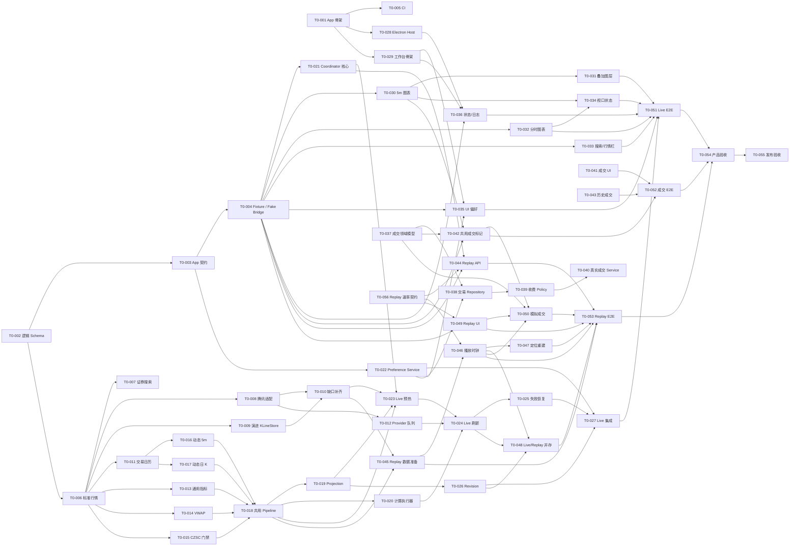

# StockPilot 盘中 T+0 助手开发 Backlog

## 1. 文档信息

| 项目 | 内容 |
| --- | --- |
| 产品 | StockPilot 盘中 T+0 助手 |
| 文档类型 | 可执行开发 Backlog 与依赖基线 |
| 状态 | 待创建 GitHub Epic / Issue |
| 版本 | v1.6 |
| 更新日期 | 2026-07-22 |
| 上位需求 | [`t0_assistant_prd.md`](./t0_assistant_prd.md) v0.43 |
| 架构基线 | [`architecture.md`](./architecture.md) |
| 模块基线 | [`module_design.md`](./module_design.md) |
| UI 基线 | [`ui_layout_spec.md`](./ui_layout_spec.md) |
| Replay 基线 | [`replay_interface_and_behavior.md`](./replay_interface_and_behavior.md) v1.0 |
| ADR | [`../adr/README.md`](../adr/README.md) 中已接受的 T+0 相关决策 |

本文把完整 PRD 拆成 **8 个 Epic、56 个开发 Issue**。Issue 编号 `T0-001` 至
`T0-056` 是创建 GitHub Issue 前的稳定规划编号，不等同于 GitHub 自动生成的编号。

本文不重新讨论已经冻结的产品、架构、模块和 Replay v1.0 契约。实施中如发现必须
改变公共契约、目录所有权或 PRD 边界，应单独提出变更 Issue，不能在普通功能 PR 中
顺手修改。Replay v1.0 已由 T0-056 补齐 PRD 要求的 `1×/2×/5×/10×` 播放速率命令、
权威状态、revision 和幂等/错误语义；T0-046 或 T0-049 不得自行扩展。

`skills/` 不在本 Backlog 范围内。本阶段不读取、复用、迁移、修改或兼容现有
skill 实现，也不要求 T+0 的指标参数、输出或测试与 skill 保持一致。skill 的公共逻辑
提炼、参数统一、兼容适配和回归验证将在 T+0 Assistant 基线完成后另行规划，不得
塞入本文任何 Issue 或 PR。

## 2. 当前覆盖基线

必须区分“设计或技术验证已完成”和“正式产品代码已实现”。`spikes/` 下的代码是 ADR
验证证据，不直接迁入正式 `apps/` 或 `packages/`。

| 范围 | 设计/验证覆盖 | 正式实现状态 | 本 Backlog 的处理 |
| --- | --- | --- | --- |
| FR-01：5 分钟 K、MA、BOLL、CZSC、笔和中枢 | PRD、架构、UI、图表/CZSC spike 已覆盖 | `chantheory` 可复用；T+0 runtime 和桌面图表未实现 | Epic C、D、E |
| FR-02：5 分钟 VOL、MACD 与联动 | PRD、UI、图表 spike 已覆盖 | 正式指标 package 和图表组未实现 | Epic C、E |
| FR-03：分时、VWAP、1 分钟指标、日 K、行情栏、布局和偏好 | PRD、架构、UI 已覆盖 | `marketdata` 有部分基础；产品链路大部分未实现 | Epic B、C、D、E |
| FR-04：自动刷新、旧数据保留、重试和日志 | 架构、ADR、Electron/Python spike 已覆盖 | 正式 App 未实现 | Epic B、D、E、H |
| FR-05：真实/模拟成交、收费方案、历史成交和标记 | PRD、模块边界已覆盖 | 未实现 | Epic F、G、H |
| FR-06：产品边界 | PRD 已冻结 | 需要贯穿全部实现与验收 | 通用 DoD、T0-054 |
| FR-07：单日历史回放 | Replay v1.0 契约已冻结 | 未实现 | Epic G、H |
| Electron 桌面应用与 Python 生命周期 | ADR 0006/0007 和 spike 已验证 | 正式 `apps/t0-assistant/` 不存在 | Epic A、E |
| 行情缓存与证券主数据 | 已有部分 `marketdata` 基础 | 尚不满足 T+0 全部数据粒度和缺口补齐 | Epic B |
| Live/Replay 共用处理管线 | 架构和模块设计已冻结 | 未实现 | Epic C、D、G |
| T+0 成交与设置数据库 | 架构已冻结 | 未实现 | Epic D、F |
| 集成、设备和发布验收 | 测试接缝已定义 | 未实现 | Epic H |

## 3. Issue 粒度和完成定义

### 3.1 拆分规则

每个 Issue 应满足：

- 一个主责执行者、一个主要目录所有权和一个可独立评审的 PR；
- 通常为 1～3 个有效开发日；超出时优先继续拆分；
- 明确 PRD/ADR 输入、交付物、依赖、非目标和可执行验收；
- 行为改变或回归风险非平凡时必须带自动化测试；
- 不以“完成 FR-03”作为单个 Issue，也不以单个类或函数作为 Issue；
- 依赖未就绪时使用 fake、fixture 或稳定端口并行开发，不复制临时领域逻辑；
- 一个 Issue 不得同时拥有公共契约变更和多个业务模块实现。
- 跨 Renderer/Backend 的集成 Issue 可以有双主责，但必须指定一名集成协调人、一个
  主要交付 PR，并在 Issue 内把双方目录和验收责任分开；其他 Issue 仍坚持单主责。

### 3.2 所有 Issue 的通用 DoD

- 实现位于 `module_design.md` 指定目录，没有 Electron/React/HTTP 泄漏进领域 package；
- 公共字段保持 `snake_case`，时间、时区、证券身份和 revision 语义符合冻结契约；
- 新增或变化行为有最小充分测试，相关测试在 `~/.venvs/czsc` 环境通过；
- 不绕过 `marketdata`、`chantheory`、Repository 或 Safe Bridge 边界；
- 错误不会用空值覆盖最后一次成功事实，内部异常只进入技术日志；
- PR 描述列出覆盖的 FR、验证命令、已知限制和后续依赖；
- 满足下方 FR-06 检查清单。

### 3.3 FR-06 强制检查清单

所有触及行情、分析、图表、成交或回放的 Issue 都必须在 PR 中逐项确认：

- [ ] 不输出买入、卖出、数量、仓位或“能不能做 T”的建议；
- [ ] 不增加趋势判断、信号处理状态机、指标解释卡或未经验证的自定义策略；
- [ ] 不读取券商账户、持仓、现金或可卖数量，不连接自动下单；
- [ ] 不自动配对成交，不计算盈亏、胜率、收益率或资金曲线；
- [ ] 不提供“跳转到下一个 CZSC 买卖点”；
- [ ] CZSC 标签只是当前结构结果，不保存首次出现快照或“失效”状态；
- [ ] 动态未闭合 5 分钟 K 不进入 CZSC；
- [ ] Replay 输出不读取目标时点之后的数据；
- [ ] Replay 模拟成交不进入真实成交仓储；
- [ ] 缺失行情不生成虚假 K 线，也不改写市场规定的回放结束时间。

## 4. 目录所有权和并行轨道

| 轨道 | 建议主责 | 主要目录 | 允许承担的工作 |
| --- | --- | --- | --- |
| 行情与通用指标 | Codex | `packages/marketdata/`、`packages/indicators/` | 标准行情、Provider、缓存、证券主数据、交易日历、指标 |
| CZSC 就绪门禁 | Codex | `packages/chantheory/` | 先验证稳定接口与性能；只有门禁失败才提交适配修改 |
| T+0 领域与 Python Backend | Claude | `packages/t0assistant/`、`apps/t0-assistant/backend/` | Runtime、Session、Coordinator、成交、偏好、Repository、API |
| 桌面与工作台 | Trae | `apps/t0-assistant/electron/`、`apps/t0-assistant/renderer/` | Electron、Safe Bridge、React、图表、交互和 UI 测试 |
| 公共契约与集成 | 指定一名集成负责人 | 契约 Schema、跨语言 fixture、顶层依赖文件 | 串行批准公共契约和共享构建配置变更 |

执行者是调度建议，不改变模块所有权。特别是动态 5 分钟 K、动态日 K、Workbench
Pipeline、Projection 和 Bounded Computation Executor 全部属于
`packages/t0assistant/runtime/`，不能因为它们处理行情就移入 `marketdata` 轨道。

多个 Agent 应使用独立 worktree/branch。公共契约、`pyproject.toml`、前端 lockfile 和跨语言
fixture 由集成负责人协调，避免多个并行 PR 同时修改。

## 5. Epic 与 Issue 清单

依赖列使用规划编号。`—` 表示不存在代码依赖；仍需遵守已冻结文档。

### Epic A：工程骨架与公共契约

| ID | Issue | 主责/目录 | 覆盖 | 依赖 | 交付与验收 |
| --- | --- | --- | --- | --- | --- |
| T0-001 | 创建正式 Electron、React、Python Backend 工程骨架 | Trae + Claude / `apps/t0-assistant/` | 公共基础 | — | 指定一名集成协调人；Electron 能启动 Renderer 和假 Python 服务；目录与模块基线一致；不迁入 spike 源码；在 App README 记录复用 `~/.venvs/czsc` 的安装、校验和启动命令 |
| T0-002 | 冻结跨进程逻辑 Schema | 集成负责人 / 契约文件 | FR-01/02/03/04 | — | 定义证券身份、K 线、快照、指标、CZSC、Session 和 warning 的逻辑结构；明确这不是 SQLite Schema |
| T0-003 | 定义 Live、成交和偏好命令/事件契约 | 集成负责人 | FR-03/04/05 | T0-002 | 只补 Live/成交/偏好；直接引用 Replay v1.0，不重定义或降级 Replay 字段 |
| T0-004 | 建立跨 Python/TypeScript 契约 Fixture、Fake Safe Bridge 和兼容性测试 | 集成负责人 | 全部 | T0-002, T0-003 | Python/TS 可消费同一 fixture；包含完整快照、增量、乱序和错误；Replay 示例使用已接受的 v1.0 |
| T0-005 | 建立 T+0 CI 与最小 smoke test | 集成负责人 | 全部 | T0-001 | 分别运行 Python、Renderer、Electron smoke 和契约测试；失败能定位到对应轨道 |

T0-002 冻结的是跨进程逻辑契约。T0-009 和 T0-038 定义内部 SQLite 表与迁移，后者必须
映射到逻辑契约，但不得反向修改或泄漏存储字段。

### Epic B：复用现有行情、证券主数据与本地缓存

Epic B 不是绿地开发。T+0 Assistant 必须复用和演进现有
`packages/marketdata/`，不得在 `packages/t0assistant/`、
`apps/t0-assistant/backend/` 或 Renderer 中再造第二套行情 Provider、K 线仓储、
证券主数据或缓存服务。

现有复用基线如下：

| 现有能力 | 复用对象 | T+0 需要补齐的缺口 |
| --- | --- | --- |
| 腾讯实时行情和 1m/5m/日 K 获取 | `TencentStockDataProvider` | 补齐 T+0 快照字段、稳定标准 Schema、行情时间和闭合状态映射 |
| 多周期 K 线 SQLite、查询和幂等 upsert | `KLineStore` | 演进成交额等必要字段、迁移与 T+0 范围读取，不新建另一份行情数据库 |
| 本地优先、远端获取和缓存 | `KLineDataService` | 从数量/范围判断强化为可靠的缺口识别与补齐，并保留已有数据 |
| 证券代码、名称、拼音搜索和 bundled master | `SecuritiesStore`、`securities_master.json` | 主要做正式 API/Service 映射与股票/ETF 验收，不重建证券主数据 |
| Provider 错误和 warning 边界 | `MarketDataResult`、`ProviderIssue` | 扩展稳定错误分类和 T+0 所需上下文，不另建平行错误模型 |

只有现有 package 确实缺失的交易日历和共享 Provider 有界队列作为新增通用能力，
仍放入 `packages/marketdata/`。Session 只能通过 Market Data Service/端口消费这些能力，
不得直接调用腾讯 Provider 或 SQLite。

| ID | Issue | 主责/目录 | 覆盖 | 依赖 | 交付与验收 |
| --- | --- | --- | --- | --- | --- |
| T0-006 | 扩展现有行情输出为稳定的 T+0 标准 Schema | Codex / `marketdata` | FR-01/03/07 | T0-002 | 复用现有 Provider 输出和市场代码规则，补齐代码、市场、时区、OHLCV、成交额、闭合状态与行情时间；不得创建平行行情模型 |
| T0-007 | 复用证券主数据完成正式搜索 Service/API | Codex / `marketdata` | FR-03 | T0-006 | 直接复用 `SecuritiesStore` 和 bundled master；只补标准证券身份映射及服务出口；股票与场内 ETF fixture 可按代码、名称和拼音搜索 |
| T0-008 | 扩展现有腾讯 Provider 的 T+0 标准化能力 | Codex / `marketdata` | FR-01/03/04/07 | T0-006 | 在 `TencentStockDataProvider` 上补齐字段和映射；现有 K 线输出缺 `amount` 和 `closed`，实时输出缺标准 `timestamp` 且字段名尚未对齐 quote 契约，`market`/`timezone` 按 T0-006 在外层标准快照中补齐；复用 `MarketDataResult`/`ProviderIssue`；原始 payload 不越过适配层，不把请求完成时间当行情时间 |
| T0-009 | 演进现有 KLineStore Schema、迁移和幂等 upsert | Codex / `marketdata` | FR-01/03/07 | T0-006 | 复用 `market_data.sqlite` 和 `KLineStore`；现有 `klines` 与 `daily_klines` 均缺 `amount`，迁移必须先检查列再幂等执行 `ALTER TABLE ... ADD COLUMN`，保留旧数据并同步演进两张表、upsert 和读取映射；补齐三种粒度且不得创建 T+0 专用行情数据库；内部 Schema 不改变公共 payload |
| T0-010 | 强化现有 KLineDataService 的缺口识别与补齐 | Codex / `marketdata` | FR-01/03/07 | T0-008, T0-009 | 保留现有本地优先流程；完整缓存不联网，缺口只补缺失范围，失败保留已有数据，成功数据仍由现有仓储落库 |
| T0-011 | 在现有 marketdata 中新增交易日历和市场边界 | Codex / `marketdata` | FR-03/04/07 | T0-006 | 这是现有代码缺失的新增模块，但必须归入 `packages/marketdata/`，不得另建独立 package；正确跨午休、周末、节假日和停牌；正常沪深交易日结束边界保持 15:00 |
| T0-012 | 在现有 Provider 边界外增加共享有界请求队列 | Codex / `marketdata` | FR-04/07 | T0-008 | 继续复用现有 Provider 单次请求和错误模型；队列只负责 Live 优先、请求合并、容量、重试协调和失效 Session 隔离，不复制 Provider |

### Epic C：通用指标与 T+0 共享处理管线

| ID | Issue | 主责/目录 | 覆盖 | 依赖 | 交付与验收 |
| --- | --- | --- | --- | --- | --- |
| T0-013 | 创建通用指标 package：MA、BOLL、MACD、VOL MA | Codex / `packages/indicators/` | FR-01/02/03 | T0-006 | 仅以 T+0 PRD、跨进程逻辑 Schema 和 Replay 契约为输入，在 `packages/indicators/` 实现 MA5/10/20/30/60、BOLL 20/2σ、MACD 12/26/9 和 VOL MA5/10；MACD 柱缩放由契约测试固定；输出对齐的 `{"timestamp": ..., "value": ...}` 完整序列，预热不足用 `null`，视口后裁剪；固定测试数据的数值与长度对齐测试通过；本 Issue 不读取、修改或迁移 `skills/` 下的任何实现 |
| T0-014 | 实现累计成交额/成交量 VWAP | Codex / `packages/indicators/` | FR-03/07 | T0-006 | 按当日累计成交额除以累计成交量；实盘/回放共用；零成交量有明确行为 |
| T0-015 | 建立 `chantheory` 正式接入就绪门禁 | Codex / `chantheory` | FR-01/07 | T0-006 | 复用 `spikes/0008-czsc-update-and-rebuild-strategy/` 的确定性 548 根 5m 数据、比较器、基准脚本和已有结果；已记录冷启 500 根单次约 895ms、预热后 500 根全量重建 p95 约 69ms、向后重建 p95 约 70ms，但该记录使用隔离 Python 运行时；本 Issue 只在修复后的 `~/.venvs/czsc` 中用既有脚本复现、记录环境差异，并验证 5m 稳定 API 及逐步输入/重建一致性，不重新设计基准；门禁失败时另建有独立估算的适配/性能 Issue，本 Issue 不修改 API、缓存或重建策略 |
| T0-016 | 实现动态 5m 聚合与正式闭合 K 替换 | Claude / `t0assistant/runtime` | FR-01/04/07 | T0-006, T0-011 | 1m 只形成动态 K；正式 5m 到来后替换；午休不补 K；动态 K 不进入 CZSC |
| T0-017 | 实现动态日 K 和目标时点行情投影 | Claude / `t0assistant/runtime` | FR-03/07 | T0-006, T0-011 | 日 K 随已发生 1m 更新；Replay 缺失字段显示空值且不读取未来快照 |
| T0-018 | 实现 Live/Replay 共用 Workbench Pipeline | Claude / `t0assistant/runtime` | FR-01/02/03/07 | T0-013～T0-017 | 通过行情/时钟端口驱动；Live/Replay 使用相同实现和独立实例；相同输入前缀结果一致 |
| T0-019 | 实现完整 Workbench Projection | Claude / `t0assistant/runtime` | FR-01/02/03/07 | T0-002, T0-018 | 原子组合行情、指标和完整 CZSC 结构；输出完整可浏览序列，不按前端视口重算 |
| T0-020 | 实现有界计算执行器 | Claude / `t0assistant/runtime` | FR-04/07 | T0-018 | Live 优先、同实例串行、旧 Replay 定位可取消/隔离；过期结果不得发布 |

T0-013～T0-015 是 Codex 轨道；T0-016～T0-020 是 Claude 轨道。Epic 名称不代表整组
交给同一执行者。

### Epic D：应用协调、偏好与 Live Session

| ID | Issue | 主责/目录 | 覆盖 | 依赖 | 交付与验收 |
| --- | --- | --- | --- | --- | --- |
| T0-021 | 实现基于端口的 App Coordinator 生命周期核心 | Claude / `t0assistant/runtime` | FR-03/07 | T0-003, T0-004 | 使用 fake pipeline 即可开发；管理当前股票、模式、Session generation 和退休语义，不等待真实 Pipeline |
| T0-022 | 实现 T+0 设置库基础、Preference Repository 与 Service | Claude / `t0assistant/preferences,repositories` | FR-01/03/05 | T0-003 | 保存最后股票、布局、图层与偏好；启动恢复；数据库不可写时明确受限且不伪成功 |
| T0-023 | 实现 Live Session 首次加载与 500 根 5m 预热 | Claude / `t0assistant/runtime` | FR-01/03 | T0-010, T0-018, T0-019, T0-021 | 数据和计算全部完成后一次发布完整快照；不足时可继续向前补；失败不发布部分工作台 |
| T0-024 | 实现快照、1m 和正式 5m 独立刷新 | Claude / `t0assistant/runtime` | FR-03/04 | T0-012, T0-020, T0-023 | 三类数据按各自节奏推进并保留各自最新时间；无新 5m 不报错 |
| T0-025 | 实现旧数据保留、退避、手工重试和 Session 级恢复 | Claude / Backend + runtime | FR-04 | T0-024 | Provider/分析失败不清空成功状态；Replay/Live 故障隔离；重试可恢复干净实例 |
| T0-026 | 实现事件 revision、乱序拒绝和快照重建 | Claude / Backend | FR-04/07 | T0-003, T0-019, T0-021 | revision 单调；事件缺口停止应用后续增量并允许重新取完整快照；旧 Session 不能覆盖新状态 |
| T0-027 | 集成选股、启动恢复、切股和真实 Live Pipeline | Claude / Backend + runtime | FR-01/03/04 | T0-007, T0-022～T0-026 | 首次空态、恢复最后股票、切股退休旧 Session、回放期间 Live 继续后台更新均可测试 |

### Epic E：Electron 桌面容器与 React 工作台

| ID | Issue | 主责/目录 | 覆盖 | 依赖 | 交付与验收 |
| --- | --- | --- | --- | --- | --- |
| T0-028 | 正式实现 Electron 管理 Python 生命周期与 Safe Bridge | Trae / `electron` | FR-04/公共基础 | T0-001, T0-003 | 参考 `spikes/0006-0007-electron-python/src/main/python_service_host.js` 的状态机与有限重启、`src/preload/safe_bridge.js` 的白名单设计、`src/main/gateway/transport.js` 的 generation/session/revision、断线快照和有界缓冲契约；按已接受 ADR 和正式 App 契约在 `apps/t0-assistant/electron/` 重新实现，不直接迁入 spike 源码；回环端口和临时凭据不暴露给 Renderer；支持健康检查、有限重启和优雅退出 |
| T0-029 | 实现 Application Shell 和三栏三行工作台 | Trae / `renderer` | FR-03 | T0-001 | 参考 `spikes/0005-t0-chart-engine-and-logical-time-axis/src/workbench/workbench-grid.ts` 已验证的布局切换和状态保留思路，在正式 React 组件中重新实现；支持 64/36、50/50、隐藏分时和固定约 280px 行情栏；核心内容无横向滚动 |
| T0-030 | 实现 5m 价格、VOL、MACD 图表组和逻辑时间轴 | Trae / `renderer` | FR-01/02 | T0-004, T0-013 | 参考 `spikes/0005-t0-chart-engine-and-logical-time-axis/src/charts/five-minute-chart-group.ts` 的 Lightweight Charts 组内同步和逻辑时间轴证据，但只消费 T0-004/T0-013 契约数据而不复制 spike 内指标计算；三图组内联动；跨非交易时段无空槽；跨日刻度可识别；可用固定测试数据独立开发 |
| T0-031 | 实现 MA/BOLL/笔/中枢/CZSC/动态 K 图层 | Trae / `renderer` | FR-01 | T0-004, T0-015, T0-030 | 完整 CZSC 图层原子替换；动态 K 半透明；五条 MA 开关和笔/中枢开关只控制显示 |
| T0-032 | 实现分时、VWAP、1m VOL/MACD 图表组 | Trae / `renderer` | FR-03 | T0-004, T0-014, T0-029 | 参考 `spikes/0005-t0-chart-engine-and-logical-time-axis/src/charts/time-sharing-chart-group.ts` 的三图组同步与组间隔离证据；spike 中 VWAP 为占位实现，正式图表必须只消费 T0-014 结果，不在 Renderer 重算；保留当日全部已发生数据；三行组内时间对齐；与 5m 图表组交互互不联动 |
| T0-033 | 实现顶部工具栏、股票搜索和行情侧栏 | Trae / `renderer` | FR-03 | T0-004, T0-007, T0-029 | 顶部只含股票选择、名称和模式；侧栏固定字段，缺失值显示 `--` 且不改变布局 |
| T0-034 | 实现视口、十字光标和 follow/manual 状态机 | Trae / `renderer` | FR-01/02/03 | T0-030, T0-032 | 参考 `spikes/0005-t0-chart-engine-and-logical-time-axis/src/models/chart-group-state.ts` 的逻辑索引映射、following/manual 转换和回放截断证据，在正式 Renderer 状态层重新实现；宽度变化时 following 重算 N；manual 保留逻辑范围；刷新和布局不强制跳回最新 |
| T0-035 | 实现前端偏好状态和异步持久化集成 | Trae / `renderer` | FR-01/03 | T0-004, T0-022, T0-029 | React 是当前 UI 状态权威；持久化只保存副本；模式/布局切换不重置图层或视口 |
| T0-036 | 实现 Loading、空态、错误反馈、重试和 Log Review | Trae / `electron,renderer` | FR-03/04 | T0-004, T0-028, T0-029 | 后台失败非阻塞且保留旧数据；主动失败弹窗；Help 菜单打开只读轮转日志窗口 |

T0-029～T0-036 优先使用 T0-004 的 fixture 和 Fake Safe Bridge，不等待全部 Python 实现。
与真实 Backend 的联调属于 Epic H。

### Epic F：真实成交、收费方案与历史

| ID | Issue | 主责/目录 | 覆盖 | 依赖 | 交付与验收 |
| --- | --- | --- | --- | --- | --- |
| T0-037 | 定义共享成交领域模型、校验和 5m 归桶规则 | Claude / `t0assistant/trading` | FR-05/07 | T0-002 | 真实与模拟成交共用值对象和校验；时间精确到秒；分钟输入补 `00`；不依赖 SQLite |
| T0-038 | 实现成交/收费 SQLite Schema、迁移和 Repository | Claude / `t0assistant/repositories` | FR-05 | T0-022, T0-037 | 参考 `packages/fundamentalscreener/sqlite_schema.py` 的单事务幂等 `init_db`、`IF NOT EXISTS`、字段检查和时间/审计字段测试模式，但不共享表、不照搬行情采集的 `fetch_run_id` 等无关血缘字段；与设置共用 App 私有数据库；CRUD、事务、永久删除、只读/不可写测试通过 |
| T0-039 | 实现收费 Policy、方案 Service 和默认申万宏源配置 | Claude / `t0assistant/trading,preferences` | FR-05 | T0-037, T0-038 | A 股/ETF 佣金、印花税、过户费方向和最低佣金正确；历史成交不追溯重算 |
| T0-040 | 实现真实成交 Service、CRUD 与标记投影数据 | Claude / `t0assistant/trading` | FR-05 | T0-037～T0-039 | 只有仓储成功后成为事实；支持修改和永久删除；通过 Renderer 无关的端口输出成交时间桶、价格、方向和手数等标记数据；不实现任何图表组件或渲染逻辑 |
| T0-041 | 实现收费方案设置和真实成交录入/编辑 UI | Trae / `renderer` | FR-05 | T0-004, T0-037, T0-039 | 支持不计算/方案下拉、费用覆盖、结构化方案编辑和删除确认；主动失败可重试 |
| T0-042 | 实现可复用的 5m 成交标记图层 | Trae / `renderer` | FR-05/07 | T0-004, T0-030, T0-037 | 基于共享成交契约和固定测试数据建立真实/模拟共用图层；标记纵坐标为成交价，标签为 B/S 加手数，同 K 多笔分别显示且区别于 CZSC；本 Issue 只负责共用渲染入口和契约数据绑定，不负责真实 CRUD、收费或 Replay Session；真实端到端联调属于 T0-052，模拟成交接入属于 T0-050 |
| T0-043 | 实现历史成交入口和对应日期图形还原 | Trae + Claude / Renderer + Backend | FR-05 | T0-040, T0-042 | 指定一名集成协调人；列出方向、时间、价格、数量、费用和备注；可编辑删除并进入当天图形；不增加筛选器 |

### Epic G：单日历史回放

| ID | Issue | 主责/目录 | 覆盖 | 依赖 | 交付与验收 |
| --- | --- | --- | --- | --- | --- |
| T0-056 | 补充并冻结 Replay 播放速率契约 | 集成负责人 / Replay 契约与固定测试数据 | FR-07 | — | 以 PRD 和既有 Replay 基线为输入，定义四档播放速率命令、权威状态、revision 和幂等/错误语义；冻结 Replay v1.0，并更新跨语言固定测试数据及所有版本引用；不实现播放逻辑或 UI |
| T0-044 | 按 Replay v1.0 实现 API 和错误交付映射 | Claude / Backend | FR-07 | T0-004, T0-021, T0-056 | 实现 v1.0 全部命令，包括播放速率命令；提供完整的“错误码→默认同步/异步通道”表和测试；单次失败不重复交付；不得自行改变 v1.0 Schema |
| T0-045 | 实现 Replay 数据准备、历史预热和粒度降级 | Claude / `t0assistant/runtime` | FR-07 | T0-010～T0-012, T0-018 | ready 前一次性准备完整 1m 或正式 5m；无可靠数据明确失败；播放后不逐根联网 |
| T0-046 | 实现模拟时钟、播放、暂停、单步和倍速 | Claude / `t0assistant/runtime` | FR-07 | T0-020, T0-045, T0-056 | 按实际 K 推进；按 Replay v1.0 支持 1×/2×/5×/10×；末端单步无效；市场结束时间不由数据尾部决定；不得在实现中再发明速率字段 |
| T0-047 | 实现前后定位、向后重建和未来数据隔离 | Claude / `t0assistant/runtime` | FR-07 | T0-046 | 向前顺序推进；向后从预热状态重建；相同输入和命令序列输出确定；无未来数据残留 |
| T0-048 | 实现 Live/Replay 并存、切换和一次性生命周期 | Claude / `t0assistant/runtime` | FR-03/04/07 | T0-024, T0-026, T0-046 | 回放期间 Live 继续更新；退出销毁 Replay 画面/日期/进度；返回实盘立即展示最新状态 |
| T0-049 | 基于 Replay v1.0 和 Fake Safe Bridge 实现 Replay 面板 | Trae / `renderer` | FR-07 | T0-004, T0-029, T0-056 | 可提前并行；日期、开始、播放/暂停、进度、单步、四档倍速和 5m 降级 UI 符合 Replay v1.0；不得自行扩展速率字段 |
| T0-050 | 实现 Session 内存模拟成交及 UI 集成 | Claude + Trae / runtime + renderer | FR-05/07 | T0-037, T0-042, T0-046, T0-049 | 指定一名集成协调人；复用成交领域模型和 T0-042 共用标记图层，但不依赖真实 CRUD/Repository；退出 Replay 后自动清空且 SQLite 无写入 |

### Epic H：集成、产品边界与发布验收

| ID | Issue | 主责/目录 | 覆盖 | 依赖 | 交付与验收 |
| --- | --- | --- | --- | --- | --- |
| T0-051 | Live 端到端验收：启动、选股、加载、刷新与故障恢复 | 集成负责人 | FR-01～04 | T0-027, T0-031～T0-036 | 使用确定性 fake 和故障注入覆盖完整链路；刷新失败不丢最后成功图表 |
| T0-052 | 成交端到端验收：收费、CRUD、标记与重启恢复 | 集成负责人 | FR-05 | T0-041～T0-043 | 真实成交重启后存在；收费方案修改不影响历史费用；永久删除和失败恢复正确 |
| T0-053 | Replay 端到端与确定性验收 | 集成负责人 | FR-07 | T0-044～T0-050 | 覆盖 1m、5m 降级、拖动重建、事件乱序、Live 并存、模拟成交清理和同输入同输出 |
| T0-054 | FR-06、图表交互和目标设备验收 | 产品 + 集成负责人 | FR-01～07 | T0-051～T0-053 | 完成 FR-06 清单；在目标 13/14 英寸视口验证布局、缩放、十字光标、状态保持和无横向滚动 |
| T0-055 | 打包、迁移、首次启动、异常重启和退出验收 | 集成负责人 | 公共基础 | T0-051～T0-054 | 可安装桌面包；运行时数据不写源码；数据库迁移可重复；Python 崩溃/重启/退出符合 ADR |

## 6. 依赖图、关键路径与就绪队列

Issue 表中的依赖列是权威信息。下图突出主要关键链、汇合点和可并行入口；为保持可读性，
不重复绘制所有辅助依赖边。调度时必须检查表格，不能因为图中省略辅助边就忽略依赖。



### 6.1 当前关键路径

以功能可交付而非单个目录完成为目标，当前主链由多条硬前置链组成，并在 T0-053
汇合。不能只按其中一条链调度：

```text
共享管线/Live：
T0-002 → T0-006 → T0-008/T0-009/T0-011 → T0-010/T0-013～T0-017
       → T0-018 → T0-019 → T0-023 → T0-024 → T0-027/T0-048

Replay 引擎：
T0-010/T0-011/T0-012/T0-018/T0-020 → T0-045 → T0-046 → T0-047/T0-048

播放速率契约与 UI：
T0-056 → T0-044/T0-046/T0-049

模拟成交与共用标记：
T0-002 → T0-037
T0-004 + T0-030 + T0-037 → T0-042 → T0-050

汇合：
T0-044～T0-050 → T0-053 → T0-054 → T0-055
```

应优先缩短 `T0-006`、`T0-010`、`T0-018` 和 `T0-023` 的等待时间。App Coordinator
核心和 UI 不在这条链上等待真实实现：T0-021 使用端口/fake，T0-029～T0-036、T0-049
使用冻结 fixture/Fake Safe Bridge 提前开发。T0-037 应在 T0-002 后立即启动，避免模拟
成交链在 T0-053 前成为晚到的硬前置。T0-048 是 Replay 引擎链与 Live 刷新链的汇合点，
必须同时等到 T0-046、T0-024 和 T0-026 完成，不能把它视为仅在 T0-046 后即可启动的
普通并行分支。

### 6.2 初始 Ready Queue

首次创建 Issue 后，只有以下任务立即 Ready：

| Ready Issue | 可并行原因 |
| --- | --- |
| T0-001 | 只依赖已冻结的目录与架构基线 |
| T0-002 | 只依赖已冻结的 PRD、架构、模块和 Replay 契约文档 |
| T0-056 | 直接以冻结的 PRD 和既有 Replay 基线为输入，可独立补充播放速率契约 |

随后按合并结果动态进入 Ready Queue：

- T0-001 完成：T0-005、T0-028、T0-029 可进入 Ready；
- T0-002 完成：T0-003、T0-006、T0-037 可进入 Ready；
- T0-003 完成：T0-004、T0-022 可进入 Ready；
- T0-004 完成：T0-021 和大部分 mock-first Renderer Issue 可进入 Ready；
- T0-006 完成：T0-007～T0-009、T0-011、T0-013～T0-015 可并行；
- T0-008 与 T0-009 完成：T0-010 可进入 Ready；T0-008 完成后 T0-012 可独立进入 Ready；
- T0-013～T0-017 完成：T0-018 可进入 Ready；
- T0-018 完成：T0-019、T0-020 可进入 Ready；T0-045 在 T0-010～T0-012 也完成后进入 Ready；
- T0-019 完成：T0-023 在 T0-010、T0-018、T0-021 也完成后进入 Ready；
- T0-023 完成：T0-024 在 T0-012、T0-020 也完成后进入 Ready；
- T0-022 与 T0-037 完成：T0-038 可进入 Ready；T0-037 与 T0-030 完成且已有 T0-004 fixture 时，T0-042 可进入 Ready；
- T0-024～T0-026、T0-007 和 T0-022 完成：T0-027 可进入 Ready，随后可与已完成的 Renderer 功能进入 T0-051 Live E2E；
- T0-056 完成：T0-044、T0-046 和 T0-049 分别在其余依赖满足后进入 Ready。

调度时应以“所有依赖已合并”为 Ready 标准，不以 Epic 或里程碑整体完成为标准。

## 7. 建议里程碑

里程碑用于报告产品进度，不替代依赖图。

| Milestone | 退出条件 |
| --- | --- |
| M0：Contract Ready | T0-001～T0-005 完成，Live 和公共契约由单一负责人维护 |
| M1：Shared Runtime Ready | Epic B、C 完成，固定行情可生成完整 Workbench Projection |
| M2：Live Workbench Ready | T0-021～T0-036 完成，实盘工作台使用真实 Backend 跑通 |
| M3：Trading Ready | Epic F 完成，真实成交和收费链路可持久化并在图表还原 |
| M4：Replay Ready | Epic G 完成，1m/5m 降级、定位、四档倍速和模拟成交符合 Replay v1.0 |
| M5：Release Candidate | Epic H 完成，FR-01～FR-07 和桌面发布验收通过 |

## 8. GitHub 组织建议

### 8.1 Labels

建议至少建立以下标签：

- Epic：`epic:t0`；
- FR：`fr:01` 至 `fr:07`、`fr:foundation`；
- Area：`area:contract`、`area:marketdata`、`area:indicators`、`area:chantheory`、
  `area:runtime`、`area:trading`、`area:preferences`、`area:backend`、
  `area:electron`、`area:renderer`、`area:test-release`；
- Type：`type:feature`、`type:infrastructure`、`type:test`、`type:contract`；
- Flow：`status:blocked`、`status:ready`、`status:in-progress`；
- Risk：`risk:contract`、`risk:data-integrity`、`risk:future-data`、`risk:desktop-lifecycle`。

不建议用 Agent 名称作为长期目录所有权标签。Agent 可以更换，模块边界不能随执行者变化。

### 8.2 Issue 模板

```markdown
## 目标

一句话描述这个 Issue 完成后可以观察到的结果。

## 基线

- PRD：FR-xx / 具体条目
- ADR / 契约：链接和版本
- 目录所有权：目标目录

## 依赖

- T0-xxx

## 交付物

- 代码、迁移、fixture 或文档
- 自动化测试

## 验收标准

- [ ] 可执行、可判断的行为
- [ ] 失败和边界行为
- [ ] 相关测试命令通过

## 非目标

- 明确本 Issue 不实现的相邻能力

## FR-06 检查

- [ ] 已逐项检查 development_backlog.md §3.3；不适用项已说明原因

## 验证记录

- 命令：
- 结果：
- 手工验证（如有）：
```

### 8.3 公共契约变更规则

1. Replay v1.0 是当前冻结开发输入；普通 Replay 实现 Issue 不得自行修改已接受的
   播放速率命令、状态、revision 或幂等/错误语义。
2. 公共逻辑 Schema 只能由独立 contract Issue 修改，并由集成负责人批准。
3. SQLite 内部字段、索引和迁移不属于公共 payload；不得把数据库行直接传给 Renderer。
4. 契约变更必须先更新跨语言 fixture 和兼容性测试，再合并消费者实现。
5. 并行 PR 如需要同一契约变化，先暂停消费者 PR，合并契约 PR 后再 rebase。
6. `service_generation + session_id + revision` 的排序与失效语义不得由各端自行扩展。

## 9. 启动执行前检查

- [ ] 已为 8 个 Epic 创建 GitHub 追踪项；
- [ ] 已按 T0-001～T0-056 创建 Issue，并保留规划编号；
- [ ] 每个 Issue 已填写 PRD、所有权、依赖、验收和非目标；
- [ ] GitHub 中只把所有依赖已合并的 Issue 标成 `status:ready`；
- [ ] 已指定公共契约与集成负责人；
- [ ] Codex、Claude、Trae 使用独立 worktree/branch；
- [ ] 已约定共享依赖文件和 lockfile 的修改窗口；
- [ ] 初始只启动 T0-001、T0-002 和 T0-056，随后按 Ready Queue 拉取；
- [ ] Spike 代码只作参考，不直接复制到正式模块；
- [ ] 所有执行者已阅读 PRD、架构、模块设计、UI 规格、Replay v1.0 和相关 ADR。
