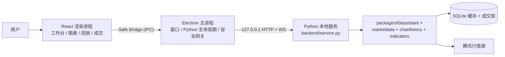

# StockPilot T+0 实现参考

## 1. 文档信息

| 项目 | 内容 |
| --- | --- |
| 产品 | StockPilot 盘中 T+0 助手 |
| 文档类型 | 实现参考与技术说明（模块 / 代码 / 逻辑） |
| 状态 | 维护中 |
| 更新日期 | 2026-07-31 |
| 适用路径 | `apps/t0-assistant/`、`packages/t0assistant/` |
| 设计基线 | [`architecture.md`](./architecture.md)、[`module_design.md`](./module_design.md) |
| 契约基线 | [`replay_interface_and_behavior.md`](./replay_interface_and_behavior.md)、[`apps/t0-assistant/contracts/`](../../apps/t0-assistant/contracts/) |

本文是 T+0 桌面应用的**实现层技术文档**，与 [`module_design.md`](./module_design.md) 的分工如下：

- **`module_design.md`**：模块职责、允许依赖与禁止依赖（设计基线，回答「代码应放在哪里」）。
- **`implementation_reference.md`（本文）**：模块、代码路径、运行时逻辑与具体技术问题的实现说明（回答「代码如何工作、改哪里、注意什么」）。

本文不替代 PRD、架构冻结文档或 JSON Schema 契约；公共字段、revision 语义和 Replay 行为以契约为准。后续可在本文持续追加各模块的实现细节、数据流说明和常见问题。

## 2. 整体架构

T+0 桌面应用由 **Electron 主进程**、**React 渲染进程** 和 **Python 本地服务** 组成，通过回环 HTTP/WebSocket 通信；渲染进程只通过 Preload Safe Bridge 访问后端，不直接接触端口、凭据或 SQLite。



### 2.1 核心原则

1. **Live 与 Replay 同源**：共用同一套计算管线，只替换时钟和行情输入端口。
2. **本地优先**：行情缓存、真实成交、偏好保存在本机，不依赖云服务。
3. **前端轻业务**：React 负责工作台状态、交互和绘图，不实现行情标准化、指标、CZSC 或仓储规则。
4. **复用现有边界**：行情复用 `packages/marketdata/`，缠论复用 `packages/chantheory/`，T+0 特有逻辑集中在 `packages/t0assistant/`。
5. **依赖方向**：`packages/` ← `apps/t0-assistant/`；Electron、React、HTTP 适配留在 app 层，领域逻辑不得泄漏进交付层。

更完整的系统边界与容器职责见 [`architecture.md`](./architecture.md)。

## 3. 目录地图

| 路径 | 职责 |
| --- | --- |
| `apps/t0-assistant/electron/` | 主进程：启动 Python、端口/凭据、Backend Gateway、日志窗口 |
| `apps/t0-assistant/renderer/` | React + Lightweight Charts：工作台、图表组、回放控件、成交 Drawer |
| `apps/t0-assistant/backend/` | Python 服务装配层；`service.py` 是 Electron 管理的唯一 Python 入口 |
| `apps/t0-assistant/contracts/` | 跨进程 JSON 契约（Python / Electron / React 共同遵守） |
| `apps/t0-assistant/tests/` | Python 与 Node 契约/集成测试 |
| `packages/t0assistant/runtime/` | Session、Coordinator、共用 Pipeline、Live/Replay 时钟 |
| `packages/t0assistant/replay/` | Replay 命令 API |
| `packages/t0assistant/trading/` | 真实/模拟成交、收费规则 |
| `packages/t0assistant/preferences/` | 收费方案、偏好 |
| `packages/t0assistant/repositories/` | T+0 专用 SQLite（成交、设置） |
| `docs/t0assistant/` | PRD、架构、模块设计、UI 规格、Replay 契约、验收清单 |

App 内目录所有权（摘自 [`apps/t0-assistant/README.md`](../../apps/t0-assistant/README.md)）：

```text
apps/t0-assistant/
├── contracts/   # 进程无关的逻辑 Schema 与 fixture
├── electron/    # main、preload、窗口与 Python 进程宿主
├── renderer/    # React/TypeScript 交付层
├── backend/     # 正式 Python API / bootstrap 适配层
└── tests/       # app 与契约 smoke 测试
```

模块职责与禁止依赖见 [`module_design.md`](./module_design.md)。

## 4. Live 与 Replay：同源管线

理解 Live/Replay 如何共用计算链路，是阅读 runtime 代码的前提。

```text
Live Session                    Replay Session
     │                                │
     ├─ LiveClock（真实时钟）          ├─ ReplayClock（可 seek / 播放）
     ├─ LiveMarketInput（实时行情）    ├─ ReplayMarketInput（历史前缀，不含未来）
     │                                │
     └──────────► WorkbenchPipeline ◄──┘
                      │
            indicators + chantheory（CZSC）
                      │
              WorkbenchProjection（完整快照）
                      │
              WebSocket 事件 → React 更新图表
```

| 关注点 | 代码入口 |
| --- | --- |
| 共用 Pipeline | `packages/t0assistant/runtime/pipeline.py` |
| Session 生命周期 | `packages/t0assistant/runtime/coordinator.py` |
| Live 装配 | `apps/t0-assistant/backend/live_application.py` |
| Replay 装配 | `apps/t0-assistant/backend/replay_application.py` |

Replay 命令、revision 和完整快照规则见 [`replay_interface_and_behavior.md`](./replay_interface_and_behavior.md)。

## 5. 前端数据流

Renderer 从 Safe Bridge 接收后端 payload，经 presenter 和 projection 层驱动图表。

```text
App.tsx
  ├─ workbench-layout.mjs      → 布局、图层、模式、偏好
  ├─ workbench-presenter.mjs   → 后端 payload → UI 状态
  ├─ chart-projection.mjs      → 快照/增量事件 → ChartProjection
  ├─ ChartGroup.tsx            → 单个图表组容器
  └─ SynchronizedChartGroup.ts → 多图联动
```

后端推送 **完整快照 + 带 revision 的增量事件**。前端用 `revision` / `service_generation` 去重；revision 跳变过大时重新拉取 `get_live_snapshot`。事件语义见 [`apps/t0-assistant/contracts/README.md`](../../apps/t0-assistant/contracts/README.md)。

UI 布局与图表组职责见 [`ui_layout_spec.md`](./ui_layout_spec.md)。

## 6. 契约：集成边界

`apps/t0-assistant/contracts/` 是 T+0 的公共 JSON 边界，由集成 owner 维护。修改公共字段或语义前应先阅读契约 README，不兼容变更需提升 schema 版本。

| 文件 | 内容 |
| --- | --- |
| `logical-v2.schema.json` | 证券、K 线、指标、CZSC、工作台快照结构（v2: instrument_type） |
| `app-v2.schema.json` | Live、历史快照、成交、偏好、事件信封（v2: t0_app_v2） |
| `replay-v2.schema.json` | Replay v2.0 命令/状态/倍速（v2: t0_replay_v2） |
| `logical-schema.json` | v1 保留：security_type (a_share|etf) |
| `app-v1.schema.json` | v1 保留：t0_app_v1 |
| `replay-v1.schema.json` | v1 保留：t0_replay_v1 |
| `fixtures/` | Python 与 TypeScript 共用的确定性测试数据 |

规则摘要：

- 公共字段一律 `snake_case`。
- 不兼容变更必须新 schema 标识，不能悄悄改字段含义。
- Provider 原始对象、凭据、端口、SQLite 实现细节不得跨边界。

## 7. 本地环境与运行

### 7.1 Python 环境

项目复用 `~/.venvs/czsc`：

```bash
source ~/.venvs/czsc/bin/activate
python --version
which python
python -m pip install -e ".[dev]"
```

`which python` 应指向 `~/.venvs/czsc/bin/python`。如需显式指定解释器，可对启动命令设置 `T0_PYTHON`。

### 7.2 启动桌面应用

```bash
cd apps/t0-assistant
npm install
npm start
```

`npm start` 会构建 Renderer、打开 Electron、在 ephemeral `127.0.0.1` 端口启动带认证的 Python 服务、等待 `/health`、连接主进程 WebSocket 网关，并在正常退出时关闭子进程。

仅开发 Renderer：

```bash
npm run dev:renderer
```

### 7.3 验证命令

从仓库根目录：

```bash
source ~/.venvs/czsc/bin/activate
python -m unittest discover -s apps/t0-assistant/tests -p 'test_*.py'
python -m unittest discover -s packages/t0assistant/tests -p 'test_*.py'
```

从 `apps/t0-assistant`：

```bash
npm run smoke
npm run acceptance:target-viewports
```

Smoke 套件分四条独立轨道：Python、Renderer、Electron 进程宿主、Contract。视口验收细节见 [`t0_054_acceptance.md`](./t0_054_acceptance.md)。

## 8. 代码阅读索引

### 8.1 基线文档

1. [`apps/t0-assistant/README.md`](../../apps/t0-assistant/README.md) — 运行与目录所有权
2. [`architecture.md`](./architecture.md) — 系统边界、容器图
3. [`module_design.md`](./module_design.md) — 模块职责与禁止依赖
4. [`ui_layout_spec.md`](./ui_layout_spec.md) — 三栏工作台布局
5. [`apps/t0-assistant/contracts/README.md`](../../apps/t0-assistant/contracts/README.md) — 事件与 revision 语义
6. [`replay_interface_and_behavior.md`](./replay_interface_and_behavior.md) — 回放契约
7. [`development_backlog.md`](./development_backlog.md) — Epic/Issue 规划与 DoD

### 8.2 按数据流阅读代码

1. `electron/main.mjs`、`electron/python-service-host.mjs` — 如何拉起 Python
2. `backend/service.py` — 命令路由与服务 bootstrap
3. `backend/live_application.py`、`backend/replay_application.py` — Live/Replay 装配
4. `packages/t0assistant/runtime/pipeline.py` — 共用计算管线
5. `renderer/src/App.tsx` — 前端总控（文件较大，先看 import 与 effect 结构）
6. `renderer/src/charts/chart-projection.mjs` — 后端事件如何映射到图表

## 9. 改代码时的边界

| 适合修改 | 不要放在这里 |
| --- | --- |
| `renderer/src/charts/*` 视口、联动、交互 | 在前端重算 MACD / CZSC |
| `packages/t0assistant/runtime/*` 管线逻辑 | 在 `apps/` 复制 `spikes/` 代码 |
| `packages/t0assistant/trading/*` 成交规则 | 改契约却不升 schema 版本 |
| `backend/*` 装配与 API 适配 | React 直接访问端口或 SQLite |

产品边界（不提供买卖建议、不自动下单、Replay 不泄漏未来数据等）见 PRD 与 [`development_backlog.md`](./development_backlog.md) 中的 FR-06 检查清单。

## 10. 相关 ADR

T+0 相关的已接受架构决策位于 [`docs/adr/`](../adr/README.md)，其中包括：

- 图表引擎与逻辑时间轴
- Electron 托管 Python 进程
- 本地 Python 传输层

实施中若需改变公共契约、目录所有权或 PRD 边界，应单独提出变更 Issue，不在普通功能 PR 中顺手修改。

## 11. 与其他组件的关系

T+0 桌面应用不是孤立 App，它复用仓库内已有 package：

| Package | T+0 中的用途 |
| --- | --- |
| `packages/marketdata/` | 行情服务、K 线缓存、证券主数据 |
| `packages/chantheory/` | CZSC 结构分析适配 |
| `packages/indicators/` | MA、BOLL、MACD、VWAP 等指标 |
| `packages/t0assistant/` | Session、Pipeline、成交、偏好、Replay API |

`skills/china-stock-analysis/` 与 T+0 当前阶段无直接耦合；skill 的公共逻辑提炼将在 T+0 基线完成后另行规划。

## 12. 模块实现说明（待补充）

以下章节用于记录各模块的具体实现细节、关键类/函数、数据流与常见问题。随开发进展增量维护。

| 模块 | 状态 | 说明 |
| --- | --- | --- |
| Electron 主进程与 Python 宿主 | 待补充 | `electron/` 生命周期、Safe Bridge、Backend Gateway |
| Python 服务 bootstrap | 待补充 | `backend/service.py` 命令路由与事件发布 |
| Live Session 与刷新 | 待补充 | `runtime/live_*.py`、`live_application.py` |
| Replay Session 与播放 | 待补充 | `runtime/replay_*.py`、`replay/api.py` |
| Workbench Pipeline | 待补充 | `runtime/pipeline.py` 计算顺序与端口注入 |
| 图表投影与视口 | 待补充 | `renderer/src/charts/` |
| 成交与收费 | 待补充 | `trading/`、`preferences/` |
| 契约与 revision | 待补充 | `contracts/` 与前后端对齐要点 |
