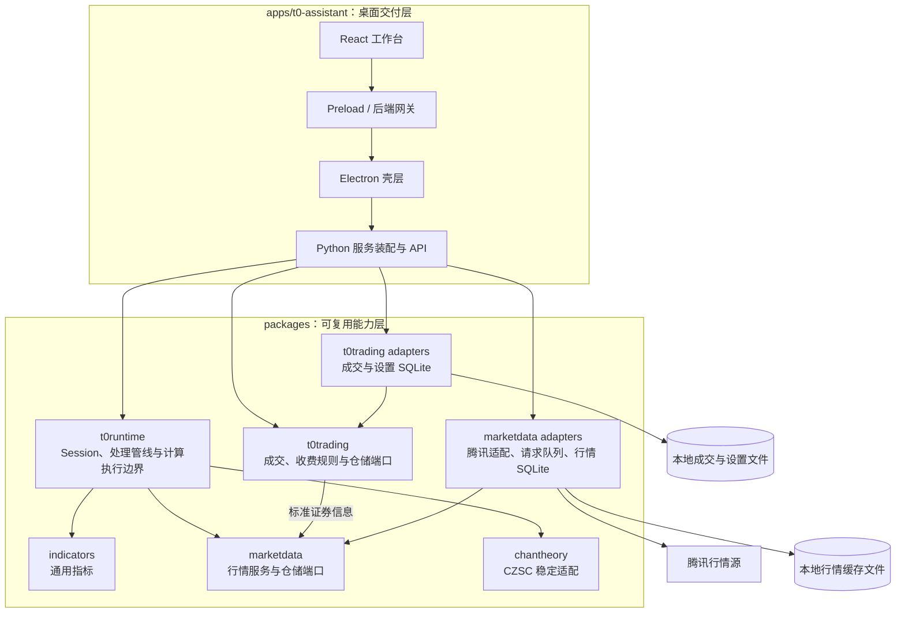
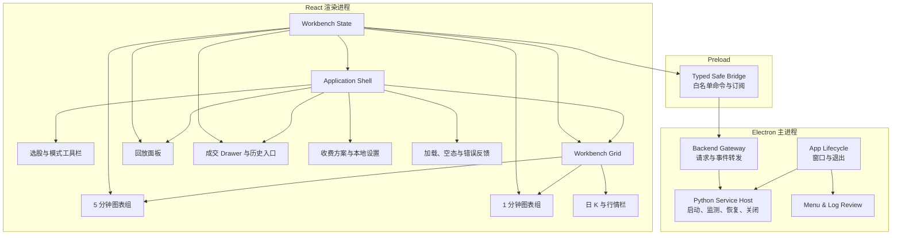
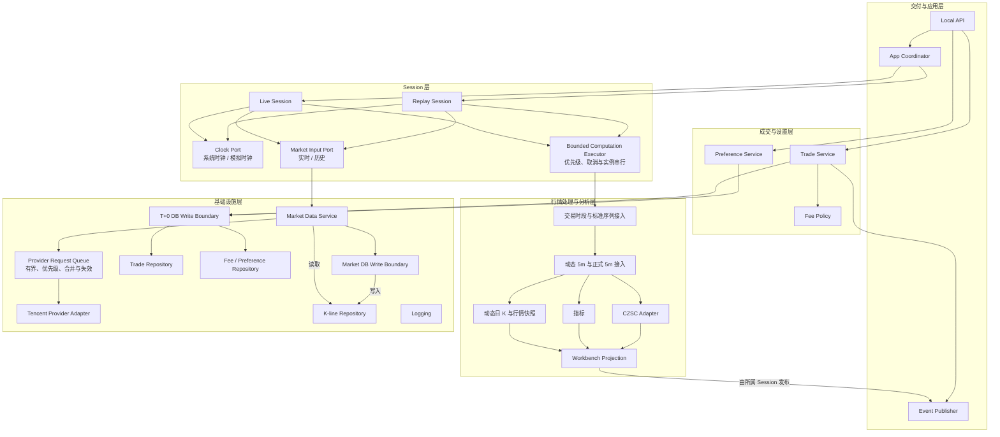
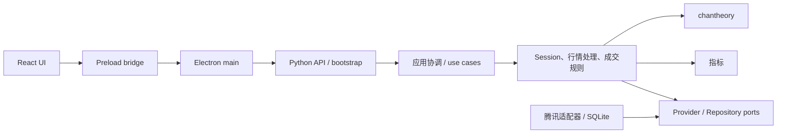

# StockPilot 盘中 T+0 助手模块设计

## 1. 文档信息

| 项目 | 内容 |
| --- | --- |
| 产品 | StockPilot 盘中 T+0 助手 |
| 文档类型 | 前端与 Python 模块设计 |
| 状态 | 架构基线候选，待确认 |
| 更新日期 | 2026-07-20 |
| 系统架构 | [`architecture.md`](./architecture.md) |
| 上位需求 | [`t0_intraday_assistant_prd.md`](./t0_intraday_assistant_prd.md) |
| UI/UX 基线 | [`ui_layout_spec.md`](./ui_layout_spec.md) |

## 2. 目的与粒度

本文定义 T+0 助手 MVP 的模块职责、允许依赖和禁止依赖，回答“代码应放在哪里、模块之间如何协作”。模块表示具有稳定职责的代码集合，不展开到类、函数、端点或数据库表。

建议的目标目录用于表达所有权，不表示已经拆成开发 Issue，也不要求在架构确认前一次性创建全部空目录。

## 3. 总体模块图



图中的 `t0runtime`、`t0trading` 和 `indicators` 是职责边界建议，最终包名可在架构确认后的技术方案中固定。它们可以是独立顶层 package，也可以是一个 `packages/t0assistant/` 下的清晰子模块；无论采用哪种目录形式，依赖规则不变。

## 4. 前端模块图



### 4.1 Electron 主进程模块

| 模块 | 职责 | 不负责 |
| --- | --- | --- |
| App Lifecycle | App 单实例、窗口、最小尺寸、启动与优雅退出 | 业务计算、图表状态 |
| Python Service Host | 选择端口、生成临时凭据、启动与监测 Python、发布连接状态、执行有限自动重启和超时关闭 | 解释业务 payload、伪造 Replay 恢复 |
| Backend Gateway | 维护允许的命令/事件列表，关联请求与响应，转发服务状态 | 领域校验、直接 SQL |
| Menu & Log Review | 系统菜单和只读日志窗口 | 日志分析、自动修复 |

Electron 主进程模块之间可以共享基础日志与配置，但不得成为第二套业务后端。

### 4.2 React 工作台模块

| 模块 | 职责 | 关键边界 |
| --- | --- | --- |
| Application Shell | 组合顶部、工作区、回放面板和底部 Drawer | 不保存领域状态或图表实例 |
| Workbench State | 镜像当前股票和模式，保存 Session 修订、布局、图层、可见范围、5 分钟跟随最新/手工浏览状态、加载与错误状态 | App Coordinator 是当前股票和模式的后端权威；后端快照是行情与成交事实源 |
| 选股与模式工具栏 | 证券搜索选择、股票名称、实盘/回放切换 | 搜索结果必须来自标准证券主数据接口 |
| Workbench Grid | 三列三行尺寸、64/36、50/50、隐藏分时及状态保持 | 不创建行情或计算指标 |
| 5 分钟图表组 | K、BOLL、MA、笔、笔中枢、CZSC、成交标记、宽度驱动的最近 N 根满轴视口及组内联动 | 只消费完整绘图序列并调整视口，不裁剪后触发指标或 CZSC 重算 |
| 1 分钟图表组 | 分时价格、VWAP、VOL、MACD 及组内联动 | 与 5 分钟组不共享时间轴状态 |
| 日 K 与行情栏 | 日 K、最新价和行情字段固定布局 | 缺失值原位显示 `--`，不做信号解释 |
| 回放面板 | 日期、开始、播放/暂停、单步、倍速、进度定位 | 发控制意图，不在前端自行推进市场时钟 |
| 成交模块 | 真实/模拟成交录入、编辑、删除确认、历史入口、标记展示 | 不直接计算持仓、配对或盈亏 |
| 设置模块 | 收费方案维护、布局和图层偏好入口 | 不追溯重算历史成交 |
| 加载与错误反馈 | 初始 Loading、空态、后台失败状态、主动操作弹窗与重试 | 不显示内部异常栈 |

### 4.3 前端状态分层

```text
后端事实状态
├── Session 快照与修订号
├── K 线、指标、CZSC、行情快照
└── 真实成交 / 当前回放模拟成交

工作台会话状态
├── 当前股票与实盘 / 回放模式的前端镜像
├── 回放控制状态
├── 图表可见范围与 5 分钟跟随最新 / 手工浏览状态
└── Drawer 展开状态

持久化 UI 偏好
├── 最后股票
├── 布局模式
└── 图层开关
```

React 不应把后端事实状态和 UI 偏好混为一个可任意写入的全局对象。后端事件只能更新事实状态；布局和图表交互只更新工作台状态或偏好。

App Coordinator 是当前股票和模式的运行时权威；Workbench State 保存用于渲染的前端镜像。React 是当前布局、图层开关和图表可见范围的运行时权威，Preference Service 只保存其中需要跨 App 重启恢复的副本。

## 5. Python 模块图



### 5.1 API 与应用协调

| 模块 | 职责 |
| --- | --- |
| Local API | 接受桌面端命令，做协议级校验与错误映射；不包含领域算法 |
| Event Publisher | 发布加载、完整工作台快照、行情与指标更新、完整 CZSC 结构快照、操作结果和服务状态，保证 Session 内事件有序并拒绝失效 Session 的结果 |
| App Coordinator | 作为当前股票和模式的运行时权威，退休/创建 Live，管理 Replay 生命周期、Session 世代、局部重建和模式切换 |

### 5.2 Session

| 模块 | 职责 |
| --- | --- |
| Live Session | 绑定创建时的股票且不在原实例上切股；使用系统时钟调度快照、1m、正式 5m 更新；回放期间继续后台运行 |
| Replay Session | 绑定 App 当前股票和目标日期；加载预热数据，按实际序列播放、暂停、单步与定位，维护模拟成交 |
| Clock Port | 向处理管线提供“当前时刻”；实现系统时钟与可控模拟时钟 |
| Market Input Port | 向处理管线提供标准行情序列；实现实时与历史输入 |
| Bounded Computation Executor | 有界调度 Live/Replay 计算任务，Live 优先，同一管线实例串行推进，并取消或隔离过期 Replay 任务 |

Session 负责编排而不复制指标或 CZSC 算法。Replay 向后定位必须重建管线状态，不能修改 CZSC 内部对象来越过未来数据约束。

### 5.3 管线实例与状态所有权

- Live Session 和 Replay Session 使用相同的管线实现，但分别创建并拥有独立的有状态管线实例；
- 管线实例内部维护动态 5 分钟 K、滚动指标、CZSC 和当前工作台投影等派生状态；
- Session 管理管线实例的创建、推进和销毁，不在 Session 内复制指标或 CZSC 算法；
- 管线只能通过 Market Input Port、Clock Port 和显式配置获得外部输入，不得读取全局当前股票、隐式系统时间或其他 Session 的状态；
- Replay 向后定位必须销毁或重置当前实例，从预热输入开始顺序重放到目标时点，不能直接倒改 CZSC 内部对象；
- MVP 不持久化管线内部状态；恢复和重建以标准行情输入为事实基础。检查点缓存可以作为后续性能优化，但不得改变确定性重放结果。

### 5.4 行情处理与分析

| 模块 | 职责 | 复用位置 |
| --- | --- | --- |
| Provider 标准化 | 统一代码、时区、OHLCV/成交额字段，完成基础校验、排序去重并输出标准行情 | `packages/marketdata/` |
| 交易时段与序列接入 | 按交易时段解释标准行情，跨午休且不补虚假 K | T+0 runtime package |
| 动态与正式 5 分钟 K | 1m 只形成尚未闭合的动态 5m；取得正式闭合 5m 后替换动态 K | T+0 runtime package |
| 动态日 K 与快照 | 从当日已发生行情形成日 K；组合目标时点可用的行情字段 | 通用实现进入 `packages/` |
| 指标 | BOLL、MA、VOL MA、MACD、VWAP | 新共享指标 package |
| CZSC Adapter | 把闭合 5m 输入 `packages/chantheory/`，输出稳定的笔、笔中枢和买卖点 | `packages/chantheory/` |
| Workbench Projection | 将同一 Session 时点的结果组合成前端可消费快照 | T+0 runtime package |

VWAP 必须使用累计成交额除以累计成交量；CZSC 不接收动态未闭合 5 分钟 K；正式 5 分钟 K 来自 Market Data Service 输出的已闭合 5 分钟行情；回放 Projection 不得用目标时点之后的快照字段补空值。

指标与 CZSC 模块接收完整已加载的跨交易日 5 分钟历史并连续计算，Workbench Projection 输出完整可浏览 K 线及对齐的指标、笔和中枢绘图结果。前端 5 分钟图表组再根据实际绘图区宽度选择最近 N 根作为默认视口；这一视口裁剪不得回传为分析输入。横坐标由实际 K 线序号形成，非交易时段不创建占位数据。

`packages/chantheory/` 继续作为唯一 CZSC 项目边界。在冻结接口契约前必须用 5 分钟固定数据验证其输入时间口径、全量重建耗时以及逐步推进与重建结果的一致性；如需增量能力，应扩展该稳定适配层，不允许 T+0 runtime 绕过它直接依赖原始 `czsc` 对象。

### 5.5 分析结果更新策略

- 首次加载、股票切换、重连和回放定位发布完整工作台快照；
- 运行时 K 线和普通指标按各自数据节奏发布更新，React 更新对应系列但不重置图表可见范围；
- 每次 CZSC 重算后发布完整 CZSC 结构快照，React 原子替换笔、中枢、买卖点等 CZSC 图层；
- Python 是分析结果的唯一权威，React 不计算 CZSC，也不合并 CZSC 领域结构的新增、修改和删除差异；
- Session 标识、修订号、事件字段和乱序恢复规则由前后端接口契约定义。

### 5.6 成交、收费和偏好

| 模块 | 职责 |
| --- | --- |
| Trade Service | 真实成交校验、CRUD、5 分钟桶归属和图表标记投影；模拟成交委托 Replay Session |
| Fee Policy | 按标的类型、方向和结构化方案计算默认费用，保存前允许用户覆盖 |
| Preference Service | 最后股票、布局、图层开关和收费方案的读取与保存 |

收费规则与成交时间归桶属于可测试业务规则，不应放在 React 表单或 SQLite Repository 中。

### 5.7 基础设施与仓储

| 模块 | 职责 |
| --- | --- |
| Market Data Service | 本地优先读取、缺口识别、远端补齐、标准化后 upsert |
| Provider Request Queue | 集中承接远程行情缺口请求，队列有界，执行 Live 优先级、相同请求合并和失效请求隔离 |
| Tencent Provider Adapter | 封装腾讯字段、单次请求和上游错误，不泄漏原始 payload；不被 Session 直接调用 |
| K-line Repository | 1m、5m、日 K 的范围读取、缺口信息和幂等写入 |
| Trade Repository | 真实成交事务、按记录及按股票/交易日读取 |
| Fee / Preference Repository | 收费方案和持久化偏好的读写 |
| Market DB Write Boundary | 串行协调当前 Python 进程对本地行情缓存文件的写入；跨 App 正确性仍依赖 SQLite 事务与文件锁 |
| T+0 DB Write Boundary | 串行协调本地成交与设置文件的写入，确保成交和配置写入结果明确确认 |
| Logging | 结构化技术日志、关联标识、脱敏和轮转 |

Repository 只负责持久化映射，不实现指标、收费公式、Session 或 UI 规则。

`packages/marketdata/` 拥有本地行情缓存文件的 schema 与迁移；T+0 成交与设置 package 拥有本地成交与设置文件的 schema 与迁移。任何 App 不得各自维护同一共享行情表的迁移副本。

App Coordinator 负责 Session 级故障恢复：Replay 失败时只销毁 Replay，Live 失败时从标准行情重建新 Live。Electron 的 Python Service Host 负责 Python 进程级故障恢复；Event Publisher 负责把“行情暂时不能保存”“成交与设置不能修改”“后端已断开”等具体受限功能状态传给前端。

## 6. `apps/` 与 `packages/` 依赖规则

### 6.1 放入 `apps/t0-assistant/` 的代码

- Electron main、preload、系统菜单、窗口和 Python 进程宿主；
- React 页面、组件、Lightweight Charts 适配和工作台状态；
- 本地服务启动入口、依赖装配、API/事件传输适配；
- T+0 桌面应用特有的 payload 映射和用户错误文案；
- 应用级资源、打包配置和端到端测试。

判断标准：如果代码只因这个桌面交付形态存在，或直接依赖 Electron/React/网络框架，应放在 `apps/`。

### 6.2 放入 `packages/` 的代码

- 标准行情 schema、交易时段、聚合、缓存服务与 provider adapter；
- BOLL、MA、VOL MA、MACD 和 VWAP 等可复用指标；
- CZSC 稳定适配和绘图 primitives；
- Live/Replay 共用的输入端口、时钟端口、处理管线和确定性回放能力；
- Provider 请求队列、计算执行边界和数据库写入协调等可独立测试的资源控制能力；
- 成交、收费、5 分钟归桶等与 UI 无关的业务规则；
- Repository 接口、SQLite 实现和迁移；
- 可以由 CLI、测试或未来其他 App 直接复用的稳定 schema。

判断标准：如果去掉 Electron/React 后仍然有业务意义，并且应在回放测试或另一个交付面复用，应放在 `packages/`。

### 6.3 允许的依赖方向



基础设施实现依赖领域定义的端口；领域层不反向导入 Electron、React、Web 框架或具体 SQLite 连接。

总体模块图中的箭头表示代码依赖或端口实现关系：领域模块依赖端口，腾讯与 SQLite 适配器实现端口并由 App bootstrap 装配。它们不表示领域模块可以绕过端口直接持有 SQLite 连接。

### 6.4 禁止的依赖

- React 或 Electron 直接导入/访问 SQLite；
- React 直接调用腾讯行情源或依赖 provider 原始字段；
- 页面组件实现指标、VWAP、5 分钟聚合、收费公式或 CZSC 映射；
- `packages/chantheory/` 依赖 T+0 App、行情 provider、运行时路径或仓储；
- `packages/marketdata/` 依赖 Electron/React 或 T+0 页面状态；
- Repository 导入 Session、图表或 UI 模块；
- Session 直接创建腾讯 Provider 客户端、SQLite 连接或无界后台任务；
- Live Session 与 Replay Session 各自复制一套行情处理和计算逻辑；
- 回放模块读取 Live Session 的未来状态来补充历史字段；
- Python package 依赖 TypeScript 生成代码作为领域实现的唯一来源。

## 7. 建议目录映射

以下目录只表达目标归属，具体命名在分模块技术方案中确认：

```text
apps/t0-assistant/
├── electron/                 # main、preload、窗口、菜单、Python host
├── renderer/                 # React 工作台、图表、成交、回放、设置
├── backend/                  # Python API、事件传输、依赖装配、启动入口
└── tests/                    # App 集成与端到端测试

packages/
├── marketdata/               # 1m/5m/日 K、标准行情、请求队列、腾讯与行情 SQLite 适配
├── chantheory/               # 延续现有 CZSC 稳定边界
├── indicators/               # 通用技术指标（候选）
├── t0runtime/                # Session、时钟、输入端口、计算执行边界、管线、投影（候选）
└── t0trading/                # 成交、收费、仓储端口与业务 SQLite 适配（候选）
```

如果最终选择单一 `packages/t0assistant/`，内部仍应保持 `runtime`、`trading`、`repositories` 等边界，且不可把 Electron/React 代码放入其中。

## 8. 跨模块不变量

1. 1 分钟 K 只形成动态 5 分钟 K；只有 Market Data Service 提供的正式闭合 5 分钟 K 进入正式指标和 CZSC，动态 K 仅用于显示。
2. 实盘与回放消费同一标准行情输入，经过同一处理管线。
3. Replay 任一输出只由目标时点及以前的数据产生。
4. 同一股票、日期和输入序列的回放结果确定且可重复。
5. Live Session 在 UI 查看回放时继续更新，但不能污染 Replay Session。
6. 真实成交只有仓储写入成功后才成为事实；模拟成交永不进入真实仓储。
7. 修改收费方案不追溯修改已保存成交的费用。
8. UI 布局、图层和可见范围变化不触发后端重算。
9. 当前股票由 App Coordinator 管理；切股退休旧 Session 并创建绑定新股票的新实例，旧修订不能覆盖新状态。
10. 外部 provider 和 CZSC 引擎对象不得越过 project-owned schema 边界。
11. 运行时行情和普通指标按各自节奏更新；CZSC 重算采用完整 CZSC 结构快照，前端只原子替换 CZSC 图层。
12. Live 与 Replay 共用管线实现但不共享实例；派生状态可丢弃，并能由相同输入前缀确定性重建。
13. 5 分钟指标和 CZSC 先基于完整已加载历史连续计算，前端可见 N 根仅是渲染视口，不能成为分析截断边界。
14. 5 分钟默认视口以最新或模拟时点为右边界，按绘图区宽度跨交易日满轴显示实际 K 线；Replay 不得为填满视口读取未来数据。

## 9. 模块级测试边界

本文不展开完整测试方案，但架构要求模块具备以下可测试接缝：

- 行情 provider、时钟和仓储均可替换为确定性 fake；
- 处理管线可在无 Electron、无网络环境下输入固定 K 线测试；
- Live 与 Replay 可对同一输入前缀做结果一致性测试；
- Replay 可验证向后定位后无未来数据残留；
- Provider 请求队列可验证 Live 优先、相同请求合并、容量边界和失效请求不更新旧 Session；
- 计算执行边界可验证同一实例串行、Replay 任务取消和过期结果隔离；
- React 可使用 Fake Safe Bridge 输入固定快照、行情与指标更新、CZSC 结构快照、乱序事件和服务断开状态；
- React 图表组可用固定快照测试组内联动、组间独立以及自动刷新不重置可见范围；
- React 5 分钟图表组可用不同绘图区宽度测试跟随最新时最近 N 根跨日满轴显示、非交易时段无空槽，以及手工浏览后布局变化不跳回最新端；
- Electron 可用假 Python 服务测试生命周期和异常恢复；
- Repository 可独立测试迁移、事务、幂等 upsert、永久删除、文件不可写和只读行为；
- 可通过故障注入验证 Provider、指标、CZSC、本地数据文件、Session 和 Python 进程失败只影响对应功能。

详细覆盖矩阵、测试层级和验收自动化在架构确认后的测试方案中定义。

## 10. 模块设计确认清单

- [ ] Electron、preload、React 和 Python 本地服务职责边界清晰。
- [ ] 前端两个图表组组内同步、组间独立，状态所有权明确。
- [ ] Live Session、Replay Session、行情处理、指标、CZSC 和仓储职责分开。
- [ ] App Coordinator 是当前股票和模式的运行时权威，Session 绑定股票并通过新实例完成切股。
- [ ] Provider 请求、计算任务和数据库写入都有明确的有界协调模块，错误恢复职责有唯一所有者。
- [ ] 回放控制由 Python 模拟时钟推进，不由前端计时器生成行情状态。
- [ ] 现有 `marketdata` 和 `chantheory` 边界得到复用而非复制。
- [ ] 新通用指标、回放和成交规则进入 `packages/`，交付适配留在 `apps/`。
- [ ] 模块依赖只从交付层指向应用/领域能力，并通过端口连接基础设施。
- [ ] 文档保持模块粒度，未提前展开类、函数、接口字段或 Issue。
